# AIApply 对标：按岗改简历与求职信（2026-10-05）

> 起因：Frank 10-05 语音「你看那个最近那个 AI play 那个网站帮我带头棒，根据不同的职位需求重构简历和 covenant 这些功能」，意思是对标 AIApply（aiapply.co）按岗位改简历、改求职信这两样。按「点名哪家只看哪家」，本稿只看 AIApply。
> 接 [付费闭环-20261003](付费闭环-20261003.md) 的「10-04 批 B2 拍板」段和 [代投竞品调研-求职信与匹配-20261004](代投竞品调研-求职信与匹配-20261004.md)（那份的 AIApply 一行多是二手，本稿用一手资料更正）。按 10-05 Frank 点头的推进顺序，这件排在收费链（C 批）跑通之后。
> 做法：只看公开页面，没注册、没登录、没开试用、没填邮箱、没提交表单；加拿大 IP 下没出 Cookie 横幅，所以没点过拒绝。登录后的界面来自 AIApply 官方 YouTube 视频的公开拖动预览帧、前端公开的界面文案表 en.json 和帮助中心 support.aiapply.co。
> 标注：[一手] = AIApply 自己的页面、文案表、帮助中心、条款、官方视频、官方 App 页；[二手] = 用户评价、竞品测评、聚合站；[推断] = 本稿自己推的。链接访问日期一律 2026-10-05。

## 1. 一句话结论

- **它是什么**：AIApply 的「按岗改」有两条路。手动那条在 Premium 里（US$29/月）：选一份底稿简历、贴 JD，几分钟出一份新简历，十秒左右出一封信，再在编辑器里手改或叫 AI 改，最后下载 PDF。自动那条是 Auto Apply 的加购（改简历、改信各 US$12/月）：每投一个岗现做一份，发出前不给看，也不能改。
- **值不值得照做**：手动那条的形值得照抄，自动那条不抄。它自己没有「新加的事实请你确认」这一步，用户骂得最多的两件事是收费（1 星约一半）和文书编事实、答错工作许可。
- **怎么做**：B2 一字不动（模板信、原件简历照发、预览后发）。收费链跑通后，先上「按这一岗改写」，只改信的中间一段，新出现的事实逐条让用户勾。改简历放进简历模块：先给缺项和逐条改法，让用户改自己的文件。整份按岗重排简历（AIApply 那种）等前两期有了数据再议。

## 2. 它怎么做

### 2.1 产品面

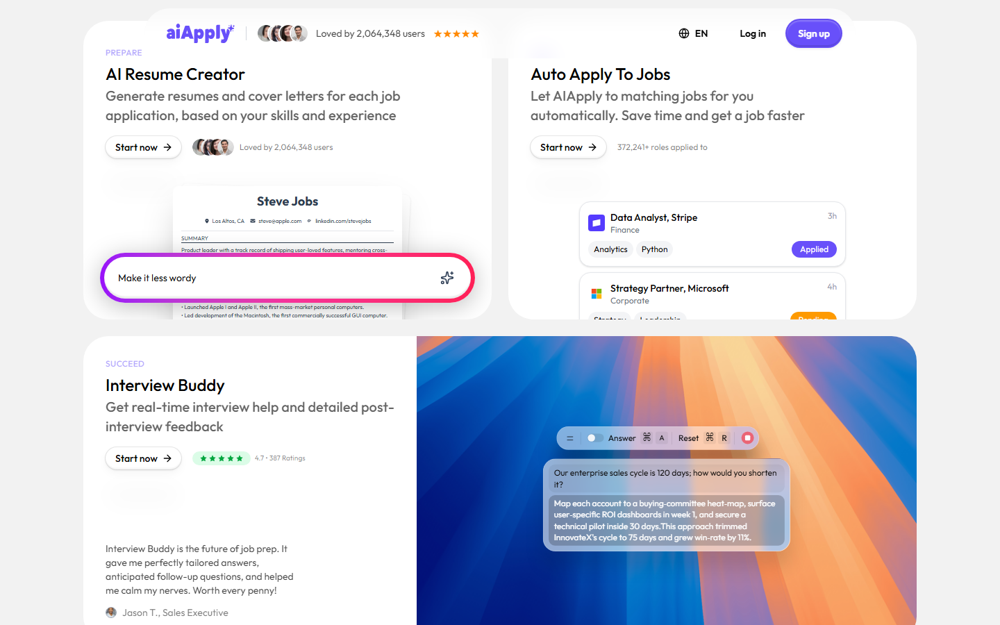

- 产品线：Auto Apply（自动投递）、AI Resume Builder（可从 LinkedIn 导入）、AI Cover Letter Generator、Application Kit、AI Mock Interview、Interview Buddy（面试实时提示，桌面 App）、Resume Scanner、Resume Rewriter、Resume Translator、站内职位板（自称 20M+ 职位），另有约 29 个免注册小工具。（一手：[llms.txt][llms]、[公司页][okf-co]、[首页][home]）
- 公司是 AiApply Ltd，英格兰及威尔士注册，2022 年成立；首页用户计数 2,064,348；自称用微调过的 GPT-4 和 Azure OpenAI。（一手：[公司页][okf-co]、[条款][tos]、[求职信页][clg]）
- 登录后左栏：Documents 下面是 Application Kits、Resumes、Cover Letters；Interview 下面是 Interview Buddy；另有 Search Jobs、Inbox、Auto Apply、Saved Jobs、Preferences。（一手：[简历视频][v-resume]、[求职信视频][v-cl]、[文案表][en]）
- 手动工具和自动投递是两套，互不包含：Premium 里生成的东西用户自己改、自己下载去投；Auto Apply 里的改写件用户不能编辑。（一手：[帮助：Premium 与其他产品][h-premium-vs]、[帮助：Tailoring 入门][h-tailor-start]）

### 2.2 按岗改简历（手动那条）

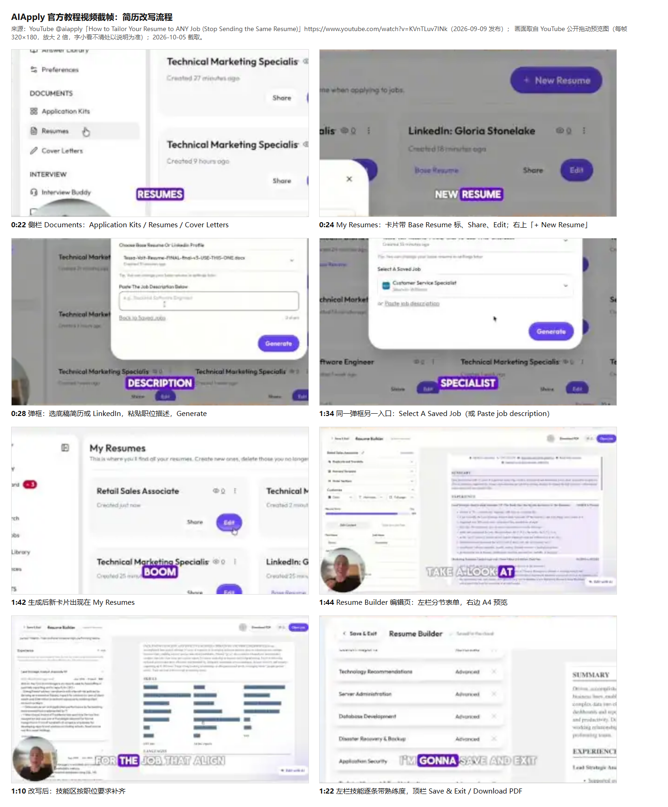

1. **作为新用户，我先上传一份 Word 或 PDF 简历，它被「重建进模板」。** 付费墙三步写的是 Bring your Word or PDF、We rebuild it in our template、Adjusted for every job。解析完有一个核对屏「Review your resume in our template」：按经历、教育、语言、技能分组，逐条点 Mark Correct 或 Mark Incorrect，标错的填「What should the answer be?」，也可以一键全对。读不进模板的文件原样发出，不改写（Sent as uploaded, not tailored）。上传限 PDF 或 DOCX、5MB。（一手：[文案表][en]；核对屏实物没见过，样子是按文案推的）
2. **作为求职者，我在 My Resumes 点「+ New Resume」，弹出一个框，填两样就点 Generate。** 一是底稿：已有简历、上传的文件或 LinkedIn 档案（下拉里能看到 PDF、docx，甚至一张 png）。二是 JD：粘贴（框下显示字数），或改成「Select A Saved Job」从职位板收藏里挑。（一手：[简历视频 0:28、1:34][v-resume]、[帮助：Application Kits][h-kit]）
3. **作为求职者，我等几分钟，新简历以卡片出现在列表里，按岗位名命名，挂在它来源的底稿下面成组显示。** 生成时提示「Tailoring your resume… Usually ready within a few minutes」。每张卡有 Share 和 Edit；改好的可以 Set as Base Resume 设成新底稿。（一手：[简历视频 1:42][v-resume]、[文案表][en]、[帮助：Resume Builder Premium][h-rb-premium]）
4. **它改了哪些地方。** 官方定义：改 summary、改突出的成就、改关键词；原话是「Paste a job description and our GPT-4 powered AI rewrites your bullet points, summary, and skills section」。视频里实际看到：summary 重写，bullet 改成「做了什么加结果」，技能栏整块重排（约 22 个技能分三栏），objective 也改了。（一手：[定制概念页][okf-tailor]、[模板页][tpl]、[简历视频 0:40–1:20][v-resume]）
5. **作为求职者，我进编辑页自己改。** 左边分节表单（Summary、Experience、Skills 带熟练度、Languages 带熟练度），右边 A4 实时预览；顶栏 Save & Exit、Download PDF；右下「Edit with AI」，可以用一句话要求改（更正式、缩短、改成技术岗口吻）。AI 写的经历条目下挂一个「AI Generated」小标签。另有 Tailor to a Job Post 页签、Duplicate and Translate、换模板（推荐 Harvard）、调节顺序、颜色、字体。（一手：[简历视频 1:04–1:47][v-resume]、[帮助：编辑与导出][h-rb-edit]）
6. **我在哪一步审：只有生成之后。** 没有改前改后对照，也没有逐条接受或拒绝；能做的是逐行手改、撤销，或者再让 AI 改。（一手：[简历视频 1:10][v-resume]）
7. **作为求职者，我导出 PDF 或 DOCX，或生成分享链接。** 模板页写「PDF for most applications, DOCX when portals ask」；分享链接能看到雇主打开了几次。模板数两种说法：帮助中心 6 个，产品文档 30+。（一手：[模板页][tpl]、[产品文档][okf-rb]、[帮助：入门][h-rb-start]）

防编造这件事，它的说法和做法对不上：

- 帮助中心说定制只用底稿里的东西，不会凭空写；要出现在定制版里的必须先写进底稿。（一手：[帮助：AI 检测][h-ai-detect]）
- 官方视频说明反复劝「不要编经历、不要加你没有的技能」，但这是写给用户的建议，产品里没看到拦截；旁白还说「AI 会帮你生成技能，你也可以自己加」。（一手：[重建视频][v-rebuild]）
- 全程没找到「这条是新加的，请确认你真有」这类标记或确认步骤。只有一个「AI Generated」标签，标的是整条是 AI 写的，不是哪个事实是新的。（一手：截帧观察）
- 官方演示自己就有毛病：定制简历保留了底稿里的乱码符号（« 和 =），一行标题和 summary 粘成一个词（PROCESSESPROFILEDriven），多处丢空格；第二次演示的 Retail Sales Associate 简历画面还是底稿原文（以「Hi!!! My name is Tessa」开头），旁白却说已改。视频有剪辑，原因断定不了。（一手：[简历视频 0:52、1:00、1:55][v-resume]）

### 2.3 按岗写求职信

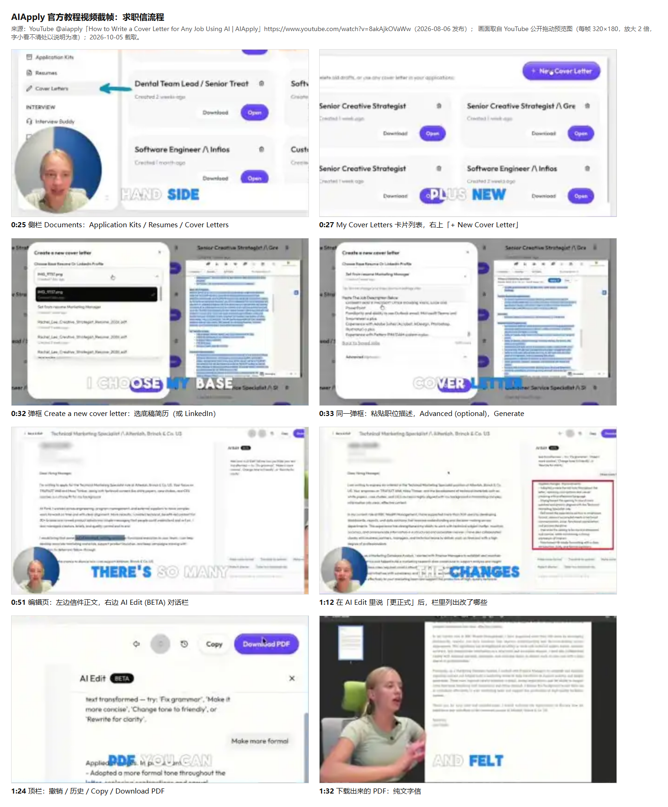

1. **作为求职者，我在 My Cover Letters 点「+ New Cover Letter」，弹出和简历同款的框：选底稿简历或 LinkedIn，贴 JD 或选收藏的岗，下面一个默认收起的「Advanced (optional)」，点 Generate。** 文案表里有 Tone（Formal、Casual、Friendly、Concise）和 Length（Short、Medium、Long）两组选项，是不是放在 Advanced 里没确认；帮助中心另说风格分学生、自由职业、职场人，语气按初级或高级岗调。（一手：[求职信视频 0:27–0:33][v-cl]、[文案表][en]、[帮助：求职信生成器][h-cl]）
2. **作为求职者，我等约十秒拿到一封信。** 演示那封以 Dear Hiring Manager 开头，正文 4 段：第一段点岗位名和公司名，并引用 JD 里的具体产品名和课程；第二段讲过往经历；第三段说能带来什么；最后客套结尾。粗数约 150 个英文词。每封以岗位名存进列表，可以 Download 或 Open。（一手：[求职信视频 0:43、0:57][v-cl]；字数是粗估）
3. **作为求职者，我在编辑页直接点进正文改，自动保存。** 右边是「AI Edit (BETA)」对话栏，快捷钮有 Make more formal、Translate to spanish、Make more catchy、Make it shorter、Tailor to a technical role，也能自己打字提要求。AI 改完回一句「Applied changes. Improvements: …」，逐条列改了什么（演示里 5 条：语气更正式、开头改写、经历段重组等）。顶栏有撤销、重做、历史、Copy、Download PDF。下载的是纯文字排版的 PDF，没看到富文本工具栏。（一手：[求职信视频 0:51–1:32][v-cl]、[文案表][en]）
4. **我在哪一步审：生成之后，整封看得见、能直接改。** 和简历一样没有逐句对照，也没有逐条批准。官网 FAQ 说可以只改某几段，视频只演示了整封一起改。（一手：[求职信视频][v-cl]、[求职信页 FAQ][aiclg]）
5. **公开页的演示表单只有三个框：Your Name、Company Name、Job Title，点「Generate AI Content」就跳注册。** FAQ 写「You won't need a template」；375px 手机屏上这块演示表单不显示。（一手：[求职信页][clg]）

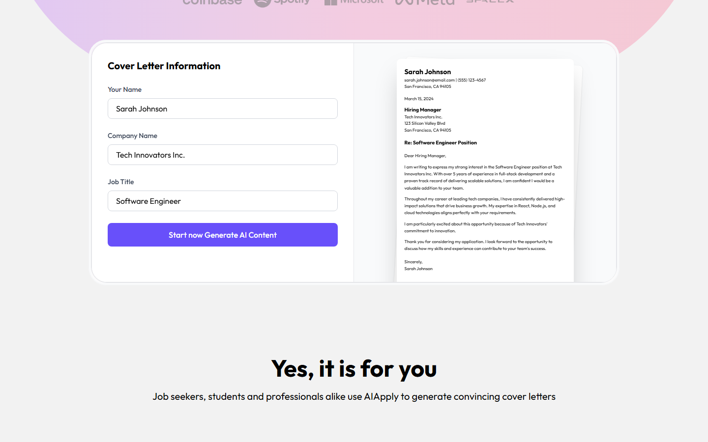

另有 **Application Kit**：给一个 JD，一次出三样：定制简历、求职信、一封跟进 HR 的邮件模板，原话「A tailored resume, cover letter, and follow-up email generated from your base resume and the job description」。可能只成功一部分；JD 里读不出职位名会报错；出空白时帮助中心让用户把 JD 删短、去掉项目符号和特殊字符再试，说明 JD 解析比较脆。（一手：[文案表][en]、[帮助：Application Kits][h-kit]、[帮助：Premium 排障][h-trouble-premium]）

### 2.4 自动投递里的改写（不给看就发）

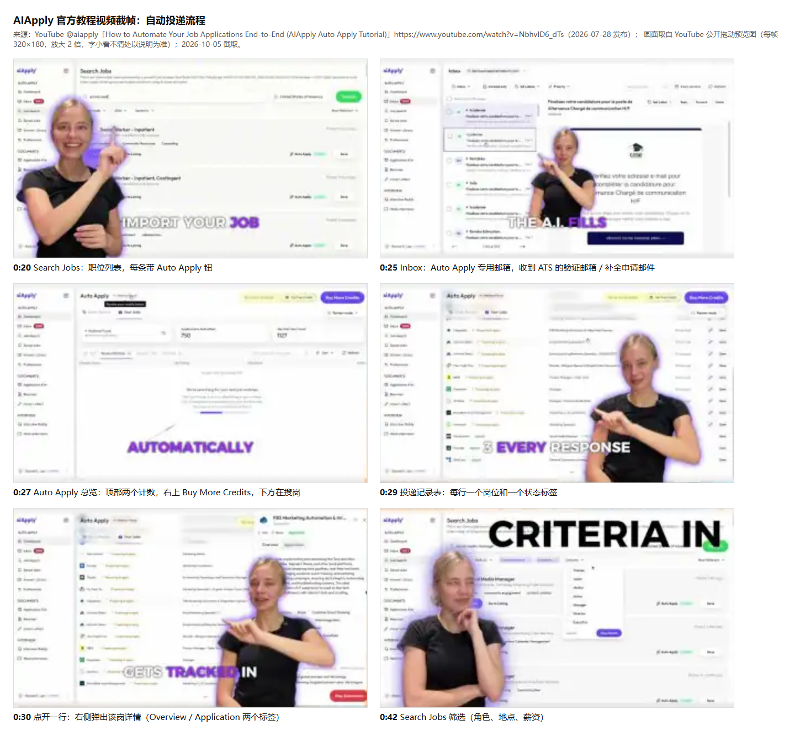

- **入门问卷**是公开页：首屏问「What's your current work status?」，文案表有 7 个阶段（Current status、Your goals、AI experience、Job preferences、Your background、How we help、Final step）；字段包括简历、期望职位、经验、远程或现场、地点、薪资、开工日期，还问工作许可、驾照、性别、残疾、退伍、安全许可（美式 EEO 题）。中间插营销页，后面放一个样例岗问「Would you apply to this role?」、一封样例信问「Does this sound like you?」，最后邮箱加 OTP 再进付费页。只截了首屏，后面没点。（一手：[问卷页][aaform]、[字段序列][aaseq]、[文案表][en]）

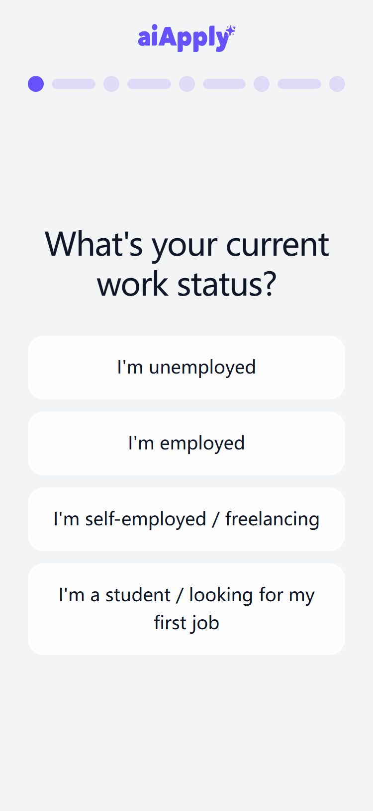

- **三种模式**：Review（每个岗你批准才投）、Hybrid（匹配度高的自动投，其余问你；阈值写过 70 也写过 75%）、Auto（全自动）。Review 审的是岗位，不是文件：每条只有 Apply 和 Decline，拒了不能撤回。（一手：[条款 §15][tos]、[帮助：模式][h-modes]、[帮助：队列][h-queue]）
- **改写件发前不给看**：AutoApply 用户协议原文「In both modes, draft answers are not shown and cannot be edited before submission」；帮助中心写没有发送前的审批步骤，发出后才能在该岗的 Review 页看到实际发出的简历、信和答过的申请问题，而且只能一份一份下载。可队列界面又有「You can still edit the cover letter and resume for this job」，边界要登录才能核。（一手：[文案表][en]、[帮助：AI 检测][h-ai-detect]、[帮助：管理定制简历][h-access]、[帮助：查看定制文件][h-review-docs]）
- **改写是开关加加购**：Resume Tailor 文案「Auto-Apply already sends your resume. This rewrites it for each job」「+44% more interviews」；没开就「Uploaded originals are sent as-is」；想发原版可以在 Preferences 开 Pause Auto-Tailor。首页和 Auto Apply 页则写成「每个岗都改写简历和求职信」，宣传比实际开关宽。（一手：[文案表][en]、[Auto Apply 页][aa]、[帮助：设简历][h-set-resume]）
- **底稿决定一切**：帮助中心反复要求先在它的编辑器里把底稿补全；上传的 PDF 或 Word 可能解析不全、做不了定制；不能上传自己写的信；答错的申请问题可以点踩填正确答案存进 Answer Library，但管不到简历和信的正文。（一手：[帮助：设简历][h-set-resume]、[帮助：怎么定制][h-tailor-how]、[帮助：更正][h-correct]）
- **专用投递邮箱**：每个用户开一个转发邮箱，简历上的邮箱被锁成它；平台用它收验证码，遇到要注册的 ATS 就替用户建账号；重要邮件转发到个人邮箱。付费结束 3 个月后邮箱永久删除。（一手：[文案表][en]、[自动投递视频 0:25][v-aa]）
- **条款把责任全推给用户**：AI 输出可能不准，提交前用户必须自己核实；不得夸大资历、工作许可或经历。可自动投的场景下用户根本看不到稿子，做不到条款要求的核实。宣传话术还写「avoids AI-detection red flags」，文案表里有「Our AI models are advanced enough to bypass AI-detection」。（一手：[条款 §11、§14][tos]、[文案表][en]）

### 2.5 匹配和打分

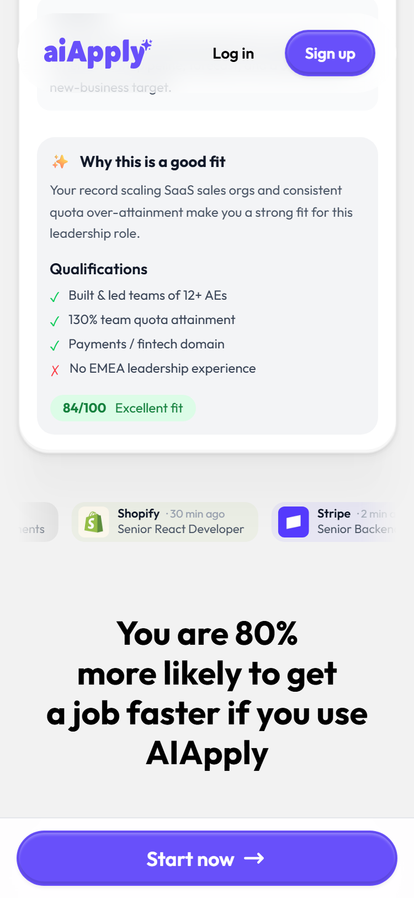

- 匹配卡的形：「Why this is a good fit」一段话，资格逐条 ✓ 或 ✗（例：✗ No EMEA leadership experience），再加一个分（例：84/100 Excellent fit）。地点是硬过滤（按城市约 50km 半径），职位名、经验进重排模型算 Job Fit Score。（一手：[首页][home]、[文案表][en]）
- 分有四种，各管各的：编辑器里的 Resume Score 进度条、扫描器的 Keyword Match Score 百分比（加缺失词、已找到词、ATS 排版建议）、只有定制后才有的 ATS 分、求职信检查器 1–100 分（75 以上算强）。Auto Apply 的 fit score 是人和岗的匹配分。（一手：[简历视频 1:47][v-resume]、[扫描视频 0:39、0:49][v-scan]、[帮助：AI 检测][h-ai-detect]、[求职信检查器][clcheck]）
- 扫描器演示里，改完简历后原来缺的 JD 词（CEU、white papers、case studies、trade shows、lead capture）全变「已找到」，分数从 38% 升到 86%，视频没展示简历是怎么改的。（一手：[扫描视频 0:39、1:17][v-scan]）
- 扫描器建议里有两个防编造的小写法：用条件句（「如果没有营销学士学位，可以写相关课程，或注明同等经验（如适用）」）；量化的地方不替用户填数，留 X 份、Y%、Z 场的空。（一手：[扫描视频 0:59][v-scan]）
- 站内投单个岗时，先做一次 quick check 出 /100 分，分低提示「Applying with a :score/100 resume score is not recommended!」，引导去改或跳过；然后问「Are you authorized to work in this location?」「Will you require visa sponsorship?」，再进「Review your application」页点 Submit。步骤顺序是按文案推的。（一手：[文案表][en]）

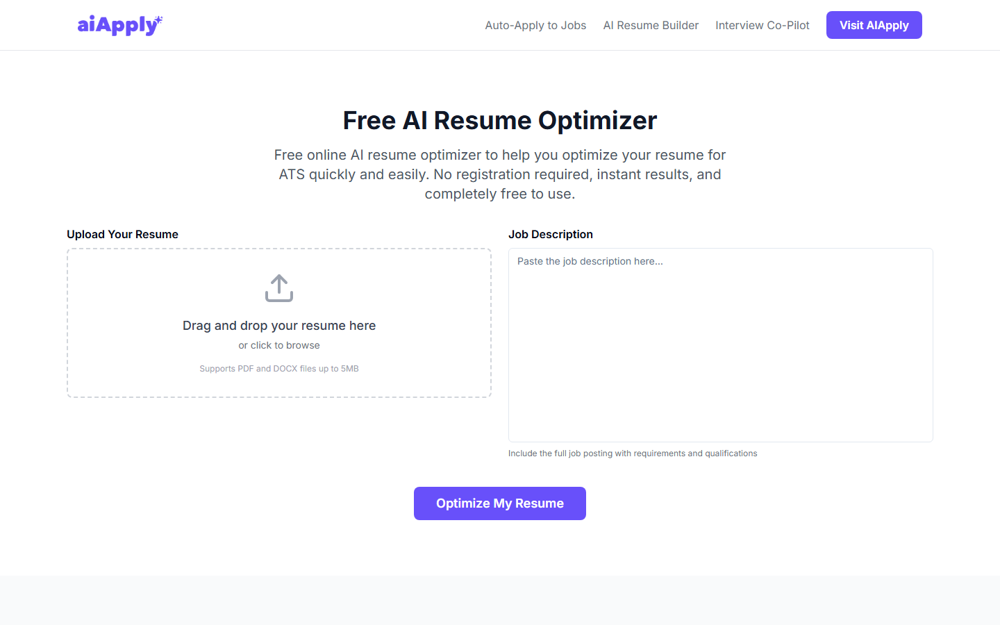

### 2.6 用户在哪一步看得到稿子（汇总）

| 路线 | 什么时候看得到改写稿 | 能不能直接改 | 有没有逐条批准或改动对照 |
|---|---|---|---|
| Premium 改简历 | 生成后进编辑页 | 能，逐行手改或叫 AI 改 | 没有；只有「AI Generated」标签 |
| Premium 写信 | 生成后进编辑页 | 能，整封直接改 | 没有；AI Edit 回一段改动摘要 |
| Application Kit | 生成后 | 简历和信同上，邮件模板只能复制 | 没有 |
| Auto Apply 加 Tailoring | 投出后才能看 | 不能 | 没有；Review 模式只批准岗位 |

其余截图：[简历改写页](img/AIApply-简历改写-手机-20261005.png)、[简历扫描三步](img/AIApply-简历扫描-三步-手机-20261005.png)、[简历翻译](img/AIApply-简历翻译-手机-20261005.png)、[简历生成器五步](img/AIApply-简历生成器-五步-手机-20261005.png)、[自动投递五步](img/AIApply-自动投递-五步-手机-20261005.png)、[领英转简历](img/AIApply-领英转简历-手机-20261005.png)，同名「桌面」版在同一目录。

## 3. 收费与限制

| 买什么 | 价格 | 包含与限制 | 来源 |
|---|---|---|---|
| Premium（手动工具箱） | US$29/月；US$144/年（折 $12/月，比价页拿 $12 做大字，$29 小字括注） | 简历生成器、求职信、Application Kit、模拟面试；FAQ 说不限次 | 一手：[帮助：Premium][h-plans-acct]、[比价页][cmp-teal] |
| Auto Apply | US$49/月 100 次；$99/月 250 次；$199/季 750 次（季付第一天全到账） | 只有投成功才扣；加量只能升级（$199→600、$299 或 $399→1,000、$499→2,000，两篇帮助对不上） | 一手：[帮助：额度与扣费][h-credits]、[帮助：用额度][h-use-credits] |
| 自动投时每岗改简历 | US$12/月（加区 iOS CA$17） | 和改信互不包含；发前不给看、不能编辑；不开就发原件 | 一手：[帮助：价目][h-pricing]、[帮助：Tailoring 入门][h-tailor-start]、[iOS 加区][ios-ca] |
| 自动投时每岗改信 | US$12/月（CA$17） | 另一篇说申请要求附信时自动写、不用设置，前后矛盾；不能上传自己的信 | 一手：[帮助：怎么定制][h-tailor-how]、[帮助：额度与扣费][h-credits] |
| Search Only | US$12/月 | 每天最多推 10 个匹配 75% 以上的岗，不代投 | 一手：[帮助：Search Only][h-search-only] |
| 免费档 | $0，没有试用期 | 模拟面试 2 次、职位板、收藏、「有限」封求职信（数没写）；简历生成器不能用 | 一手：[帮助：免费][h-free] |
| 免注册小工具 | $0 | Resume Optimizer：上传简历（PDF、DOCX，5MB）加 JD，15–30 秒出缺词、弱动词、改写 bullet、ATS 分；Cover Letter Checker 打 1–100 分并给改写示范 | 一手：[优化工具][opt]、[求职信检查器][clcheck] |
| 凑齐自动投 + 改简历 + 改信 | 网页最低 US$73/月；加区 iOS 约 CA$103/月 | 按官方价相加 | 推断 |

加区 iOS 内购（加元，一手：[App Store 加区][ios-ca]）：Auto-Apply Starter $69、Pro $129、Pro+ $249、Elite $249、Power $399、Ultra $699；Premium $39；Resume Tailor $17；AI Cover Letter $17；Interview Buddy $25。档名对应多少次没写，按美区价推是 100 / 250 / 600 或 750 / 1,000 / 2,000（推断）。

限制和坑：

- **自动续费**：所有订阅自动续，按当时价续；账期结束前至少 24 小时取消才拦得住；同时有几个订阅要逐个取消。（一手：[条款 §10][tos]、[帮助：取消续费][h-cancel-renew]）
- **挽留关**：点取消先问为什么，再弹「暂停 1 / 2 / 3 个月」，要点「No thanks, continue cancelling」才算；在暂停页关窗口，订阅照常续。（一手：[帮助：取消][h-cancel]）
- **退款**：原则不退。可退的只有：可复现的技术故障（要截图和复现步骤）、误购 30 分钟内申请且没用过。续费、已投出的、不满意结果、买错计划都不退。首页 FAQ 却写「case-by-case… often provide prorated refunds or credits」，比条款宽。（一手：[条款 §10][tos]、[帮助：退款][h-refund]、[首页 FAQ][home]）
- **额度过期**：营销页写「they never expire」；帮助中心说只在订阅期内结转，一取消就作废，重订从 0 开始。（一手：[Auto Apply 页][aa]、[帮助：订阅结束][h-credits-end]）
- **周价示意**：没有周付，但官方承认平台上可能显示周价，只是折算，实际按月、季、年扣。（一手：[帮助：发票][h-invoices]）
- **币种和付款**：网页一律按 USD 扣、含 VAT；Stripe 收卡，排障里提 Apple Pay、Google Pay；帮助中心搜 PayPal、Alipay、WeChat、Klarna 都是零结果；iOS 走 Apple 内购。（一手：[帮助：币种][h-currency]、[帮助：付款方式][h-payment]、[帮助：付款排障][h-pay-trouble]）
- **标「免费」的付费件**：简历生成器页结构化数据写价格 0、「Free to try, no credit card required」，帮助中心说免费档不能用；求职信页标题「Free AI Cover Letter Generator」，按钮直接跳注册；改写页写「no account required」，按钮同样跳注册。（一手：[简历生成器页][rb]、[求职信页][clg]、[改写页][rewriter]、[帮助：免费][h-free]）
- **学生折扣**：学生页写 40% off，帮助中心又写「Discount plans are not generally available」。（一手：[学生页][students]、[帮助：发票][h-invoices]）
- **语言**：界面 13 个 locale，没有中文、韩文（zh.json、ko.json 都是 404）；简历翻译只支持 6 种欧洲语言；Auto Apply 里的信用岗位帖的语言写。（一手：[llms.txt][llms]、[简历翻译页][rtrans]、[帮助：怎么定制][h-tailor-how]）

更正旧稿（[代投竞品调研-求职信与匹配-20261004](代投竞品调研-求职信与匹配-20261004.md) 第 23 行，二手）：Auto Apply 不是「按次数另卖、次数不过期」，是按月或季自动续费的订阅，加量只能升级，「不过期」只在营销页成立；「每岗定制得另买」现在有一手价，改简历、改信各 US$12/月，分开订。

## 4. 用户夸什么、骂什么

总盘：

- Trustpilot 4.2 分、1,888 条；5 到 1 星占 65 / 18 / 3 / 2 / 12%。（二手：[Trustpilot][tp]）
- 这个分多半来自公司发的邀评链接：最近 200 条里 168 条来自 BasicLink，其中 158 条是 4–5 星（94%）；用户自己来写的 32 条里 24 条是 1 星（75%）。（二手：页面内嵌数据，本稿统计）
- 好评很短：最近 164 条 4–5 星的字数中位数 14 个英文词，只有 19 条（12%）提到简历、求职信或定制；有几条自己说「刚开始用」。（二手：本稿统计）
- 新 iOS App（2026-08-24 上架）：美区 2.8 分（38 个）、加区 2.5 分（8 个）、英区 4.1 分（14 个）；美区最新 8 条有 7 条 1 星，6 条骂「找工作还得先付 $49–50 一个月」。BBB 评级 F。（二手：[App Store][ios-us]、[评论 RSS][ios-rss]、[BBB][bbb]）

骂收费（1 星样本 200 条，2025-01 到 2026-10）：

- 145 条（73%）提到钱；107 条（54%）明确是扣款、退款、续费、取消、试用；60 条提 refund，39 条提取消。抽查 16 条，命中约九成。（二手：[Trustpilot 1 星][tp1]，本稿统计）
- 典型：页面显示 €14 每周，结账实扣 €171；以为只买一周，被扣一个月再加一周（加拿大用户）；试用期内取消照样扣；续费前没提醒；填完资料、传完简历才看到价格，被骂「数据农场」。公司回复都说不卖周订阅、价格购买前显示。（二手：[评价 1][r-week1]、[评价 2][r-week2]、[评价 3][r-trial]、[评价 4][r-renew]、[评价 5][r-datafarm]、[评价 6][r-price-after]；公司回复是一手）

骂文书（通读 296 条 1–3 星里提到文书的 104 条，手工归类，约数，一条可能算进几类）：

| 类 | 条数 | 例子 |
|---|---|---|
| 空泛、内容被压缩、像 AI 写的 | 约 18 | 资深岗的专业细节被删光；整段经历压成 3 条；语言、技能两节整节漏掉就发出去了（二手：[评价][r-compress]、[评价][r-sections]） |
| 号称每岗定制，实际没改或只换几个词 | 约 12 | 「只改了两个关键词」，公司回复建议改用 Tailor to a Job Post（二手：[评价][r-2kw]；回复一手） |
| 编造或写错事实 | 约 11 | 写了没有的技能、不存在的经历、不会说的语言，还投了要求乌克兰语的岗；信里写有学士学位，其实没有（二手：[评价][r-fab1]、[评价][r-fab2]） |
| 不能改、格式受限 | 约 7 | 信只能输提示词让它重写；自动投出的文书不能改（二手：[评价][r-noedit]） |
| 语言出错 | 约 4 | 一半英文一半法文；默认美式英语；魁北克双语岗处理不了（二手：[评价][r-us-en]） |
| 申请表替用户答错 | 约 3 | 告诉雇主他有工作许可（其实没有）、薪资报低；被答成会波兰语和乌克兰语；担保资格答错（二手：[评价][r-permit]、[评价][r-lang-form]、[评价][r-sponsor]） |

- 「用了旧简历」「看不到发出去的是哪版」也反复出现：更新简历后信里还是旧职位。（二手：[评价][r-old-cv]、[评价][r-which-ver]）
- 自评分偏高：同一份简历它打 100%，ResumeWorded 只给 36%。（二手：[评价][r-score]）
- 几乎没人骂关键词堆砌，只有 1 条反过来说「只换了两个关键词」。「ChatGPT 免费就能做」反复出现。（二手：[评价][r-chatgpt]）

夸什么：

- 省时间，每个岗自动出一封信，有人夸「每岗一封精致的信」；有人说按 JD 微调帮他拿到面试。一条 3 星说求职信是最好的功能，简历一般、错多。（二手：[评价][r-good1]、[评价][r-good3]）
- 竞品 Remote Job Assistant 说用 15 个 JD 测过：信会对着 JD 改，但关键词过头、像机器人，建议只当初稿、开头自己重写；技能栏每次都对上。这家是竞品，有偏向。（二手：[测评][rja]）

## 5. 对我们

### 5.1 逐条对照 B2 现有决定

| 我们定的 | AIApply 怎么做 | 照抄 / 不抄 / 改着抄 | 我们怎么做 |
|---|---|---|---|
| 求职信 v1 只用模板 | 每岗 AI 写整封（4 段、约 150 词） | 改着抄 | 模板照它的段落形：开头点岗位名和公司名（从数据填），中间一段固定的安全句，结尾客套。以后改写只动中间那段 |
| 不做富文本 | 整封纯文本直接改，下载纯文字 PDF，没有工具栏 | 照抄（已一致） | 不动 |
| 发前预览 | 手动那条生成后自己下载去投；自动那条发前不给看 | 自动那条不抄 | 预览一步保留，这是差异点 |
| 匹配检查回简历模块，只列缺项 | 资格逐条 ✓ ✗ 加分数；扫描器关键词分 38% 升到 86% | 改着抄 | 只抄 ✓ ✗ 清单，不打分；改法用条件句，数字留空让用户填 |
| 事实结论免费、省操作才收费 | 扫描免费、改写收费；但页面标免费、点了要注册 | 照抄切法，不抄话术 | 缺项照 08-03 免费看前 5 行，改写收费；写免费的地方就真免费 |
| 一次性 CA$5 / 30 天、CA$13 / 90 天 | 订阅自动续费、加购、挽留关、周价示意；1 星约一半骂这个 | 不抄 | 不动；定价在投递前就看得到，不做周价折算 |
| 发邮件附原件简历 + 求职信 PDF | 简历先「重建进模板」才能改；读不进的原样发 | 改着抄 | 原件照发不动；改简历先只给逐条改法让用户改自己的文件；整份重排放到最后议 |
| 投递记录存当次发出的信 | 每岗一份版本挂在底稿下；投递记录看得到用的哪版简历 | 照抄 | 建议投递记录再记一格：当次附的简历文件名和上传时刻（简历替换即覆盖，不记就查不到发的是哪版）。B2 要不要带，Frank 定 |
| 回信走 reply.offer2pr.com | 每人一个转发邮箱，还替用户注册 ATS、收验证码 | 改着抄 | 只收回信转发，不替用户注册任何账号 |
| 工签类型第一次投递时问 | 自动投替用户答工作许可、担保，有人被答错 | 不抄 | 工签、担保、年限这类事实只用用户自己的答案，模型不写 |
| 用户多是中文母语、简历常是中国经历 | 界面没有中文；简历翻译只 6 种欧洲语言；有人骂中英、英法混杂 | 改着抄核对屏 | 简历模块上传后加核对屏：公司名、学校名、职位名的英文写法由用户定，模型不译专有名词；发给雇主的一律英文、加拿大拼写 |
| — | AI Edit 聊天栏、Tone 和 Length 多参数 | 不抄 | 只做一个「按这一岗改写」钮，能点选不打字 |
| — | 「能绕过 AI 检测」话术 | 不抄 | 08-03 定的「不用标 AI」照旧，也不宣传绕检测 |

### 5.2 分期

**期 0：B2（现在，不接模型）**

- 用户能做什么：作为求职者，我上传一份简历，投递时拿到一封按这一岗填好职位名和公司名的信，在多行框里改，预览后发出，雇主收到原件简历和信的 PDF。
- 要防：
  - 编造：默认模板只写不会错的句子，10-03 效果图样信里「two years of relevant experience in Canada」这类关于用户本人的话不进模板（B2 已定）。
  - 中文名 PDF 字体：pdf-lib 自带字体只认西文，框里拦非西文（B2 已定）。另要注意签名的姓名是从账号填的，注册名若是中文同样画不出来，投递页要让用户填拉丁字母写法（推断，没实测）。
  - 关键词堆砌：不涉及。
- 成本：模型 $0。

**期 1：收费链（C 批）跑通后，「按这一岗改写」信的中间一段**

- 用户能做什么：作为求职者，我在求职信那一步点「按这一岗改写」，等几秒，中间一段换成按这个岗写的（约 80–120 词），新出现的公司名、技能、年限、学历、数字标出来，我逐条勾「我确实有」，没勾的不进信；改完照常预览、发送。
- 怎么做：输入 = 简历抽出的文字 + `jd_formatted` 的 [REQS] 段（09-21 覆盖率约 32%，要重查，没有就用 JD 原文）；输出只要一段英文、加拿大拼写；开头的岗位名、公司名和结尾的姓名仍从数据填。新事实的核对用代码做：把输出里的专有名词、数字、年限拿去和简历原文比，对不上的标出来，不再调一次模型。
- 要防：
  - 编造：上面那一步逐条勾选，这是 AIApply 没有的一步；工签、担保只用用户自己的答案。
  - 关键词堆砌：提示词只许用简历里有对应经历的要求，缺的不写进信；不打分。
  - 中文简历：专有名词照简历原文的写法搬，不让模型译；简历是中文的，先引导去期 2 的核对屏定好英文写法。
  - 中文名 PDF：输出照样过非西文拦截。
- 成本：见 5.3。闸三道：只在点钮时调用；按（简历版本，岗位号）缓存，同一岗再点不重算；每天上限，数值等选定模型后按单价定。

**期 2：简历模块（09-14 定的那个），缺项清单 + 逐条改法**

- 用户能做什么：作为求职者，我上传简历后先过一遍核对屏，确认抽出的经历、学历、技能对不对、英文写法是不是我要的；在某个岗上点「对照这一岗」，看到缺哪几条（免费看前 5 行，照 08-03）；付费用户还能看到「这几条可以这样改」，比如「如果你做过 X，可以写成……」，数字留 X、Y% 让我自己填；我把改法抄进自己的简历文件，再传一份新的。
- 要防：
  - 关键词堆砌：不出百分比，不出「改完分数涨到多少」；AIApply 38% 升到 86% 的演示正是在诱导往简历里塞 JD 原词。
  - 编造：改法只针对简历里已有的条目；缺的只列缺，不替用户写进去。
  - 中文简历：核对屏就是给中国经历用的，公司名用拼音还是英文名由用户定。
  - 中文名 PDF：期 2 不生成简历文件，用户发的还是自己的原件，不涉及。
- 成本：见 5.3；现成的 `/api/resume/match`（09-14 按钮撤掉了，代码还在）是这一期的底子。

**期 3：按岗生成整份简历 PDF（AIApply 那种，前两期有数据再议）**

- 用户能做什么：作为求职者，我在某个岗上点「为这一岗生成简历」，拿到一份按这个岗重排的英文简历，在分节表单里改，存成这个岗的版本，投递时附这一份。
- 为什么排最后：要先有结构化简历（期 2 核对屏的结果）、一套英文简历模板、pdf-lib 自己算排版；简历里的中国公司名、学校名一旦要画中文，就要加 `@pdf-lib/fontkit` 和中日韩字体（完整字体十几 MB 级，要子集化；一般常识，没实测）。AIApply 自己的演示都留着乱码和粘词，这一步做不好比不做伤人。
- 开工判据要 Frank 定，比如期 1 改写钮的点击率、勾选后的弃用率、有没有用户来要整份重排。
- 要防：编造（同期 1 的逐条勾选，范围扩到整份）、关键词堆砌（同期 2）、中文字体（上面那条）。

### 5.3 成本口径（只写量级）

依据：Claude Haiku 4.5 每百万 token 输入 US$1、输出 US$5；Sonnet 5.5 输入 $2、输出 $10（Anthropic 官方价，claude-api 资料 2026-09-25 缓存）；`cms/src/lib/llm/constants.ts` 的注释口径是「单次 1–2k 进 + ≤500 出 ≈ $0.004」；`lib/resume` 现有上限是送模型的简历 12,000 字符、JD 与简历各 8,000 字符、匹配输出 Pro 1,600 token。token 按英文约 4 个字符 1 个、中文约 1 个字 1 个以上粗算，没用 count_tokens 实测；中文简历的 token 数粗估是同内容英文的 2 倍左右。

| 动作 | 进 | 出 | Haiku 4.5 | Sonnet 5.5 | 朋友 qwen |
|---|---|---|---|---|---|
| 期 1：改写信的中间一段 | 约 2–4k | 约 150–250 | 约 US$0.003–0.005 | 约 US$0.006–0.01 | $0；同后端改写一篇 JD 约 7–11 秒，排队另算 |
| 期 1：新事实核对 | — | — | $0（代码比对） | $0 | $0 |
| 期 2：缺项清单加逐条改法 | 约 3–5k | 约 800–1,600 | 约 US$0.007–0.013 | 约 US$0.014–0.026 | $0；现有匹配就跑在这里 |
| 期 3：整份按岗重排 | 约 3–5k | 约 1.5–2.5k | 约 US$0.01–0.02 | 约 US$0.02–0.04 | $0；质量没评过 |

- 最坏情况（照 09-23「每天最多 20 封」）：一个 30 天包投满 600 封、每封都点改写，Haiku 约 US$2–3（约 CA$3–4，汇率按 1.4 粗算没核），快吃掉整个 CA$5。所以期 1 的缓存和每天上限不能省；正常用量会低得多。
- 朋友 qwen 每次 $0，但和 JD 译文、jdformat 批量任务共用一个队列，生产要走 ngrok 那条线；家里那台本地 Ollama（192.168.1.150）是批量翻译用的，生产 cms 连不到，不适合用户点一下就要结果的场景（推断）。
- 质量线：08-11 同后端的 AI 顾问被判「没法和 GPT 比」，09-28 删了。期 1 开工前照 10-04 拍板题 2 的推荐 A 做：20 个真实岗加 Frank 的简历，qwen 和 Haiku 各写一遍，Frank 盲评，qwen 过线用 qwen，不过线用 Haiku。

### 5.4 期 1 开工前要定的（不急）

1. 用哪个模型：推荐照上面盲评定。
2. 免费的 3 封里给不给改写钮：推荐给，让人付钱前先看到值，3 次成本不到 US$0.02；按收费原则「一键生成」本是收费项，所以要 Frank 点头。
3. 投递记录记不记当次附的简历文件名和上传时刻：推荐记，成本两格字段；B2 带还是期 1 带都行。

## 6. 没查实的

- 登录后的界面没亲眼看过：弹框、编辑页、AI Edit、Application Kit 全来自官方视频的公开拖动预览帧（320×180 到 720p，有剪辑）和 en.json 文案；视频本身没放（播放器要发 POST，按规则全拦）；字幕是 YouTube 自动识别的。
- 求职信弹框「Advanced (optional)」里有什么；Tone、Length 两组选项放在哪；帮助中心说的「学生、自由职业、职场人」风格在哪选。
- AI Edit 能不能只改选中的一段（FAQ 说能，视频只演示整封）；简历编辑器 Tailor to a Job Post 页签点开怎么用；有用户 2025-10 说信「只能输提示词重写、不能直接改」，和 2026-08 视频里能直接改对不上，可能是改版。
- 有没有防编造机制：会不会标出新加的句子、会不会拦住无中生有的经历，都没找到说明。
- Resume Score 怎么算，和 Keyword Match Score 是不是一套；扫描演示 38% 到 86% 之间是手改还是一键改。
- 生成的简历和信能不能指定用中文或其他非英语写；Auto Apply 的信「按岗位帖语言写」具体怎么判。
- Auto Apply 排队期间到底能改什么：条款说发前不给看，界面又说还能改简历和信，边界要登录才能核。
- 结账页没进（要先走完问卷、填邮箱、过 OTP）：有没有首单优惠、加拿大 IP 显示什么币种估价、是不是真大字显示周价；问卷页数据里的 12 / 12 / 29 / 19 是什么单位和周期；网页结账是否开放 Apple Pay、Google Pay，有没有微信、支付宝。
- 帮助中心几处数字互相矛盾，哪个现行不知道：Hybrid 阈值 70 还是 75%；1,000 次档 $299 还是 $399；600 次档按月还是按季；模板 6 个还是 30+；自动投时的信要不要另付 $12。
- 免费档「有限」封求职信是几封；免费生成的信能不能复制、下载。
- iOS 档名（Starter、Pro、Pro+、Elite、Power、Ultra）对应多少次投递，是按美区价推的。
- AutoApply User Agreement、Interview Buddy Terms 两份专项条款没有公开链接，可能另有退款或续费条款。
- 学生 40% 折扣管不管 Auto Apply 和 Tailoring 加购。
- 入门问卷只截了首屏；页面数据里 variant 为 "pre"，说明有 A/B 变体，题数和顺序可能不一样。10-03 Frank 说的「一进来问 30 多道题」应该就是这份问卷，题数没数。
- Chrome 商店「aiApply : Cover Letter Generator」（2,000 用户，4.4 分）署名开发者是 radarlinkedin，不是 AiApply Ltd，是不是官方的不知道。（一手：[商店页][cws]）
- 二手站把 App Store 编号 id6466998706 当成 AIApply，这个编号现在是另一款「Sawell: AI Job Agent」，别引用；官方是 id6791593934。（一手：[旧编号页][ios-old]、[帮助：App][h-app]）
- Reddit 一条原帖都没拿到（工具和内置浏览器都被拒）；要补得 Frank 本机浏览器看。G2 返回 403。
- Trustpilot 1 星共 220 条，只抓到最新 200 条（第 11 页起要登录）；邀评字段写 BasicLink、invited，页面却显示「Unprompted review」，两个标签各指什么没核实；2026 年 4 到 6 月是否挂过「误导展示」警告，只有竞品和聚合站这么说（二手：[jobhire][jobhire]、[checkthat][checkthat]）。
- 退款窗口：用户说客服讲 2 小时，条款写 30 分钟，实际按哪个不明。
- 加拿大 IP 下没出 Cookie 横幅（Cookiebot 脚本加载了），欧盟访客看到的可能不一样；截图时拦了非 GET 和跟踪请求，少量动画或懒加载图可能没出来。
- 我们这边：成本表的 token 数是按字符粗算的，没实测；`jd_formatted` [REQS] 覆盖率要重查；pdf-lib 字体限制、中日韩字体大小是一般常识，仓库里还没装 pdf-lib。
- 视频单帧、定价页、Trustpilot 的原始截图还在会话 scratchpad（`aiapply/shots`、`aiapply-pricing`、`aiapply_complaints`），没拷进 img/，要留档由 lead 挑。

[llms]: https://aiapply.co/llms.txt
[okf-co]: https://aiapply.co/okf/company/aiapply.md
[home]: https://aiapply.co/
[aa]: https://aiapply.co/auto-apply
[aaform]: https://aiapply.co/product/auto-apply/form
[aaseq]: https://aiapply.co/build/assets/auto-apply-field-sequence-BQBzuopI.js
[en]: https://aiapply.co/translations/en.json
[tos]: https://aiapply.co/terms-of-service
[tpl]: https://aiapply.co/resume-templates
[okf-rb]: https://aiapply.co/okf/products/ai-resume-builder.md
[okf-tailor]: https://aiapply.co/okf/concepts/resume-tailoring.md
[rtrans]: https://aiapply.co/resume-translator
[clg]: https://aiapply.co/cover-letter-generator
[aiclg]: https://aiapply.co/ai-cover-letter-generator
[rb]: https://aiapply.co/resume-builder
[rewriter]: https://aiapply.co/ai-resume-rewriter
[opt]: https://aiapply.co/tools/resume-optimizer
[clcheck]: https://aiapply.co/tools/cover-letter-checker
[students]: https://aiapply.co/students
[cmp-teal]: https://aiapply.co/compare/aiapply-vs-teal
[v-resume]: https://www.youtube.com/watch?v=KVnTLuv7INk
[v-cl]: https://www.youtube.com/watch?v=8akAjkOVaWw
[v-aa]: https://www.youtube.com/watch?v=NbhvID6_dTs
[v-scan]: https://www.youtube.com/watch?v=ReFKCUeVujE
[v-rebuild]: https://www.youtube.com/watch?v=iEBzREz6YKk
[h-premium-vs]: https://support.aiapply.co/en/articles/15126985-premium-vs-other-products
[h-tailor-start]: https://support.aiapply.co/en/articles/15112038-getting-started-with-tailoring
[h-tailor-how]: https://support.aiapply.co/en/articles/15112741-how-tailoring-works
[h-ai-detect]: https://support.aiapply.co/en/articles/15692859-resume-tailoring-ai-detection
[h-access]: https://support.aiapply.co/en/articles/15069796-how-can-users-access-and-manage-tailored-resumes-on-aiapply
[h-review-docs]: https://support.aiapply.co/en/articles/15113681-reviewing-your-tailored-documents
[h-cl]: https://support.aiapply.co/en/articles/15127171-cover-letter-generator
[h-kit]: https://support.aiapply.co/en/articles/15127206-application-kits
[h-trouble-premium]: https://support.aiapply.co/en/articles/15127233-troubleshooting-premium
[h-rb-edit]: https://support.aiapply.co/en/articles/15127127-resume-builder-editing-exporting
[h-rb-start]: https://support.aiapply.co/en/articles/15127008-resume-builder-getting-started
[h-rb-premium]: https://support.aiapply.co/en/articles/15693010-resume-builder-premium
[h-queue]: https://support.aiapply.co/en/articles/15216806-tracking-controlling-your-queue
[h-modes]: https://support.aiapply.co/en/articles/14182222-what-are-the-application-modes
[h-set-resume]: https://support.aiapply.co/en/articles/15704885-how-to-update-and-set-your-resume-for-auto-apply-in-aiapply
[h-correct]: https://support.aiapply.co/en/articles/15071039-how-can-users-correct-incorrect-information-in-their-applications-on-aiapply
[h-plans-acct]: https://support.aiapply.co/en/articles/15126913-premium-plans-account
[h-free]: https://support.aiapply.co/en/articles/15692800-free-trial-getting-started
[h-credits]: https://support.aiapply.co/en/articles/16864279-how-plans-credits-and-charges-work
[h-pricing]: https://support.aiapply.co/en/articles/15692812-pricing-billing
[h-use-credits]: https://support.aiapply.co/en/articles/15504519-how-do-i-use-my-credits
[h-credits-end]: https://support.aiapply.co/en/articles/15070980-what-happens-to-credits-when-a-subscription-ends-or-is-downgraded
[h-cancel-renew]: https://support.aiapply.co/en/articles/15070845-how-can-i-cancel-my-subscription-and-stop-auto-renewal
[h-cancel]: https://support.aiapply.co/en/articles/16992039-cancel-your-subscription
[h-refund]: https://support.aiapply.co/en/articles/15069772-what-is-aiapply-s-refund-policy
[h-search-only]: https://support.aiapply.co/en/articles/16208258-what-is-the-search-only-plan
[h-invoices]: https://support.aiapply.co/en/articles/15169716-billing-invoices
[h-currency]: https://support.aiapply.co/en/articles/15383038-in-what-currency-are-fees-charged-and-why-might-i-see-a-different-currency
[h-payment]: https://support.aiapply.co/en/articles/15860974-billing-managing-your-subscriptions-and-payment-method
[h-pay-trouble]: https://support.aiapply.co/en/articles/15556705-troubleshooting-billing-payments
[h-app]: https://support.aiapply.co/en/articles/16764354-getting-started-with-the-aiapply-app
[ios-ca]: https://apps.apple.com/ca/app/aiapply-ai-job-search/id6791593934
[ios-us]: https://apps.apple.com/us/app/id6791593934
[ios-rss]: https://itunes.apple.com/us/rss/customerreviews/id=6791593934/sortBy=mostRecent/json
[ios-old]: https://apps.apple.com/us/app/aiapply/id6466998706
[cws]: https://chromewebstore.google.com/detail/ai-cover-letter-generator/aceohhcgmceafglcfiobamlbeklffhna
[tp]: https://www.trustpilot.com/review/aiapply.co
[tp1]: https://www.trustpilot.com/review/aiapply.co?languages=all&stars=1
[bbb]: https://www.bbb.org/us/ca/berkeley/profile/virtual-assistant-employment/aiapplyco-1116-965510
[rja]: https://www.remotejobassistant.com/blog/aiapply-review
[jobhire]: https://jobhire.ai/blog/aiapply-reviews
[checkthat]: https://checkthat.ai/brands/aiapply/reviews
[r-week1]: https://www.trustpilot.com/reviews/6aa3c51981cb34df71b4f5db
[r-week2]: https://www.trustpilot.com/reviews/6ac2e2edcd36faaec5cf8528
[r-trial]: https://www.trustpilot.com/reviews/6ab2a4c0fe2ab27902c56322
[r-renew]: https://www.trustpilot.com/reviews/6abad8db9845b5f386e97804
[r-datafarm]: https://www.trustpilot.com/reviews/6a51f0e6ba5ef09c83934039
[r-price-after]: https://www.trustpilot.com/reviews/6a6515ca708bfdebc0bf8d3a
[r-fab1]: https://www.trustpilot.com/reviews/6a3d668d261eb49b5794a8d4
[r-fab2]: https://www.trustpilot.com/reviews/6793458d3485c44b22a375c3
[r-permit]: https://www.trustpilot.com/reviews/6abda879ff2c6cfe19dcd864
[r-lang-form]: https://www.trustpilot.com/reviews/6981f7b2430e7369fdf301b9
[r-sponsor]: https://www.trustpilot.com/reviews/6abcc088e808d7c96af22c4f
[r-2kw]: https://www.trustpilot.com/reviews/6807fb07c27e3f491a4e7791
[r-old-cv]: https://www.trustpilot.com/reviews/6ab1301d0c9dfde40352739f
[r-which-ver]: https://www.trustpilot.com/reviews/698f5b346b0ccf2061a7ab77
[r-compress]: https://www.trustpilot.com/reviews/698e67e696aef8e7058af95c
[r-sections]: https://www.trustpilot.com/reviews/69c5144d9fa504457fb64500
[r-noedit]: https://www.trustpilot.com/reviews/68fb603d9c18c85a7d6376e0
[r-score]: https://www.trustpilot.com/reviews/67d1b1191df12cc3cf515c73
[r-us-en]: https://www.trustpilot.com/reviews/69a5a4511648107001663941
[r-chatgpt]: https://www.trustpilot.com/reviews/6989eabc115eb7611d4358f8
[r-good1]: https://www.trustpilot.com/reviews/6a8a3169002a33a010281d86
[r-good3]: https://www.trustpilot.com/reviews/6a5923a5144612fa8707aef3

## 审查更正(10-05,以本节为准;上文原样留着)

审查员逐条打开 25 个以上来源核对。条款(Review / Hybrid / Auto 三种模式)、额度与扣费、退款、取消挽留关、站内文案、iOS 内购价、5 个官方视频都对得上;下面这些要改:

**说法要改的**
1. 「发前不给看、不能改」降一档:官方帮助中心同一篇里既说投递前能审能改,又说投完才看得到;站内文案也有「还没投出去,下面的信和简历还能改」。站得住的一手只有「no pre-send approval step」那一句(https://support.aiapply.co/en/articles/15692859 )。所以「预览后再发」是我们的稳妥做法,但别说成「它完全没有」。
2. §2.2 的「核对屏」是拼出来的:那几条文案属于自动投递的设简历流程和申请表答案纠错,不是 Premium 里逐条核对简历;「按经历 / 教育 / 语言 / 技能分组」没找到出处。期 2 的核对屏是我们自己要做的东西,不标「照它抄」。
3. 用户骂得最多的不是编造:差评里「空泛、压缩、像 AI 写的」约 18 条,「号称定制其实没改」约 12 条,编造约 11 条,申请表答错约 3 条。期 1 除了防编造,还得回答「改得像不像人写的、改没改到点上」—— 这两条决定付费改写值不值钱。
4. 出处更正:改简历 / 改信各 US$12 / 月出自 https://support.aiapply.co/en/articles/16864279 ;「Azure OpenAI」出自站内文案(新比价文案写「GPT-5 via Azure OpenAI」,「微调 GPT-4」可能过时);界面是「14 种语言与地区变体」;公司页自称 Trustpilot 4.8、百万用户,实际 Trustpilot 4.2、首页计数 2,064,348。
5. 免费求职信:比价页写「免费档不限次 AI 求职信」,帮助中心写「有限次数」—— 营销与帮助自相矛盾,它正拿免费求职信当钩子。Interview Buddy 也有两处价格对不上(比价页算进 Pro 的 $12,帮助中心单卖 $19 / 月)。
6. 「凑齐自动投 + 改简历 + 改信最低 US$73 / 月」可能算多了:帮助中心写每次投递含一份定制简历和一封定制信,改信那 $12 可能本已包含。

**和我们 B2(10-05 已收窄)对不上、上文没提的**
7. 期 1「按这一岗改写」会和 Frank 10-05 拍的「改过的信记成模板」打架:按 A 岗改写的中间段会跟着模板进 B 岗的信。期 1 开工时要定:改写段不进模板(模板只记用户自己改的),或每岗重新改写。
8. 期 1 要的「简历文字」B2 没存(user_resumes 不存 resume_text,10-05 定)。期 1 开工时改成点钮时从原件现抽,缓存键用 user_resumes.updated_at 顶「简历版本」。
9. 中转回信、首投三题(工签身份)都已移出本批;期 1「工签、担保只用用户自己的答案」要等首投三题那批上了才有数据。署名 Frank 已拍(第 1 步填英文名)。
10. 期 1 内部顺序:中文简历的新事实核对靠代码比对英文输出和中文原文,会全标或全漏 —— 期 2 的核对屏(英文写法由用户定)得先于期 1,或期 1 先只对英文简历开。
11. 魁北克:发给雇主的信不是一律英文 —— 魁北克的岗按招聘帖语言写(AIApply 同此:https://support.aiapply.co/en/articles/15112741 );pdf-lib 的西文字体写得出 é、è、ç。
12. 隐私:期 1 / 期 2 要把简历送去模型(Haiku 或朋友的 qwen 服务器),开工时要同步改法律页(按 09-28 口径写泛称)。
13. §5.1 第一行「默认模板改成三段式」实际是改 B2 的默认模板,要 Frank 单独点头,不算「B2 一字不动」。
14. 期 2「缺项免费看前 5 行」和 08-14「事实与结论一律免费」有张力,留给 Frank 判。
15. 成本口径补:CA$5 的包扣掉 Stripe 手续费约 CA$0.45;「同一岗再点不重算」意味着用户不满意不能重写一次(AIApply 可以),这是产品取舍,要 Frank 定。

## 登录后后台(2026-10-05 补)

> 为「我的」四个页签(我的求职 / 我的收藏 / 我的资料 / 我的订阅)找参考,只看 AIApply。没登录:图来自官方 YouTube 教程 1080p 原片逐帧截取(画面里的讲解人和大字幕是视频自带)和 App Store 官方宣传图;文字来自帮助中心 support.aiapply.co。帮助中心 160 篇文章全扫过,**一张后台截图都没有**(只有站标),所以下面没图的块只有文字。

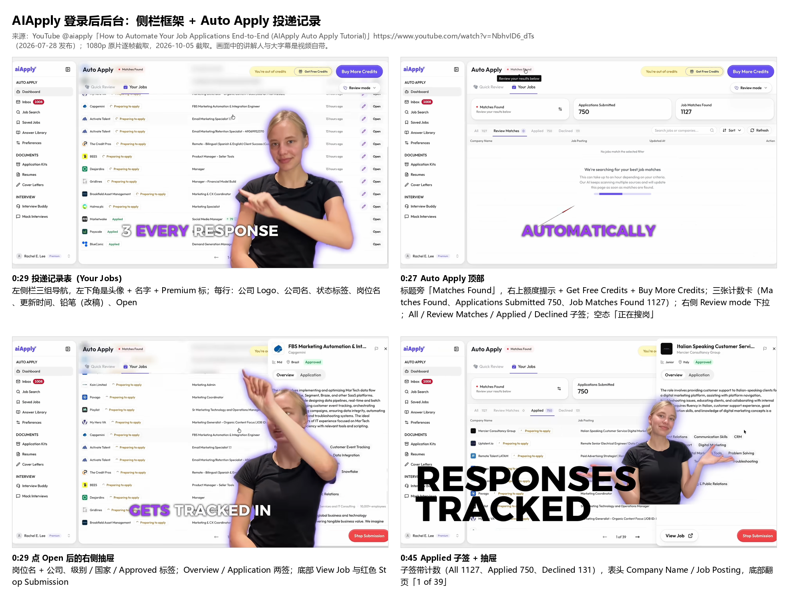

### 1. 后台整体框架

- 左侧栏分三组:AUTO APPLY(Dashboard / Inbox 带红色未读数 / Job Search / Saved Jobs / Answer Library / Preferences)、DOCUMENTS(Application Kits / Resumes / Cover Letters)、INTERVIEW(Interview Buddy / Mock Interviews);侧栏顶部是站标和折叠钮。
- 没有顶栏,每页自己的标题行就是顶部;Auto Apply 页右上常驻额度条(「You're out of credits」+ Get Free Credits + 紫色 Buy More Credits)。
- 账户入口在侧栏**左下角**:头像 + 名字 + 「Premium」小标 + 上下箭头(点开是菜单,视频里没点开)。账户设置是单独的 `/app/settings`,帮助中心提到的页签有 Preferences、Personal Info、Notifications、Billing、Export Data、Sign Out(含删号)。
- 手机 App 底栏四签:Apply / All jobs / Inbox / Profile(图见 [手机 App 对照板](img/AIApply-后台-手机App-20261005.png))。
- 来源:[自动投递视频](https://www.youtube.com/watch?v=NbhvID6_dTs)(2026-07-28)、[帮助:管理账户](https://support.aiapply.co/en/articles/15169458-managing-your-account)(2026-07-16 更新)。

### 2. 投递记录(Auto Apply 的 Your Jobs)

- 页面两签:Quick Review(逐个点 Apply / Decline,键盘左右键也行)和 Your Jobs。Your Jobs 上方三张计数卡(Matches Found、Applications Submitted、Job Matches Found),下面子签 **All / Review Matches / Applied / Declined**,每签带数字;右侧搜索、Sort、Refresh、Review mode 下拉。
- 表格列:公司 Logo + 公司名、状态标签、岗位名、更新时间(Updated At)、操作(铅笔改稿 + Open);底部翻页「1 of 39」。状态标签看到的有 **Preparing to apply(可改简历和信)→ Applying Now(锁定)→ Applied**,另有 Failed(没投成不扣额度)、Declined;Applied 行有时带匹配分(如 79)。
- 点 Open 弹右侧抽屉:岗位名 + 公司、级别 / 国家 / Approved 标签;帮助中心写三签 **Overview / Job fit / Review**(视频里旧版只有 Overview / Application 两签),Review 签里能看提交的简历、求职信、答过的申请题和代建的雇主账号密码;底部 View Job 外链和红色 Stop Submission。
- 空态:「No jobs match the selected filter」+「正在为你搜岗,最多要一小时」加进度条。队列本身另有状态:Pending / Applying / Done / Paused / System Paused / Inactive Subscription,Pause / Start 钮在 Your Jobs 页。Settings → Export Data 能把全部岗位导成 CSV(含匹配分、状态、投递日)。
- 来源:[视频](https://www.youtube.com/watch?v=NbhvID6_dTs) 0:27–0:45;[帮助:Dashboard & Inbox](https://support.aiapply.co/en/articles/14219952-dashboard-inbox-managing-your-queue-and-emails)(2026-09-24)、[帮助:Tracking & Controlling Your Queue](https://support.aiapply.co/en/articles/15216806-tracking-controlling-your-queue)(2026-07-17)、[帮助:监控投递与额度](https://support.aiapply.co/en/articles/15555591-how-can-i-monitor-my-applications-and-credits)(2026-07-17)、[帮助:导出数据](https://support.aiapply.co/en/articles/16666761-export-data-downloading-your-jobs-and-inbox-emails)(2026-08-27)。

### 3. Saved Jobs

- **未找到公开截图**(查过:帮助中心全部文章、5 条官方教程视频逐帧、App Store 宣传图;只有 Job Search 列表里每条岗位右侧的「Save」钮在视频 0:20–0:23 出现过)。
- 按帮助中心文字:每条收藏显示岗位名 + 公司、收藏于多久前、一个动作钮(能自动投的显示 **Auto Apply**,扣 1 额度;雇主系统不支持的显示 **Go to Listing**,跳原帖自己投、不扣额度)、Delete;页顶一个 Refresh。**没提批量投递**,是逐条点。
- 来源:[帮助:Saved Jobs](https://support.aiapply.co/en/articles/16666824-how-the-saved-jobs-section-works)(2026-08-27)、[帮助:Job Search](https://support.aiapply.co/en/articles/16889656-how-to-use-the-job-search-section)(2026-09-09)。

### 4. Resumes / Cover Letters

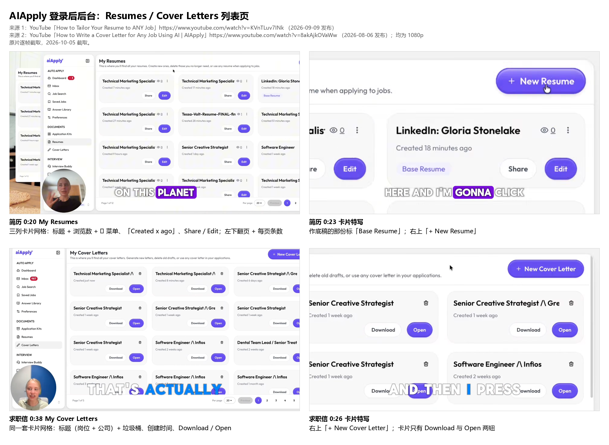

- 两页同一套形:标题「My Resumes / My Cover Letters」+ 一句说明,右上紫色「+ New Resume / + New Cover Letter」,下面三列卡片网格,左下「Page 1 of 12」+ 每页条数 + 页码。
- 简历卡:标题 + 眼睛图标浏览数 + ⋮ 菜单(含 Set as Base Resume)、「Created x ago」、**Share / Edit**;作底稿的那份多一个淡紫「Base Resume」标。求职信卡:标题(岗位 /\ 公司)+ 垃圾桶、创建时间、**Download / Open**。
- 新建都走弹框:选底稿简历(或从 LinkedIn 导入 / 上传)+ 贴招聘帖 → Generate。给 Auto Apply 用哪份,在简历编辑后点「Use for Auto Apply」或在 Preferences → Quick Settings 点「Use This Resume」。
- 来源:[改简历视频](https://www.youtube.com/watch?v=KVnTLuv7INk)(2026-09-09)0:20–0:29、[求职信视频](https://www.youtube.com/watch?v=8akAjkOVaWw)(2026-08-06)0:26–0:41;[帮助:Resume Builder 入门](https://support.aiapply.co/en/articles/15127008-resume-builder-getting-started)、[帮助:设置 Auto Apply 用的简历](https://support.aiapply.co/en/articles/15704885-how-to-update-and-set-your-resume-for-auto-apply-in-aiapply)(2026-08-10)。

### 5. Preferences(求职条件)

- **未找到公开截图**(查过:帮助中心、5 条视频、App Store 图;只有手机 App 宣传图 ④ 是投递模式三选一卡片)。
- 按帮助中心文字:页顶三签 **Quick Settings / Job Preferences / Answer Library**,后加了第四签 **Rejection Reasons**。Quick Settings:投递模式(Auto / Hybrid / Review)、邮件转发、选用哪份简历、目标职位名。Job Preferences 分段:① 职位与经验(求职状态、目标职位可多个、资历、行业方向、全职 / 兼职 / 合同)② 地点与时间(可合法工作的国家、远程 / 现场 / 混合、城市、愿不愿搬、可到岗日)③ 薪资(最低年薪)等;改了右上提示「You have unsaved changes」+ Save。
- Rejection Reasons:两段输入框「不想要的职位名」「不想要的技能要求」各配 Add;拒绝岗位时选的理由(过期 / 公司 / 地点 / 薪资 / 职位名 / 资历 / 技能)也会自动进这里。
- 来源:[帮助:Auto Apply 设置](https://support.aiapply.co/en/articles/14218613-auto-apply-settings-setting-up-your-profile-and-job-preferences)(2026-08-05)、[帮助:Managing your preferences](https://support.aiapply.co/en/articles/15216716-managing-your-preferences)(2026-08-06)、[帮助:Rejection Reasons](https://support.aiapply.co/en/articles/16889264-how-to-use-the-rejection-reasons-tab)(2026-09-09)、[帮助:Personal Info](https://support.aiapply.co/en/articles/15860922-personal-info-keeping-your-profile-accurate)(2026-08-05)。

### 6. 订阅 / Billing / 账户设置

- **未找到公开截图**(查过同上;视频里只看到侧栏左下「Premium」小标和 Auto Apply 页右上的额度条)。
- 按帮助中心文字:Account Settings → **Billing** 签,每个在用订阅一张卡:产品名(Auto Apply / Premium Subscription)、计费周期、价格、续费日期,卡上一个 **Cancel**;右上 **Update Card** 换卡(对所有订阅生效)。
- 取消流程:点 Cancel → 答几道离开原因 → 挽留页提供**暂停 1 / 2 / 3 个月** → 选「No thanks, continue cancelling」才算取消;取消后用到本期末,未用额度期末作废;要求续费前 24 小时取消。
- 账户设置其他签:Preferences(界面语言、简历上显示的邮箱、底稿简历、营销 Cookie 开关、推荐返额度)、Personal Info、Notifications、Export Data、Sign Out(内含 Delete Account,提醒先取消订阅)。
- 来源:[帮助:Billing](https://support.aiapply.co/en/articles/15860974-billing-managing-your-subscriptions-and-payment-method)(2026-08-25)、[帮助:取消订阅](https://support.aiapply.co/en/articles/16992039-cancel-your-subscription)(2026-09-17)、[帮助:Preferences 默认项](https://support.aiapply.co/en/articles/15860835-preferences-language-resume-and-account-defaults)(2026-07-17)、[帮助:退出与删号](https://support.aiapply.co/en/articles/15861019-sign-out-and-delete-account)(2026-07-17)。

### 7. Inbox(投递专用邮箱)

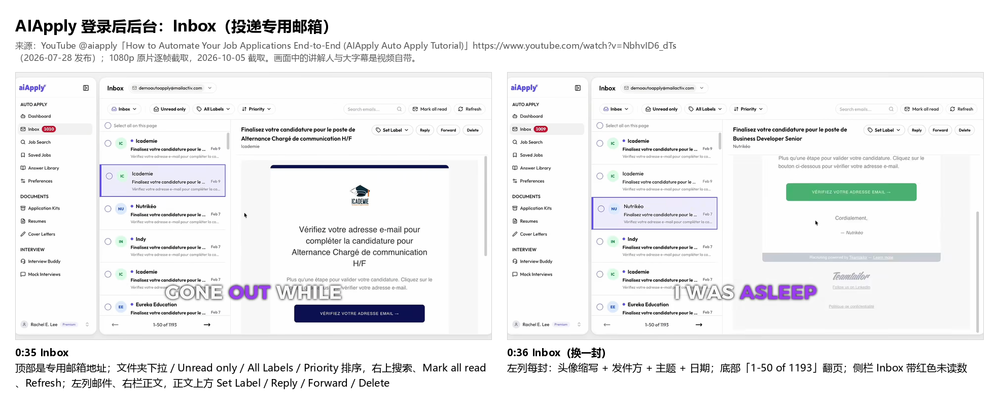

- 两栏邮件客户端形:顶部显示系统代开的专用邮箱地址;工具条 文件夹下拉(Inbox / Sent / Junk / Deleted)、Unread only、All Labels、Newest / Priority 排序,右上搜索、Mark all read、Refresh;左列每封 头像缩写 + 发件方 + 主题 + 日期 + 勾选框,底部「1-50 of 1193」;右栏正文,上方 Set Label / Reply / Forward / Delete。
- 每封自动打标签:Application Confirmation、Incomplete Application、Interview Invite、Interview Follow-up、Interview Feedback、Assessment Invite、Assessment Result、Not this time、Hired、OTP Verification(自动挪进 Deleted)、EEO Form、Other。
- 手机 App 把它压成分签:All / Replies(或 Interview invites)/ Interviews / Updates / Other,每行公司 + 一句状态 + 时间,面试邀请弹大卡。Notifications 设置里能看专用邮箱的账号密码,并按标签选哪些转发到个人邮箱。
- 来源:[视频](https://www.youtube.com/watch?v=NbhvID6_dTs) 0:25–0:36、[App Store 宣传图](https://apps.apple.com/us/app/id6791593934)(v1.3.0);[帮助:Inbox](https://support.aiapply.co/en/articles/16762226-how-to-use-the-auto-apply-inbox)(2026-08-31)、[帮助:Notifications](https://support.aiapply.co/en/articles/15327304-notifications)(2026-09-01)。
