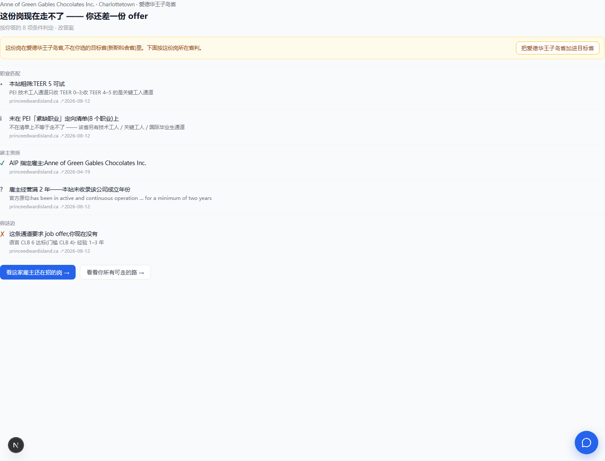

# `/plan/pr` 三步重设计(设计)— 2026-08-12

> 拍板链(Frank 08-12 当晚):「重新设计一下这部分流程」→「我是说整个页面的 plan pr 重新设计」→
> 「第一步 第二步 第三步 每一步的输入 输出」→「最终给一个方案」→「不仅仅是我发现的这几个问题」。
>
> 范围:**整个 `/plan/pr`**(含带岗 `?job=` 态)。不含定价与付费位置(Frank 同日拍板:先做完整再谈收费),
> 本文只给它留位置。上位:[判定合一与SEO落地页-20260810](判定合一与SEO落地页-20260810.md)、
> [通道判定口径根治-20260812](通道判定口径根治-20260812.md)。

## 0. 一句话诊断

**这页把「采集 → 判定 → 行动」三件事摊平成并列的卡片,而不是串成有顺序的步骤。**
于是每加一个功能就多一张卡,用户得自己找顺序;而两套主语(我 / 这份岗)共用一套区块序,
产生的矛盾没人调和。

## 1. 全量审计(14 条,Frank 报的 3 条在内)

按性质分三类。**★ = Frank 当晚亲自点名的。**

### A. 结构性(改了别的都白改)

| # | 问题 | 证据 |
|---|---|---|
| A1 | **一页两套主语**:无岗时主语是「我」、带岗时是「这份岗」,却共用同一套区块序 | 带岗页同时出现「按目标省的方案」与「按岗位省的判定」 |
| A2 | **输入与输出混排**:问卷卡(输入)→方案(输出)→估分(又是输入+输出)→判定(输出)→挑岗(动作) 五块并列,没有主次 | 答完题后页面 7 个区块,谁先看谁后看全靠猜 |
| A3 ★ | **「你的条件」与「个人条件」重名**:一个是问卷回显,一个是判定的第三关 | Frank:「上面有你的条件,下面还有个人条件」 |
| A4 ★ | **目标省 ≠ 岗位省,同屏出现却一个字不说** | Frank:「目标省和点的工作的省份还不一样」 |
| A5 | **估分是第三个输入面**,挂在方案下面与主流程并列,但它其实是第二步的深化 | 「还有 9 题」的入口卡与方案卡平级 |

### B. 正确性(说了不该说的话)

| # | 问题 | 证据 |
|---|---|---|
| B1 ★ | **粗筛冒充官方结论**:`pnpEligible` 被渲染成绿勾「TEER 5 在该省受理范围内」,而库里 PEI 技术工人通道 `applies_teer=0,1,2,3` —— TEER 5 不在那条通道里 | CLAUDE.md 明写 `pnpEligible` 是「粗筛信号,非资格认定」 |
| B2 ★ | **清单行没说适用范围**:「未命中该省任何具名清单」事实无误,但 PEI 的 OID 只是**其中一条**通道的定向清单(8 个职业),读起来像判死 | Frank:「爱德华王子岛有 pnp 吗?」——有,库里就有它的清单与门槛行 |
| B3 | **没有结论句**:带岗页 8 行事实,没有一句可复述的话 | 用户要自己把四关合成一个判断 |

### C. 注意力(把最该看的埋了)

| # | 问题 | 证据 |
|---|---|---|
| C1 | **新访客首屏是 8 个「待填写」空格子** | 空状态占据落地页第一屏 |
| C2 | **唯一的免费硬事实(各省抽选)排在整页最末** | 88% 是 Google 来的英文流量,落地页把事实垫底 |
| C3 | **常见案例 15 条纯标题列表占主干位** | 它是资料不是步骤 |
| C4 | **付费面横在动线中间**:第三关整段 5 行马赛克 | 其中 3 条(语言/最快通道/换省对照)在同一页免费就有 |
| C5 | **一个按钮三态**(开始评估/继续作答/改答案)承担了全部导航 | 用户看不出「我现在在第几步」 |
| C6 | **答完题后页面很长**(条件卡+方案+估分+判定+挑岗+案例+抽选表),没有收敛 | 无主次 |

## 2. 重设计:三步,每步一进一出

**页面形态**:一页**三段式向导**(不是三个 URL —— URL 不变,保收录)。当前步展开,已完成的步收成一行摘要。
带岗进入(`?job=`)= 直接落在第三步,前两步自动收成摘要。

```
第一步 · 你是谁          → 一份可复述的画像
第二步 · 你能走哪条路    → 排好序的通道 + 一句「先做什么」
第三步 · 这份工作行不行  → 三关判定 + 一句可复述结论 + 下一步动作
──────────────────────────────────────────────
资料区(不进主干,随时可查):各省最近抽选 · 常见案例
```

### 第一步 · 你是谁

| | |
|---|---|
| **输入** | 8 项:职业 / 现在的情况 / 语言 / 总经验 / 加拿大经验 / 有没有 offer / 有没有加拿大学历 / 目标省。**每项都可答「不清楚」**;目标省可答「还不确定」 |
| **输出** | ① 一行可复述的画像(「国内厨师 · 1–3 年 · 没考语言 · 无 offer · 目标未定」);② **点名**哪几项没答会影响结论(「补答语言,能多判 4 条通道」) |
| **完成判据** | 8 项都有答案(「不清楚」算答案) |
| **界面** | 未答:**只出一句话 + 一个主按钮**,不摊 8 个空格子(修 C1);答过:一行摘要 + 「改答案」 |

### 第二步 · 你能走哪条路

| | |
|---|---|
| **输入** | 第一步的画像(目标省可为空=不限省) |
| **输出** | ① **按障碍难度排好序**的通道清单,每条一句状态(能走 / 差什么 / 判不了)+ 官方出处;② 一句总结:「你现在最该做的是拿一份 offer」;③ 可选深化入口:「按官方分值表估分 · 还有 N 题」 |
| **完成判据** | 用户选定一个方向,或直接去挑岗 |
| **界面** | 方案卡(现有)+ **总结句**(新);估分作为**本步的第二段**,不再与方案平级(修 A5) |

### 第三步 · 这份工作行不行

| | |
|---|---|
| **输入** | 一份具体岗位(从职位板点「身份判定」进来,或第二步「去挑岗」选中) |
| **输出** | ① **一句可复述的结论**(「这份岗现在走不了 —— 你还差一份 offer」);② 三关证据:职业匹配 / 雇主资质 / **你这边**(改名,修 A3),每关带官方原句与出处;③ 下一步动作(看这家在招岗 / 回到全局) |
| **完成判据** | 用户知道下一步做什么 |
| **界面** | **主语是这份岗**:抬头(岗位+雇主+城市省)→ 结论句 → 三关 → 下一步。前两步收成一行摘要,**不重复摆问卷卡**(修 A1/A2) |

### 跨步规矩(修 A4 / B1 / B2 / B3)

- **省份消歧**(A4):第三步主语=岗位所在省。岗位省 ∉ 目标省时,结论句下一行:
  「这份岗在爱德华王子岛省,不在你选的目标省里。下面按这份岗所在省判。**[加进目标省]**」——
  **不是警告是消歧**,并给一键对齐。
- **举证标准三态**(B1/B2),三关每一行按**来源**决定符号与措辞:

  | 来源 | 符号 | 措辞 |
  |---|---|---|
  | 官方门槛行判出来 | ✓ / ✗ | 直陈 + 官方原句 + 出处 |
  | **本站粗筛** | **不给对错符号** | 明写「本站粗筛」,并**指向真门槛**:「PEI 技术工人只收 TEER 0–3,收 4–5 的是关键工人通道」 |
  | 库里没有 | ? | 「本站未收录」+ 指路 |

  这与 08-12 判定核的三值折叠是同一套规矩 —— 那轮只收口了判定核,职业关这几行还没上。
- **结论句由确定性层拼**(B3),不新增判定、不让 LLM 合成:
  有 `excluded`→「走不了 X:<原因>」;有 `unknown`→「判不了:还缺 <点名>」+ 补答按钮;
  有 `gap`→「差 <最难拆的那项>」(复用 BLOCK_COST 次序);全 `met`→「符合 <省><通道> 的已知门槛」+ 最近一轮抽选线。
  **必须可复述**:用户能原样转述而不失真;禁「可能」「建议咨询」。

### 资料区(修 C2 / C3 / C6)

各省最近抽选、常见案例从主干撤到页面末尾的**资料区**,但**抽选表上移到案例之前**——
它是这页唯一的免费硬事实,且要被爬到。案例保持纯标题列表(答不了就不假装能答的老规矩不变)。

### 付费面留位(C4,本轮不拍口径)

第三步的**结论句与三关事实免费**;「差多少分 / 先补哪一项最划算 / 多久能到」这类**可执行推演**
是天然付费位,位置在**结论之后**而不是横在动线中间。卖不卖、卖哪几条,Frank 另拍。

## 3. 效果图(第三步,Mode B 注入本地真页面实拍)




图里已体现:主语是这份岗 · 一句可复述结论 · 省份消歧行带一键对齐 · 粗筛不给绿勾且锚到真门槛 ·
清单行补适用范围 · 第三关改称「你这边」· 下一步两个动作。
**第一步/第二步的效果图等本文流程点头后再出**(免得白画)。

## 4. 批次

- [ ] **B1 举证标准**(B1/B2):粗筛撤符号 + 锚真门槛;清单行补适用范围。**与其余无依赖,且它是错的 —— 先做这条。**
- [ ] **B2 第三步重排**(A1/A3/B3):抬头→结论句→三关→下一步;第三关改称「你这边」;带岗不再重复摆问卷卡。
- [ ] **B3 省份消歧 + 一键对齐**(A4)。
- [ ] **B4 第一步/第二步收成向导**(A2/A5/C1/C5/C6):未答只出 CTA;估分降为第二步的二段;每步一行摘要。
- [ ] **B5 资料区下沉与抽选上移**(C2/C3)。

## 5. 明确不做

- **不**拆成三个 URL(`/plan/pr` 的收录不动)。
- **不**在本轮动定价与锁区。
- **不**让 LLM 合成结论句(工具层红线)。
- **不**把问卷卡搬进第三步「顺便让他改答案」——输入面只留一个,多一个就又是两套主语。
