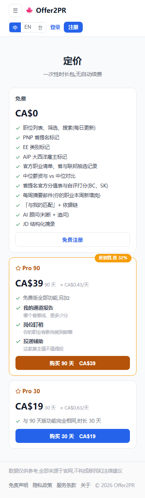

# 付费概率提升计划(2026-08-03 立项)

> **一句话**:把「答完题、读完报告的人」的付费概率从 **~1%** 抬到 **3%-5%**,
> 唯一的一跳来自**把锁区里真值钱的那样东西搬到大多数人面前**,其余三条是把漏的堵上。
> 立项起因:Frank「来一波收费走查」→「算用户腹诽概率」→「付费概率是多少」→「来个提升计划」。
> 走查明细见 [功能盈利点检查.md](../功能盈利点检查.md) 第 31 轮清单 #240-#246;主线判据见 [主线与支线](../主线与支线-20260801.md)。

## 1 · 现状(全部实测,不是估计)

| 口径 | 30 天 | 备注 |
|---|---|---|
| 真实陌生注册用户 | **69** | 库里 70 减掉 Frank 自己那个 qq.com |
| 其中付费 | **0** | 两条 Stripe session:一条测试号、一条 Frank 07-04 开闸演练(已退款) |
| 锁区被看到 | ~390 | 08-02 当天实测 13 次外推(干净数据只有那一天) |
| 打开定价页 | **1** | Umami 30 天实测 |
| 锁区 → 定价 | **0.26%** | ← **瓶颈在这一格** |

零事件的 95% 置信上界(rule of three):每注册用户付费 < 4.3%、每访客付费 < 0.17%。
**注意 0/69 不能推翻「真实率 1%」** —— 若真是 1%,69 人里期望 0.7 笔,观测 0 完全正常。
现在是「率低」与「样本不够判」同时成立,不能拿 0 去论证产品没救。

## 2 · 为什么是 1%(生产实读,三条)

**① 免费层把他最想知道的那件事说完了,而接下来卖的东西他不需要。**
「我这职业在不在清单上」是他点进来的全部动机,答完题第一屏白送(这是对的:aha 必须在掏钱之前)。
但后面必须接一个**更痛**的问题 —— 现在接的是「换省会不会更有利」,而他刚被告知 BC、SK、MB 三个省都命中。
**卖点与他的处境错配。**

**② 门槛那一节在主动扣分。** 五条里四条是「算的是全家收入,本站没问」「你还没填经验」
「这项只有雇主拿得出材料」×2。读完的合理反应是「这网站判不了我的事」——
然后他为什么要给一个判不了他事的网站付钱?这一节不是中性的,**是负分**。
(且违反 Frank 08-02 自己拍的「判不了的行不参与判定,那还显示干什么」。)

**③ 真值钱的东西大多数人看不到。** 「有 N 家雇主发过能走省提名的岗,名单在这里」——
这是求职者今晚就能用的东西,而它**只长在卡①「找工作」**上(`buildPrReport` 的 `employers` 恒为空,
只有 `buildJobReport` 查 `sponsorList`)。而漏斗实测**16 次出报告有 12 次是拿 PR 卡**(首页 CTA 直接进)。
大多数人看到的锁区只有两行,其中一行叫「**其余结论全文**」——没人为一个不知道是什么的口袋掏 $19。

## 3 · 四条杠杆(按预期收益排序)

| | 做什么 | 改哪 | 成本 | 预期 |
|---|---|---|---|---|
| **L1** | **雇主线索接进拿 PR 卡与选省份卡**(#244) 免费层出「有 N 家雇主发过能走省提名的岗」(卡①已验证这是最像 aha 的一句),**锁的是名单本体** | `buildPrReport` / `buildProvReport` 接 `occ.sponsorList`;`/api/report` 对这两张卡多一次 `assembleOccStats` 往返 | 中(多一次库往返;雇主侧门槛逻辑卡①已有,直接复用) | **唯一的一跳**。卖点从「他不需要的建议」换成「今晚能用的名单」 |
| **L2** | **锁区文案说清锁了什么**(#245) 「其余结论全文」→ 按真实类别与条数写 | `rpt.lock.more` 三语 + `LOCK_ORDER` 附条数 | 低 | 中。空口袋换成具体承诺 |
| **L3** | **定价页写上雇主名单**(#246) 并把 Pro 栏第一条改写成免费栏没有的东西(现在「我的通道报告:哪个省够线、差多少分」与免费栏「省提名官方分值表与自评打分」看着重复) | `PricingCard` 文案三语 | 低 | 中。到了定价页别再被劝退 |
| **L4** | **清掉负分文案**(#243) 雇主侧两条**并进 L1 的雇主线索**(它们本来就是雇主的事);「本站没问」那条不出,改成可点的补答入口 | `lib/rules.ts` 出行逻辑 + 报告渲染 | 低 | 小幅,但它是**止血**不是增长 |

**另有 P0 但不涨转化**:`#242` 免费态承诺「PDF 里有雇主明细与 LMIA 记录」而免费 PDF 里没有
(PDF 那一块**没有任何 pro 判断**)。**必须先修** —— 它防的是已经掏钱的人后悔,和退款。

## 4 · 怎么知道有没有用(这一节最重要)

**不测付费**。1% → 3% 在 69 人量级上根本读不出来:要把这个差别读到 95% 置信,需要 ~500 个走完链路的人,
按现在的量得两三个月。**做完了却不知道有没有用,是这类改动最常见的死法。**

**测中间那一格 —— 锁区 → 定价**(现在 0.26%,样本大两个量级)。

### 归因靠分组,不靠时间(2026-08-03 Frank「为什么要等两周」当场推翻原方案)

原方案写的是「批 2 上线后等两周读数」,**站不住**,两个理由:

1. **两周也判不清**。约 180 次曝光,0.26% 期望 0.5 次、1.5% 期望 2.7 次 —— 差别落在「看到 1 次还是 3 次」,
   这个量级等两周换不来一个能下结论的数。拿最贵的东西(时间)买最不值钱的东西(判不清的数)。
2. **根本不需要用时间分离** —— **卡①「找工作」是天然对照组**:
   - 卡① 现在就有雇主线索锁行(走查实录 `plan/job` 锁行 = `score` + `sponsors`),拿 PR 卡没有(`score` + `more`);
   - **L1 只动拿 PR / 选省份卡,不动卡①**;
   - 两头的埋点本来就按卡分好了:`lock-seen` 的 prop 就是卡名,`pricing-open` 的来路是 `from=rpt-<卡>`。

   于是可以直接算**每张卡各自的「锁区→定价」转化率**,拿卡① 当同期对照 ——
   它自动把批 1 的文案改动、周末、流量波动全控制掉(这些对两张卡一视同仁)。

**所以批 2 不等,立刻上。** 观察窗随曝光量走,不随日历走。

| 指标 | 读法 | 达线 |
|---|---|---|
| 拿 PR 卡的 锁区→定价 | `pricing-open[from=rpt-pr]` ÷ `lock-seen[prop=pr]` | 向卡① 的水平靠拢 |
| 卡①「找工作」同一比值 | 同上,`job` | **对照组,不该因 L1 而变** |
| 何时可以下结论 | 拿 PR 卡累计曝光 ≥ 300 次(不是「几周」) | 那时 1.5% 对 0.26% 才有分辨力 |
| 付费 | 只记录,不设线 | 样本不够 |

读数口径:`/funnel` 面板(admin);开发流量已按 host 挡在表外,验证时用生产真访问并**事后按主键删掉自己的那几条**
(08-03 已踩过一次,手法见 [next-session-status])。

## 5 · 明确不做什么

- **不降价**。30 天只有 1 个人打开定价页 —— 人根本没走到价格这一步,降价是在解一个还没出现的问题。
- **不加新数据源**。雇主线索已经有货(卡① Pro 态 Frank 07-08-01 真号验过 12 家全出),**这是分发问题不是数据问题**。
- **不上 AI**。AI 接入(欠账③)是另一格的事,且它进两头不进中间的判断没变;放在这轮之后。
- **不动卡⑥的免费定位**。08-03 已整卡撤锁,它现在是纯免费surface,别再往上装付费墙。

## 6 · 排期与验收

| 批 | 内容 | 何时算完 |
|---|---|---|
| 批 1 | `#242` PDF 承诺(止血)+ `L2` 锁区文案 + `L3` 定价页文案 | 三语实读一遍、生产复验;一个 push |
| 批 2 | **`L1` 雇主线索进拿 PR / 选省份卡** + `L4` 门槛负分文案并入 | 版式改动 → **先出效果图给 Frank 点头**(Mode B);生产复验雇主行真出货 |
| 批 3 | **拿 PR 卡累计曝光 ≥ 300 次**后读 `/funnel`,按卡对照(§4) | 达线 → 继续往 M4;不达线 → 回到 §2 重判卖点 |

**验收的诚实条款**(2026-08-03 Frank 改拍:「问用户没用,用户也不知道想要什么功能 ——
你得设计好了,然后用户用,然后用户反馈『这就是我想要的功能』,逻辑是这样的」):
若曝光攒够后拿 PR 卡的锁区→定价仍 < 1%、且与卡① 拉不平,**问题不在文案在卖点** ——
那就**重新设计卖点再投放**,不是去访谈。重设计的输入只有两样,都不用张嘴问:
① **行为数据**:69 个注册用户实际点了哪张卡、停在哪、带什么词进来;头号既有信号 =
   最大入口是 `google_jobs_apply`(30 天 470 次)+ 死链用户注册收藏点申请 —— 他们的已表达需求是
   「拿下这份工作」,而锁区卖的是移民结论,**先检验这个错位假设**(付费点该不该往「帮他拿 offer」挪);
② **问题原文**:智能客服(B5)上线后用户的每条提问 = 一条痛点原话,接痛点盘点方法论当设计原料。
设计好 → 投放 → 读行为 → 再设计;用户的角色是用与不用,不是答卷。
