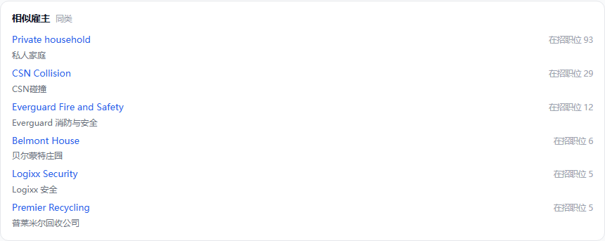
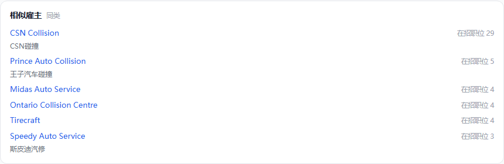

# 公司分类做实 —— 用户故事版(2026-09-21)

> 起因:2026-09-21 Frank 看公司弹框「相似雇主」连问「这个相似雇主 现在算的不对吧」→(当天改成按公司分类找,aae47e6b;省份改排序,0ef34438)→「相似雇主 这个算法有问题是吧」→「应该按文本算相识度，还是把分类做扎实了」「相似雇主 和 相似职位 都用文本做相似度 是不是业内做法」「分类也用相识度算？」→「写设计稿吧」。
> 一句话定位:**私营雇主的公司分类从「按它招什么岗去猜」改成「本地模型读名字、岗名、简介直接判」,15 类下面加一层子类;相似雇主按子类找,文本相似度只做子类内的细排。**
> 承接 [雇主分类与搜索-20260918](雇主分类与搜索-20260918.md) 的「公司分类」段(两级联动已上线)与 [分类清洗-20260915](分类清洗-20260915.md) 的公司段(`etl/classify` 公司段一直没开工)。
> 主线哪一格:数据补全(地基)。雇主板的公司分类筛选、相似雇主、以后的「同城同行业在招」段,全部读这一格。
> 执行顺序:判法与金标(数据层)→ 全量判 → 池表加列 → 相似雇主换排序(展示层)。改错层下游白干,顺序不许倒。

---

## 用户故事

### 故事一:小刘,渥太华的汽修技师

小刘在职位板点开 King Garage,想看还有哪些修车铺在招人。现在「相似雇主」第一家是 Private household(雇保姆的家庭),后面是消防安全公司、养老院、保安公司、回收站 —— 它们都被归在「生活服务」一类。他要的是 CSN Collision、Midas、Mr. Lube 这种。

(上图生产原样截图;下图是把行注入生产页面拍的真样式,名单是示意 —— 真值等全量判完。)

### 故事二:小赵,护工

小赵看 Sienna 养老院,想找同类的养老院。现在名单里混着医院、化验所、成瘾中心、居家护理;换成文本相似度排,又会混进三户雇保姆的家庭(DIANA FAMILY、RINA PECILE…)。她要的是 Amica、Riverwood 这种养老院。

### 故事三:老张,在魁省找餐馆的活

老张在雇主板选「私营企业 → 餐饮住宿」,前面几家是养老院集团 Le Groupe Maurice、物业公司 COGIR —— 它们招厨师和服务员,被按岗位反推成了餐饮。

### 故事四:小陈,想走住家护理(caregiver)

小陈想看哪些家庭在招住家保姆。这些「个人雇主」现在散在医疗健康、生活服务两类里,没法单独找出来。

## 现状(2026-09-21 生产库实测)

- 在招私营雇主 **35,142** 家,公司分类的来源:**按在招岗反推 28,053(80%)**、没有 6,393(18%)、本地模型判过 696(2%)。公立 / 政府 494 家按名字判(医院、学区、大学、市政府…),准,本稿不动。
- 反推的毛病是拿「招什么岗」猜「做什么生意」:养老院招厨师 → 餐饮;食品厂、滤网厂只挂了会计岗 → 金融;同一种修车铺被撒进三类(Ontario Collision Centre、Tirecraft → 运输,A Class Collision → 零售,Speedy Auto、Mr. Lube → 空)。
- 就算判对,15 类也太粗:「生活服务」里修车铺和雇保姆的家庭是同一类,「医疗健康」里医院、牙科、养老院、药房是同一类。
- 有文本(AI 简介或官网简介 ≥ 120 字)的只有 **14,549 家(41%)**,占在招岗 52%;剩下的多是只招一两个人的小雇主,手里只有名字和岗名。

## 为什么先做分类,文本相似度放在后面

- **业内做法**:成熟的招聘站是三样叠加 —— 结构化分类(职业、行业)、文本向量、用户行为(看了这家的人还看了);没有只靠文本的。行为要流量,我们还没有(09-21 刚给相似雇主卡加了点击埋点 `similar-employer`)。
- **相似职位**现在按职业代码分四档(同码同城 → 同码同省 → 同前缀同城 → 同前缀同省),就是业内的标准做法,不改;没有代码的岗由职位分类流水线补(覆盖 93%)。
- **文本相似度单用不行**(09-21 试验,见附录 B):King Garage 前 8 家里 6 家是修车铺,比现在好;但 Tim Hortons 的前 7 家全是 Tim Hortons 自己的加盟店,Sienna 混进 3 户雇保姆的家庭,Hamilton Health Sciences 第一家是「Hamilton City Dental」—— 只是名字里都有 Hamilton。前两种毛病要先靠分类(家庭雇主单列)和同品牌去重挡掉。
- **分类也用相似度算吗**:判类不需要。15 类加 69 个子类整张表放得进提示词,模型直接在表里选;向量只用在子类内的细排(批四)。职位那边要先用向量找候选,是因为职业有 516 个。
- **修订 09-16 拍板**:当时定「相似公司不靠更细的码,细粒度交给简介文字相似度」,理由是 NAICS 细码连官方都靠人工判、我们只有一两段简介。现在改成**子类打底 + 文本细排**:子类是本站按「求职的人觉得像不像」切的(修车铺 / 清洁 / 保安),不是官方按生产流程切的细码;试点子类准确率 93%(见下);而文本只覆盖 41% 的雇主,还带上面三种噪音。这一条要 Frank 点头(待拍 ①)。

## 方案

### 1. 分类体系

- 板上不变:第一级「雇主类型」、第二级「公司分类」(私营 15 类)。
- 私营 15 类下面加一层**子类**,先只给相似雇主用,不上板(要不要做成第三个下拉另议)。
- **家庭雇主**单列:私人家庭 / 个人雇保姆、护工的(Private household、Cecille Visser 这类),默认做成**第 7 种雇主类型**(待拍 ③),不参与相似雇主。

| 公司分类 | 子类(69 个) |
|---|---|
| 科技 | 软件与互联网、IT 服务、电信、电子与硬件 |
| 医疗健康 | 医院、诊所、牙科、养老与护理院、居家护理、药房、检验影像、康复理疗 |
| 教育 | 私立中小学、托儿早教、培训辅导、私立学院 |
| 金融保险 | 银行、保险、投资理财、贷款支付 |
| 专业服务 | 律所、会计税务、管理咨询、工程设计、人力中介、营销广告 |
| 建筑工程 | 总包房建、专业工种(水电暖、屋面、油漆…)、土木重型、园林除雪 |
| 制造 | 食品饮料、金属机械、木材家具、化工塑料建材、其他制造 |
| 零售批发 | 超市食品、综合专业零售、汽车销售配件、建材家居、加油站便利店、批发分销 |
| 餐饮住宿 | 餐厅酒吧、快餐连锁、咖啡烘焙、酒店住宿、团餐食堂 |
| 运输物流 | 卡车货运、快递配送、仓储物流、客运、航空 |
| 能源矿业 | 油气、采矿、电力水务(含风电太阳能,试点补的) |
| 农林渔 | 农场、温室苗圃、渔业水产、林业 |
| 地产物业 | 地产经纪、物业管理、开发出租 |
| 文娱媒体 | 影视出版新闻、体育健身、博彩、景点活动 |
| 生活服务 | 汽修车身、清洁、安保、美容美发、社团公益、其他生活服务 |

### 2. 判法

- 本地 qwen 读三样:**名字 + 在招岗名前 5 + 简介(有就给)**,在 69 个子类加「家庭雇主」里选一个;拿不准就弃权(留空,宁可留空不瞎猜)。弃权的退回按岗位反推的类当兜底,只进公司分类、不进子类。
- 确定性规则先于模型:岗名是 private home / live-in caregiver / home child care provider 这类的,直接判家庭雇主(试点里模型漏了一户 Wen Lian Graham,岗名就是「child caregiver - private home」)。
- 提示词补两句(试点教训):岗位可能只是会计、IT 这类职能岗,说明不了公司做什么,以名字和简介为准(RAD Torque 做扭矩扳手,只挂了一个软件岗,被判成软件公司);键必须照表抄(一条写成了 agriculture.farming)。
- 量:在招私营雇主全判一遍,约 3.5 万家、每家 1.3 秒,**约 13 小时**,盒子夜里跑;之后每轮只判新出现的雇主。只读库里已有的名字、岗名、简介,不外抓(懒查询铁律不碰)。

### 3. 相似雇主

- 必须同雇主类型、同公司分类(现状不变);**排除家庭雇主**;**排除同品牌加盟店**(名字归一后同一个牌子的,Tim Hortons 那一撞)。
- 排序:**同子类 → 在招省份重叠 → 在招数**。子类不够 6 家,用同公司分类的补(不再整卡空着)。
- 文本相似度(批四,可选,看点击埋点再定):同子类内按「名字 + 岗名 + 简介」的 bge-m3 向量细排,ETL 里预先算好每家的前 6 存进池表,cms 只读,不在请求里算。

### 4. 名字规则漏判的公立机构

试点和这两天走查照出来一批:Hamilton Health Sciences(医院,被判私营)、Prescott-Russell(联合县政府)、Oak Bay Parks, Recreation & Culture(市镇部门)、National Capital Commission(联邦官方企业);反方向误判:猫诊所、兽医院判成公立医院,Dentistry at University Downs 判成大学。这些归 `etl/names` 名字规则修,已单独挂任务,不在本稿批次里。

## 试点(2026-09-21,107 家)

- 样本:在招私营雇主按现公司分类分层,每类按随机序取 6 家,加上已知问题户(King Garage、Private household、Le Groupe Maurice、COGIR、Tim Hortons、Sienna…)。提示词与子类表即本稿第 1、2 节(补丁两句之前的版本)。逐条核对见附录 A,请 Frank 抽查。
- **公司分类(15 类)**:能核的 100 家里 **91 家对**、7 家错、2 家两可;另 6 家凭现有信息核不了,1 家弃权(Oak Bay 市镇部门,弃得对)。同一批样本上现在的分类:24 家错、6 家空。
- **子类**:类判对的 91 家里 85 家子类也对(93%)。错的 6 家:键写错 1、挖土方 / 钻孔判成专业工种 2(应为土木重型)、新能源没地方放 1(已补进电力水务)、酒吧判成快餐 1、加油站便利店判成综合零售 1。
- 家庭雇主:5 户抓住 4 户。
- 修对的典型:养老院(Le Groupe Maurice、Belmont House、Sienna)→ 养老与护理院;只挂会计岗的工厂(Zinetti Food、Camfil、Ucan Fastening)→ 制造;COGIR → 物业管理;Popeyes → 快餐连锁;Fed IT → 人力中介。
- 速度:每家 1.3 秒(think 关,温度 0,与 explore / classify 同一台盒子同一个模型)。

## 数据层

- **`etl/classify` 加公司段**(09-15 设计稿写了没开工):产物 `processed/classify/companies.json`(池键 → 公司分类、子类、判法 rule / model / infer / abstain、理由、版本、时刻);金标 `raw/classify/gold_companies.json`(照职位段 `gold_jobs.json`),本稿 107 家先入。
- **employers 域**汇池时读它:公司分类 = 模型判的 > 按岗反推的;新列 `subcategory`;家庭雇主落 `sector = household`(如待拍 ③ 过)。
- **explore 域**:INDUSTRY 那一行在公司段覆盖全量以后退役,explore 只剩翻译(将死的依赖幸存的,不反向)。
- **库**:`employer_pool` 加 `subcategory varchar`,`docs/sql/` 手写 DDL,纯加列;`sector` 多一个字面量 `household`,cms 两处消费者(雇主类型下拉、ruling 雇主门槛)先接住新值再放数据。加列窗口期照 seed 哈希那条老规矩:先换版、再清 `seed_state`。
- **cms**:`SIMILAR_EMPLOYERS` 排序加子类一档、排除家庭雇主与同品牌;雇主板不动(子类不上板)。

## 质量闸

- 类准确率 ≥ 90%、弃权 ≤ 10% 才铺全量:本稿 107 家 + 下一批**随机** 100 家(不分层,代表真实分布)进金标,Frank 核。
- 家庭雇主:岗名规则 + 模型两路,抽 30 户核,误伤 0。
- 相似雇主:20 个锚(每类至少 1 个)改前改后截图对照。
- 代码:ruff / pyrefly 0 / 形制闸;cms 四道闸;上线拉公司弹框验换版。

## 分批

| 批 | 做什么 | 验收 |
|---|---|---|
| 0 | 本文 | Frank 拍三件待拍 |
| 1 判法 | `etl/classify` 公司段 + 岗名规则 + 提示词补丁;金标入库;随机 100 家再试 | 准确率 / 弃权率报数,Frank 核 |
| 2 全量 | 3.5 万家夜里跑完;之后每轮只判新雇主;employers 域读产物;池表 `subcategory` DDL + 灌库 | 分布报数;抽查 50 家 |
| 3 相似雇主 | 排序加子类、排除家庭雇主与同品牌 | 20 个锚截图对照;四道闸;生产换版 |
| 4 文本细排(可选) | 同子类内 bge-m3 细排,ETL 预算前 6 存池表 | 看点击埋点再决定开不开 |
| 5 板上(可选) | 家庭雇主进雇主类型下拉;子类要不要做第三个下拉 | 效果图先行 |

## 已拍 / 待拍

**2026-09-21 已拍**:
1. 相似雇主改按公司分类找(aae47e6b,Frank「应该是比如这个雇主是医院 相似的应该是其他医院」)。
2. 省份不硬筛,在招省份重叠的排前面(0ef34438,Frank「只是把同省的排在前面」);卡上小注改「同类」。
3. 先把分类做扎实,文本相似度放后面(本稿,Frank「写设计稿吧」)。

**待拍**(默认值即本稿写法):
1. **子类表**(上面 69 个):修订 09-16「细粒度交给文字相似度、不靠硬标签」,改成子类打底 + 文本细排。
2. **全量判**:在招私营雇主 3.5 万家全判一遍,改 09-19「被用户看过的才让模型判」的懒判口径(只读库里已有的,不外抓)。
3. **家庭雇主**单列为第 7 种雇主类型(板上雇主类型下拉多一项;不进相似雇主)。

## 状态

- 2026-09-21:设计稿;试点 107 家(附录 A);文本相似度试验 4 家(附录 B);两张效果图。代码未开工。

---

## 附录 A:试点 107 家明细

「核」一栏:✓ = 类和子类都对;子类✗ = 类对子类错;✗ = 类错;? = 凭名字、岗名、简介核不了;两可 = 两个类都说得通。

| # | 雇主 | 在招岗(前两个) | 现在的分类 | 试点判 | 核 |
|---|---|---|---|---|---|
| 1 | AG Farms | fruit farm worker | 农林渔 | 农林渔 · 农场 | ✓ |
| 2 | Gazon + | grounds maintenance labourer | 农林渔 | 零售批发 · 建材家居 | ✓ |
| 3 | Larch Grove Farm Ltd. | contractor - agricultural service / livestock labourer | 农林渔 | 农林渔 · 农场 | ✓ |
| 4 | Nolte Apiaries Ltd | bee farm worker / beekeeping technician | 农林渔 | 农林渔 · 农场 | ✓ |
| 5 | Poelman Apiaries Ltd. | apiary technician / apiary worker | 农林渔 | 农林渔 · (键写错) | 子类✗(键写错(agriculture.farming),类对) |
| 6 | Tonte de pelouse Luc Sauriol / Deneigement Luc Sauriol | grounds maintenance labourer | 农林渔 | 建筑工程 · 园林除雪 | ✓ |
| 7 | 6 AM Construction Ltd | carpenter / construction helper | 建筑工程 | 建筑工程 · 总包房建 | ✓ |
| 8 | Construction et Développement UNU Inc | cabinetmaker | 建筑工程 | 建筑工程 · 总包房建 | ✓ |
| 9 | FHR CONSTRUCTION LTD. | construction carpenter | 建筑工程 | 建筑工程 · 总包房建 | ✓ |
| 10 | One Call Drywall Solutions Ltd | construction labourer and helper / drywall installer team leader | 建筑工程 | 建筑工程 · 专业工种 | ✓ |
| 11 | Star Painting Ltd. | painter | 建筑工程 | 建筑工程 · 专业工种 | ✓ |
| 12 | Van Boekel Landworks | heavy equipment operator | 建筑工程 | 建筑工程 · 专业工种 | 子类✗(挖土方应为土木重型) |
| 13 | Circle of Friends Daycare Centre Ltd. | early childhood educator (ECE) | 教育 | 教育 · 托儿早教 | ✓ |
| 14 | Collège Mérici | Assistant Director of Studies - School Organization and Student Services / Certified Maintenance Mechanic | 教育 | 教育 · 私立学院 | ✓ |
| 15 | Garderie Les Anges de Ste Therese | early childhood educator (ECE) assistant | 教育 | 教育 · 托儿早教 | ✓ |
| 16 | micky mousse | early childhood educator (ECE) assistant | 教育 | 教育 · 托儿早教 | ✓ |
| 17 | Pitter Patter Learning Centres | early childhood educator (ECE) | 教育 | 教育 · 托儿早教 | ✓ |
| 18 | Tigger’s Too Playschool | early childhood educator (ECE) | 教育 | 教育 · 托儿早教 | ✓ |
| 19 | Brightmark | information technology (IT) consultant / insurance sales agent | 能源矿业 | 金融保险 · 保险 | ?(名字与岗位对不上,凭现有信息核不了) |
| 20 | Emera Inc. | auditor - finance / biomedical engineering technologist | 能源矿业 | 能源矿业 · 电力水务 | ✓ |
| 21 | Puits Bernier inc. | Drill Operator Assistant / electrical mechanic | 能源矿业 | 建筑工程 · 专业工种 | ✓ |
| 22 | RPM Construction Group Inc | cable installer - telecommunications / driller, construction | 能源矿业 | 建筑工程 · 总包房建 | 子类✗(通信管线钻孔应为土木重型) |
| 23 | Team Drilling LP | diamond drill operator - surface mining and quarrying | 能源矿业 | 建筑工程 · 专业工种 | ✗(矿区钻探应为能源矿业·采矿) |
| 24 | Vogtech Renewables | artificial intelligence (AI) analyst / artificial intelligence (AI) designer | 能源矿业 | 能源矿业 · 油气 | 子类✗(新能源,子类表缺这一项) |
| 25 | Camfil Canada Inc | senior cost accountant | 金融保险 | 制造 · 化工塑料建材 | ✓ |
| 26 | Kangs Packaging Solutions Inc. | senior accounting clerk | 金融保险 | 制造 · 化工塑料建材 | ✓ |
| 27 | Refine Group Ltd | financial consultant | 金融保险 | 金融保险 · 贷款支付 | ✗(外包 CFO 应为专业服务) |
| 28 | Ucan Fastening Products | accounting assistant / material handler | 金融保险 | 制造 · 金属机械 | ✓ |
| 29 | Weyburn Credit Union Limited | commercial banking manager | 金融保险 | 金融保险 · 银行 | ✓ |
| 30 | Zinetti Food Products Ltd. | senior accountant | 金融保险 | 制造 · 食品饮料 | ✓ |
| 31 | Cecille Visser | home child care provider | 医疗健康 | 家庭雇主 | ✓ |
| 32 | David Golbert | home child care provider | 医疗健康 | 家庭雇主 | ✓ |
| 33 | Hamilton Health Sciences | Registered echo technologist / Administrative assistant | 医疗健康 | 医疗健康 · 医院 | ✓ |
| 34 | Market Drugs Medical Ltd. | technician, pharmacy | 医疗健康 | 零售批发 · 批发分销 | ?(药房还是医疗用品批发,凭现有信息核不了) |
| 35 | MOONKO DENTAL LABORATORY LTD. | dental technician assistant | 医疗健康 | 医疗健康 · 牙科 | ✓ |
| 36 | Physiocare Physiotherapy & Rehab Centre | physiotherapist | 医疗健康 | 医疗健康 · 康复理疗 | ✓ |
| 37 | Sienna Senior Living | Server / Concierge | 医疗健康 | 医疗健康 · 养老与护理院 | ✓ |
| 38 | Wen Lian Graham | child caregiver - private home | 医疗健康 | 金融保险 · 贷款支付 | ✗(应为家庭雇主(私人住家育儿)) |
| 39 | COGIR Immobilier | Dishwasher / Maintenance worker | 餐饮住宿 | 地产物业 · 物业管理 | ✓ |
| 40 | Dal Moro's Fresh Pasta to go | head chef | 餐饮住宿 | 餐饮住宿 · 餐厅酒吧 | ✓ |
| 41 | Fed Manutech Canada | Operations Director / Automation Engineer | 餐饮住宿 | 制造 · 其他制造 | ✓ |
| 42 | Le Castel 1954 inc. | cook | 餐饮住宿 | 餐饮住宿 · 餐厅酒吧 | ✓ |
| 43 | Le Groupe Maurice | Concierge / Food Service Server | 餐饮住宿 | 医疗健康 · 养老与护理院 | ✓ |
| 44 | Mr. Sub | food counter attendant / food services manager | 餐饮住宿 | 餐饮住宿 · 快餐连锁 | ✓ |
| 45 | Nonstop Chicken | cook | 餐饮住宿 | 餐饮住宿 · 快餐连锁 | ✓ |
| 46 | Pub Amigo | cook's helper | 餐饮住宿 | 餐饮住宿 · 快餐连锁 | 子类✗(酒吧应为餐厅酒吧) |
| 47 | ROYAL CURRY RESTAURANT & SWEETS LTD. | cook | 餐饮住宿 | 餐饮住宿 · 餐厅酒吧 | ✓ |
| 48 | Tim Hortons | food service supervisor / food counter attendant | 餐饮住宿 | 餐饮住宿 · 快餐连锁 | ✓ |
| 49 | Garage D&C Messier Inc | Daily Worker | 制造 | 建筑工程 · 专业工种 | ?(魁省 Garage 多是修车铺,岗名只有 Daily Worker) |
| 50 | Pro Image Signs & Printing | printing machine operator | 制造 | 制造 · 其他制造 | ✓ |
| 51 | Sana'a Cannabis | Encapsulator - cannabis processing | 制造 | 制造 · 其他制造 | ✓ |
| 52 | The Meat Box | meat packing supervisor | 制造 | 制造 · 食品饮料 | ✓ |
| 53 | Toitures PLC inc. | assembler, wood products | 制造 | 制造 · 木材家具 | ✓ |
| 54 | Vidir Solutions Inc. | CNC machining tool operator / welder | 制造 | 制造 · 金属机械 | ✓ |
| 55 | Fitness 2000 Athletic Club | instructor, yoga | 文娱媒体 | 文娱媒体 · 体育健身 | ✓ |
| 56 | GAMEPLEX | manager, recreation | 文娱媒体 | 餐饮住宿 · 咖啡烘焙 | ✓ |
| 57 | GROUPE MEDIA REGIONAL VAL-OUEST | cyberjournalist / major community projects coordinator | 文娱媒体 | 文娱媒体 · 影视出版新闻 | ✓ |
| 58 | Oak Bay Parks, Recreation & Culture | food service supervisor / lifeguard | 文娱媒体 | (弃权) | 弃权(对)(市镇政府部门,名字规则漏判) |
| 59 | Slush Puppie | graphic artist / production clerk | 文娱媒体 | 餐饮住宿 · 快餐连锁 | ✗(冰沙饮料品牌,应为制造·食品饮料) |
| 60 | Upland Contracting Ltd. | construction labourer / VFX project manager | 文娱媒体 | 建筑工程 · 总包房建 | ✓ |
| 61 | ADVERTEK | printing supervisor | (空) | 制造 · 其他制造 | ✓ |
| 62 | CANADIAN INSTITUTE OF SAFETY, WELLNESS AND PERFORMANCE | health services researcher | (空) | 教育 · 培训辅导 | ✓ |
| 63 | COMPLETE SMALL ENGINE PARTS AND REPAIRS | small engine mechanic | (空) | 生活服务 · 汽修车身 | ✓ |
| 64 | Dartboard Freight | truck driver-supervisor | (空) | 运输物流 · 卡车货运 | ✓ |
| 65 | IGA Alimentation J.P.J Martin inc. | Wrapper | (空) | 零售批发 · 超市食品 | ✓ |
| 66 | Primewood | Logistics and Purchasing Manager / Shipping and Receiving Clerk | (空) | 运输物流 · 仓储物流 | ?(凭现有信息核不了) |
| 67 | Cass & Bishop | associate lawyer | 专业服务 | 专业服务 · 律所 | ✓ |
| 68 | GEMTEC Consulting Engineers and Scientists Limited | geotechnical engineer / structural engineer | 专业服务 | 专业服务 · 工程设计 | ✓ |
| 69 | Globe Immigration | paralegal | 专业服务 | 专业服务 · 律所 | ✓ |
| 70 | North Eastern Ontario Family and Children's Services | justice / youth worker | 专业服务 | 生活服务 · 社团公益 | ✓ |
| 71 | TrevJ Enterprises | accounting bookkeeper | 专业服务 | 专业服务 · 会计税务 | ✓ |
| 72 | UMC Financial Management Inc. | bookkeeper / property accountant | 专业服务 | 金融保险 · 投资理财 | ✓ |
| 73 | Hamilton East Kiwanis Non-Profit Homes Inc. | superintendent, building | 地产物业 | 医疗健康 · 养老与护理院 | ✗(非营利住房,应为地产物业或社团公益) |
| 74 | Melbourne Property Management Inc. | market research analyst / property manager | 地产物业 | 地产物业 · 物业管理 | ✓ |
| 75 | National Capital Commission | Building Services Technician / Information Technology (IT) Technical Support Officer | 地产物业 | 地产物业 · 物业管理 | ✓ |
| 76 | Prescott-Russell | Administrative assistant - provincial offences / Animator | 地产物业 | 运输物流 · 卡车货运 | ✗(联合县政府,名字规则漏判,不该进私营) |
| 77 | Rent In Ottawa Property Management Inc. | bookkeeper | 地产物业 | 地产物业 · 物业管理 | ✓ |
| 78 | Ulto Property Group Inc. | interior designer / intern | 地产物业 | 地产物业 · 物业管理 | ✓ |
| 79 | Canco 141 Ganges | retail store supervisor | 零售批发 | 零售批发 · 综合专业零售 | 子类✗(Canco 是加油站便利店) |
| 80 | Eclipse Stores Inc | assistant manager - retail / sales associate | 零售批发 | 零售批发 · 综合专业零售 | ✓ |
| 81 | kanab | sales associate | 零售批发 | 零售批发 · 综合专业零售 | ✓ |
| 82 | Popeyes | assistant manager, restaurant / cashier | 零售批发 | 餐饮住宿 · 快餐连锁 | ✓ |
| 83 | Premium Label Outlet | sales associate | 零售批发 | 零售批发 · 综合专业零售 | ✓ |
| 84 | Rob and Kathy's No Frills | cashier / clerk, deli counter | 零售批发 | 零售批发 · 超市食品 | ✓ |
| 85 | Belmont House | assistant executive housekeeper / cleaner | 生活服务 | 医疗健康 · 养老与护理院 | ✓ |
| 86 | CC'S Crazy Cleaning | light duty cleaner | 生活服务 | 生活服务 · 清洁 | ✓ |
| 87 | Chatters Salon | hairstylist | 生活服务 | 生活服务 · 美容美发 | ✓ |
| 88 | CSN Collision | auto body technician / car detailer | 生活服务 | 生活服务 · 汽修车身 | ✓ |
| 89 | Eco Solutions | customer service clerk | 生活服务 | 制造 · 化工塑料建材 | ?(凭现有信息核不了) |
| 90 | Everguard Fire and Safety | Administration & client support coordinator / Experienced fire alarm technician | 生活服务 | 建筑工程 · 专业工种 | ✓ |
| 91 | King Garage | garage mechanic | 生活服务 | 生活服务 · 汽修车身 | ✓ |
| 92 | MUQADAS BATOOL | housekeeper | 生活服务 | 家庭雇主 | ✓ |
| 93 | Private household | child caregiver - private home / home child care provider | 生活服务 | 家庭雇主 | ✓ |
| 94 | Riverside Spa | esthetician | 生活服务 | 生活服务 · 美容美发 | ✓ |
| 95 | S.X.B. Environnement | cleaner, tank | 生活服务 | 生活服务 · 清洁 | ✓ |
| 96 | Fabrimet inc. | CNC Programmer / Factory Worker | 科技 | 制造 · 金属机械 | ✓ |
| 97 | Fed IT | information systems operations director / AI Hardware Validation Specialist (NVIDIA GPUs) | 科技 | 专业服务 · 人力中介 | ✓ |
| 98 | LYNKED Inc. | devops engineer / software developer | 科技 | 科技 · 软件与互联网 | ✓ |
| 99 | RAD Torque Systems | software developer | 科技 | 科技 · 软件与互联网 | ✗(扭矩扳手厂,被唯一的软件岗带偏) |
| 100 | Rogers | Business Sales Consultant, POS / Manager, Collections | 科技 | 科技 · 电信 | ✓ |
| 101 | Trilogie Groupe Conseil inc. | Senior IT Technician | 科技 | 专业服务 · 管理咨询 | 两可(IT 服务或管理咨询) |
| 102 | Bhullar truck services ltd | truck driver | 运输物流 | 运输物流 · 卡车货运 | ✓ |
| 103 | Blackstone Paving Inc. | dump truck driver | 运输物流 | 建筑工程 · 土木重型 | ✓ |
| 104 | MOVING ON UP HOME SOLUTIONS LTD | logistics manager - transportation | 运输物流 | 运输物流 · 仓储物流 | 两可(搬家:生活服务或运输) |
| 105 | R.N. Apex Solutions Ltd | bookkeeper / driver, truck | 运输物流 | 运输物流 · 卡车货运 | ✓ |
| 106 | Tripod Smart Enterprises Ltd. | forklift operator | 运输物流 | 制造 · 其他制造 | ?(凭现有信息核不了) |
| 107 | Tuk Tuk Thai Commissary LP | purchasing and inventory management coordinator | 运输物流 | 餐饮住宿 · 餐厅酒吧 | ✓ |

## 附录 B:文本相似度试验(同类同省候选,bge-m3「名字 + 岗名 + 简介」余弦前 8)

| 锚 | 候选 | 前 8 家 | 现在(按在招数)前 6 家 |
|---|---|---|---|
| King Garage(ON,生活服务) | 539 | Premier Recycling、Timmins Auto Service、LEMAC Maintenance Cleaning、Mr Lube、Midas Auto Service、H&M c.a.r.s.、Erin Park Automotive、Midas Auto Service and Tires | Private household、CSN Collision、Everguard Fire and Safety、Belmont House、Premier Recycling、Prince Auto Collision |
| Tim Hortons(QC,餐饮住宿) | 1,084 | 7 家 Tim Hortons 加盟店、McDonald's | Subway、Le Groupe Maurice、Fed Manutech、McDonald's、A & W、COGIR |
| Sienna Senior Living(ON,医疗健康) | 2,276 | Amica、Senior Homecare by Angels、Riverwood Senior Living、DIANA FAMILY、Spark Lifecare、RINA PECILE、CarePartners、SANGHA FAMILY | Extendicare、VON Canada、Hamilton Health Sciences、LifeLabs、CAMH、Amica |
| Hamilton Health Sciences(ON,医疗健康) | 2,276 | Hamilton City Dental、Halton Healthcare、KMH Cardiology、Centre de santé communautaire Hamilton、Mackenzie Health、Huron Perth Healthcare Alliance、Gifted Hands、LMC Diabetes | Sienna、Extendicare、VON Canada、LifeLabs、CAMH、Amica |

嵌入 3,899 家用时 35 秒(盒子上的 bge-m3)。
