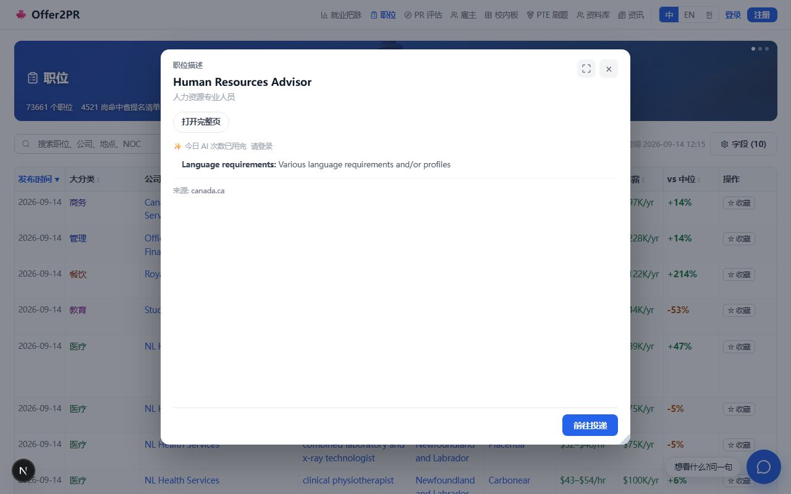

# 弹框统一 —— 用户故事版(2026-09-14)

> 2026-09-14 Frank 走查一天改了六处弹框钮条,每处一个文件,漏一处就是截图里的不一致。同日三句话:「现在所有的弹框用的不是一个组件吗」「现在想改一下弹框的内容不好改」「那你先出设计稿」。本稿把「为什么不好改」落成一张现状表,把「改成好改」落成三批,**未逐条点头不动代码**。
> 一句话定位:**全站弹框只剩一个壳、一条钮条、一个开关状态机;每个弹框的内容住自己的目录,改一个弹框只开一个目录。**
> 为什么改:壳有两个(`components/modal` 与 `advisor/floatpanel`),钮条五个域各拼一份,内容散在三个桶 50 个文件里,翻译 / 速读 / 配额三个开关和内容绑死。08-24 弹框族批只收了遮罩与胶囊,08-28 换装批把 advisor 里两个浮层壳合成 `FloatPanel` 时写明「不套 Modal,因为它没有八向拉伸与尺寸记忆」—— 今天核过,Modal 早有八向拉伸(`edgeResize`),缺的只是尺寸记忆和窄屏全屏,两件都是搬家不是新写。
> 执行三批,一批只做一种变换([[CLAUDE.md]] 分期节奏):批一搬家验行为不变 → 批二收拢验形归一 → 批三归位验内容不变。改错层下游白干,顺序不许倒。

---

## 0. 现状(2026-09-14 核)

**两个壳**

| | `components/modal`(Modal) | `advisor/floatpanel`(FloatPanel) |
|---|---|---|
| 遮罩 | `overlayCls` | 借 modal 的同一份 `overlayCls` |
| 拖动 | 整卡 pointer(`useCard`) | 标题栏 pointer(`makeDragStart`) |
| 拉伸 | 八向手柄 `edgeResize`(`modal/resizehandles.tsx`) | 八向手柄(`advisor/resizehandles.tsx`,逐字双胞胎) |
| 全屏 | `toggleMax`(图标 `MaxIcon`) | `toggleFull`(图标 `IconMaximize` / `IconMinimize`) |
| 尺寸记忆 | 无 | 有(`localStorage`,键 `prefKey`,记 full / w / h) |
| 窄屏 | `useIsNarrow` 控制手柄与全屏钮 | 窄屏强制全屏、禁拖拉 |
| 关闭钮 | `IconX` | 字符 `CLOSE_MARK` |
| 页眉 | 无(内容自己画) | `head` 槽(标题 / 副题 / 剩余次数) |
| 档位 | sm / md / lg / fit | 定宽高 + 记忆 |
| 消费者 | 10 件:登录、定价 ×2、向导、PTE ×2、简历对照、规则、投递栏、plan | 2 个宿主:`ActModal`(职位描述)、`AdvisorModal`(公司 / 地点 / 分类 / 字段 / 移民) |

**五份钮条**(同一排「中文对照 / AI 速读 / 打开完整页」;**本稿写完当天下午 Frank 又拍「按钮都去掉」:公司 / 地点 / 分类 / 字段四个弹框的钮条整排撤,职位弹框只剩「显示中文对照」,中 / 韩界面对照默认开 —— 五份钮条只剩一份,批二的活缩成「一颗钮 + 一个开关」,但壳与内容两批不变**)

| 弹框 | 文件 | 今天改了几次 |
|---|---|---|
| 职位描述 | `jobs/jdacts.tsx` | 3(白底、去 ↗、撤速读) |
| 公司 | `companies/companypanelacts.tsx` | 1(去图标 / 角标 / ↗) |
| 地点 | `advisor/locationacts.tsx` | 1 |
| 分类 | `advisor/categoryacts.tsx` | 1 |
| 字段 | `advisor/fieldacts.tsx` | 1 |

**内容住哪**:advisor 桶 34 件(其中 20 件 `*facts` / `*card`),jobs 桶 `jd*` 14 件,companies 桶 2 件。三个开关(翻译 `useNocTrans` / 速读 `useAiRead` / 配额 `freeLeft`)在 `advisor/hooks.ts`,职位描述另有一套在 `jobs/hooks.ts`。

**效果图(现状,当天上午拍)**:图 1 职位描述弹框(FloatPanel),图 2 公司弹框(FloatPanel)。两张的壳、页眉、窗口钮已经一样,差的只是钮条 —— 这正是「壳一份、钮条五份」的直观证据(下午钮条已撤,图留作改前存证)。




---

## 故事一:Frank,想让所有弹框的钮条去掉图标

**他是谁**:站主,走查时一眼看到公司弹框的钮有图标、职位弹框的没有。

**他怎么用(改后)**:
1. 打开 `components/acts/`(新桶),改 `ModalActs` 一处的形。
2. 五个弹框同时变,不存在「还有一个没改」。
3. 想撤某颗钮(比如职位描述撤「AI 速读」),只在那个弹框的开关清单里少传一项,钮条本身不动。

**做成的标志**:同一排钮的形制只有一个文件能决定;新加一个弹框不许再写钮条。

## 故事二:小王,在手机上从职位板点开一家公司

**他是谁**:小红书来的纯手机用户(88% 流量走英文,但手机比例最高)。

**他怎么用**:
1. 点公司名,弹框全屏铺开(窄屏一律全屏,没有拖拉手柄,没有全屏钮)。
2. 右上角一个 ×,和他刚才点开职位描述、稍后点开地点时看到的**同一个位置、同一个图标**。
3. 往下滚看在招职位,点一条职位,新弹框覆盖旧弹框,层级由壳自己叠(z 由调用方传,不再各家算)。

**做成的标志**:三种弹框在 375px 下的截图除内容外逐像素一样;Escape / 点遮罩 / 点 × 三条关闭路径全站一致。

## 故事三:小李,把职位描述弹框拉大了

**他是谁**:桌面用户,一天看几十个岗,嫌默认弹框窄。

**他怎么用**:
1. 拖右下角把职位描述拉到 1100 宽,关掉。
2. 再点开任何一个职位,还是 1100 宽(尺寸记忆按弹框种类记,键沿用今天的 `JD_PREF` / `ADV_PREF`)。
3. 点公司弹框,是公司弹框自己记的尺寸,互不串。

**做成的标志**:尺寸记忆从 advisor 搬进 modal 后,行为逐字不变(键名、字段、读不到就用默认值)。

## 故事四:开发者,要新加一个「城市弹框」

**他是谁**:下一个 session 的我。

**他怎么用**:
1. `mkdir components/city`,写 body 一件、hooks 一件。
2. 壳用 `<Modal head=… prefKey=…>`,钮条用 `<ModalActs items=…>`,开关用 `useModalToggles`。
3. 不碰 advisor,不碰 modal,不写第六份钮条。

**做成的标志**:新弹框零新增通用代码;`advisor` 桶不再因为「加个弹框」长文件。

---

## 1. 终态形状

```
components/modal/        壳(唯一):overlay + 拖 + 八向拉 + 全屏 + 尺寸记忆 + 窄屏全屏 + head 槽 + z 叠层
components/acts/         钮条(唯一):ModalActs(开关清单 → 一排 ghost pill)+ useModalToggles(翻译 / 速读 / 配额)
components/jobs/         职位描述内容(jd* 14 件不动,ActModal 宿主搬来)
components/companies/    公司内容(AdvisorBody 的 GROUP_COMPANY 段搬来,companypanel 已在)
components/location/     地点内容(locationpanel + 6 张 *cards 搬来)
components/noc/          分类内容(categorypanel + classfacts / groupfacts 搬来)
components/advisor/      只剩字段弹框与移民段(fieldfacts / eligfacts / pilotfacts … 真共用的事实件)
```

- **壳**:Modal 吃进 advisor 的 `useFloatPanel` 三件(`readPrefOf` / `savePrefOf` / 窄屏强制全屏),`prefKey` 可选(轻弹框不传就不记);`head` 槽收标题 / 副题 / 剩余次数;关闭钮统一 `IconX`;`advisor/resizehandles.tsx` 与八个拖拉函数删。
- **钮条**:`ModalActs` 收 `items: ActItem[]`(`key / label / on / busy / onClick`)+ 可选 `link`(打开完整页,`href`);形 = 今天定下的 ghost + 全局 `.pill`、白底、无图标、不折行。
- **开关**:`useModalToggles` 收翻译 / 速读 / 配额三个状态,advisor 与 jobs 各一套并成一套;文案键不变。
- **内容**:一弹框一目录,目录名说领域([[CLAUDE.md]] 域内九抽屉);跨弹框真共用的事实件才留 advisor。

## 2. 三批怎么走

| 批 | 变换 | 验收(机器可核) |
|---|---|---|
| 批一 搬家 | Modal 补尺寸记忆 + 窄屏全屏 + head 槽;`ActModal` / `AdvisorModal` 改吃 Modal;删 `floatpanel.tsx` + `advisor/resizehandles.tsx` + 拖拉函数 | 拖 / 拉 / 全屏 / 记忆 / Escape / 遮罩关闭六条动线两边探针哈希一致([[css-migration-pitfalls]] 手法);`localStorage` 键与值格式 diff 为空;tsc / lint / vitest / build 四道全绿 |
| 批二 收拢 | 立 `components/acts`;五份钮条改成五处 `<ModalActs>`;两套开关 hook 并一套 | 五个弹框钮条 DOM 结构与计算样式逐条相同;`grep -rn "cat.aiRead"` 只剩 acts 桶一处渲染 |
| 批三 归位 | advisor 拆四家(company → companies,location → location,category → noc,field 留);`ActModal` 搬 jobs | 每个弹框改前改后 `textContent` 逐字相同;advisor 桶文件数 34 → ≤ 12;eslint 桶闸(`no-cycle`、`domain-file-names`)零新增 |

每批一个 session、一个提交、四道闸;批一验不过不开批二。

## 3. 待拍(未点头不动)

1. **尺寸记忆键**:沿用「一种弹框一个键」(职位描述 / 顾问各一),还是全站一份?—— 推荐沿用,改了用户已记的尺寸会跳。
2. **轻弹框要不要可拖拉**:登录 / 定价 / 向导现在默认可拖(`draggable = true`);统一壳后建议轻弹框传 `draggable={false}`,只有内容型弹框可拖拉。
3. **关闭钮**:FloatPanel 是字符 ×,Modal 是 `IconX`;统一取 `IconX`(今天「去图标」说的是钮条,不是窗口钮)。
4. **字段弹框的「AI 速读」「打开完整页」两颗灰钮**(disabled 占位):统一后是删还是留?—— 推荐删,占位钮不点不算钮。
5. **批三是否连带把 advisor 改名**:剩下字段 + 移民段后「advisor」名不副实;推荐批三不改名,另起小批。
