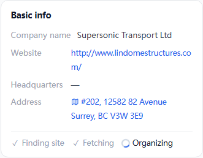
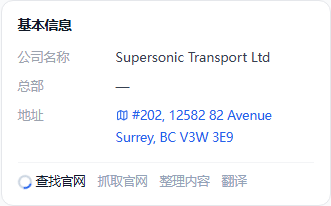
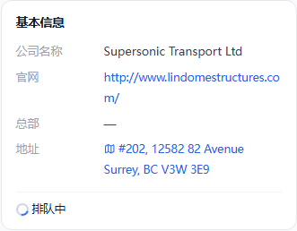
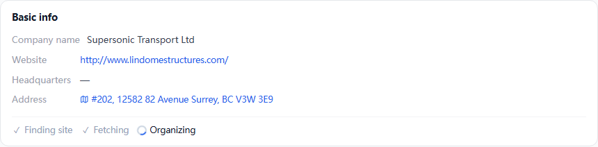

# 点开过的公司优先抓取和纠错

> 2026-09-20 · Frank 拍板(「下一个 session 做『按用户点开过的公司优先抓取和纠错』的队列」;页面形态、频率、查找官网阶梯、自动纠错五条当天逐条点过头,见第三节)。
> 主线定位:数据可信度那一格,不直接推收款;限一个 session。
> 状态:2026-09-20 Frank「开工」,同日实现;落地时与原稿不同的几处记在文末「七、落地记」。

## 一、用户故事

**小王在雇主板翻到一家没听过的公司 Supersonic Transport,点开公司卡。**

- 现在他看到的:官网 `lindomestructures.com`(别家的站),总部「—」,「主营业务」写的是卖帐篷钢构(照着别家官网整理的)。
  这家在招 5 个岗,sites 域按在招岗数从大户往下排,轮到它要一周以后;轮到了也只会再抓一遍那个错官网。
- 做完以后:他点开的那一刻这家排到队首。卡上简介区按步显示进度,一两分钟后总部与简介自己出现,不用刷新;
  每一条点得开出处。错官网 / 死官网被换成真官网 `supersonictransport.ca`。
- 他没点开、只是在雇主板上列出过的公司:不走插队,但排在后台例行抓取的最前面(几小时内轮到,不是一周)。
- 家里那台机器没开(Frank 合盖出门):卡上停在「排队中」,原有简介照旧显示,不空白。

## 二、公司卡进度态(效果图 = 注入生产页 DOM 拍的真样式)

进度住在基本信息卡分隔线下面、简介的位置;**全部步骤放一行**(2026-09-20 Frank「这些思考过程都放到一行呢」,原稿一步一行作废):做完的打勾变灰,正在做的转圈,没到的灰字不带记号。内容到了整块换成简介。

| 手机 375 英文(英文界面没有翻译这一步) | 手机 375 中文,有官网 |
|---|---|
|  |  |

| 手机 375 中文,没官网 | 手机 375 中文,工人不在线 |
|---|---|
|  |  |

桌面 1440 英文:

状态词(三语,只有这五个):

| 键 | 中 | EN | 한 |
|---|---|---|---|
| queued | 排队中 | Queued | 대기 중 |
| find | 查找官网 | Finding site | 사이트 찾기 |
| fetch | 抓取官网 | Fetching | 사이트 수집 |
| facts | 整理内容 | Organizing | 내용 정리 |
| trans | 翻译 | Translating | 번역 |

规则:
- 已有简介的公司(官网版 / 有出处的)不出进度,后台照样插队刷新;进度只在「简介区本来是空的」时出现。
- 没官网的那条:查找官网的同时问 Wikidata 要总部;找到官网接「抓取 → 整理」;找不到,总部行出 Wikidata 给的,简介走现有 AI 检索兜底(不空白)。
- 「翻译」这一步就是现有的懒翻译在途(中 / 韩界面),不新造工序。
- 15 秒问一次进度;到 done / 查无 / 满 5 分钟停止轮询。

## 三、做法

### 1. 队列表加列(只加不改,幂等;`docs/sql/employer-explore-stage-20260920.sql`)

`employer_explore` 加:`opened_at`(最近一次真人点开)、`open_count`、`stage`(queued / find / fetch / facts / done / none)、`stage_at`、`stage_note`、`site_host`。
原 `status` 列仍只管翻译名那条工种,两个工种各看各的列。取活索引 `(stage, opened_at DESC)`。

### 2. 入队(cms)

- 公司页 / 公司弹框被点开 → `POST /api/employers/explore/open {name}`,**只认带 `x-human: 1` 的**(无头爬虫顺站点地图进来的不入队);
  键只认池里真有的。同一家 24 小时内已走过一轮(成败都算)→ 不重置 stage,直接用上次结果。
- 雇主板列出 → 现有 `reportSeen` 不变(只累计 seen_count,不触发插队)。
- 进度查询 `POST /api/employers/explore/stage {name}`(公开只读;公司名走请求体不走地址栏 —— 私人雇主的名字就是人名)。回 stage + 公司表现在的官网与总部,办完那一拍卡上直接补。

### 3. 家里的工人(1 分钟一轮;域间不互相 import,所以按域各出一步)

| 步 | 住哪 | 干什么 | 写回 stage |
|---|---|---|---|
| `findsite` | company 域(新役,1 分钟) | 取「没官网 / 官网已死」的活 → 阶梯:帖内线索 → Wikidata P856 → Google → Bing → DDG;候选一律过现成 `site_of_links` + NOT_OFFICIAL 闸;同时跑 wikihq 要总部 | find → fetch(找到)/ none(找不到) |
| `visit` | sites 域(新役,1 分钟,有头浏览器镜像,自带 cookie 罐) | 取「有官网」的活 → 现成 `fetch_site` → 现成 `facts_one` | fetch → facts → done |

- 取活 / 交活走带 `x-seed-token` 的 cms 接口(数据层照旧不直连库):`…/explore/site-todo`、`…/explore/site-done`。
- **内容几分钟内上页面**:交活时 cms 直接写 companies 的总部六列 + 官网 + 简介(简介由官网整理记录里核对过原句的节拼:WHAT / HQ→BASE / SIZE / FOUNDED + 后三节,出处 = 页面地址)。
  只在简介为空、零出处、或官网刚被纠错换过时才盖;aiBrief 几列在 seed 里本来就是「mart 没给就保旧值」,不会被下一轮灌库抹掉。
  工人同时照常写 `processed/sites/*.json` 与 `company_enrich.json`,下一轮 mart 汇装出来的值与此一致。
- **两个进程写同一份 json**:例行轮一跑两小时、整本缓存在内存里,会把工人的写入盖掉 → `write_pages` / `write_facts` / 找官网缓存改成「落盘前重读、只并入本进程改过的那几家」。
- **Google 那一档只在本机跑**(统一 profile + `BROWSER_CHANNEL=chrome`,弹验证等 Frank 亲手点,现成逻辑等 120 秒;助手不替过验证):
  本机 `python etl/company/main.py --only findsite`(设 `FINDSITE_GOOGLE=1`)开着时每轮在 `data/processed/company/findsite_host.json` 打心跳;
  容器里的同一步见心跳在 2 分钟内就让出找官网的活,心跳没了(Frank 不在)自己走 Bing → DDG。120 秒没人点 → 本机那步也退 Bing。
- Bing:`https://www.bing.com/search?setmkt=en-CA&q=…`,`li.b_algo h2 a`,href 的 `u=a1<base64url>` 去前缀补 `=` 解码;DDG:`https://duckduckgo.com/html/?q=…`,`a.result__a`,真地址在 `uddg`。都走有头浏览器,原文进 crawl 层(`data/crawl/search-<engine>/`)。

### 4. 后台例行轮的排队(没被点开、只被列出过的)

explore 域每轮取活时顺手把队列表的「被看过的公司」落成 `data/processed/explore/seen.json`(slug、seen_count、last_seen、opened_at)。
sites 的 `target_order_of` 与 company 的 `wikihq_order_of` / `nosite_priority_of` 排队键最前面加一档「在这份清单里、最近被看过的在前」,其后照旧按在招岗数。
(交接里写的是「mart 多产一份清单」;实际放 processed:mart 的规矩是一文件 = 一张表、会被 seed 灌回库,清单本来就是从库里来的,放 mart 成环。)

### 5. 频率

| 情形 | 规则 |
|---|---|
| 点开触发的抓取 | 同一个**主机名** 24 小时内最多一次(A&W / IGA 加盟店共用 aw.ca / iga.net:第一家抓,其余复用 crawl 层缓存原文,只各自整理) |
| 没人点的 | 照旧 30 天例行刷新 |
| 失败冷却 | 瞬时网络错(ConnectError / 超时 / 掐断)与点开触发的:1 天;真被拦(拦截页 / robots):14 天;域名不解析:不再重试那个地址,转去重新找官网 |
| 查找官网、Wikidata | 一家一天一次 |
| 整理、翻译 | 读本地缓存,不限 |

### 6. 自动纠错

- 官网连续两轮抓不到且属于「域名不解析 / 拒连」(抓页失败后用标准库 `socket.getaddrinfo` 复核一次)→ `pages.json` 记 `dead`。
- mart 汇装见 dead 的官网 → 官网格清空;company 域找官网阶梯把「缓存里的官网 = 已死的那个」当成没官网重找(`wiki_skip` / `should_skip_find` 原先见 website 非空就跳过,补这一条)。
- 归属闸 `name_ok` 没过的:**只是不带总部,不清官网**(09-20 已核,多数是雇主自报的经营品牌 / 母公司站)。Supersonic ↔ lindomestructures.com 这类靠「点开 → 查找官网阶梯找到名字对得上的站」来换,不靠清。
  换的条件:阶梯找到的新站过了 `site_of_links` 闸,而旧站没过 `name_ok` —— 两条同时成立才换。

## 四、可证伪的假设

1. 点开 → 内容出现,有官网的 3 分钟内、没官网的 5 分钟内(工人在线时)。
2. 有头浏览器开 Bing 连续 20 发不弹验证。
3. 一天的点开入队量 = 真人量级(几十到一两百),不是上千。
4. 改成「落盘前重读并入」后,例行轮与工人同时跑一小时,两边的记录都在。
5. 三个死 / 错官网样本(Cotech、Cuisines Bernier、Supersonic Transport)两轮内被换成真官网。

## 五、验收

1. 拿一家没抓过的长尾公司,生产上点开公司卡 → 进度逐步变化、内容自动出现;一小时内生产库里总部 / 简介带出处。
2. Cotech → cotech.ca;Cuisines Bernier → armoiresbernier.com;Supersonic Transport → supersonictransport.ca。
3. 队列不被爬虫灌:上线后看一天 `opened_at` 非空的新增行数。
4. tsc / eslint / vitest / pyrefly / ruff / etl gate shape 全过;页面先 375 再桌面;上线后在生产验。

## 六、不做

译名 / 灰字打磨;空壳帖正文补全;动盒子的 searxng 配置;jobbank 全量重解析;把 Google 降成手动备用;清掉归属闸没过的官网。

## 七、落地记(2026-09-20 实现时定下来的)

- **役名**:sites 域第二役叫 `visit`(容器 `visit`),company 域第二役叫 `findsite`(容器 `findsite`);两域的 `META` 改成 `METAS`(一域多役,load 先例)。
- **官网名字对不上的也转给查找官网**:visit 步整理完发现归属闸没过(Supersonic ↔ lindomestructures.com),进度写回 `find`,findsite 步避开旧主机名走阶梯;
  找到名字对得上的新站才换(富化缓存记 `replaces` = 旧主机名,mart 汇装见来源侧官网等于它就让位),找不到原官网不动。一家一天只找一次,不会来回打转。
- **简介让位规则**(cms 交活 SQL):原简介为空 / 不是五节新版 / 零出处 / 官网这回被换过 / 出处里没有这个官网主机名 → 官网版简介盖上去并清旧译文;
  出处本来就是这个官网的(company 域照 About 页写的五节简介,更全、带译文)不盖。
- **简介四个核心节一律出行**(没核对上的写 `(not stated)`):cms 认五节简介靠 `[FOUNDED]` 标记,缺了会被当成过期缓存重查。
- **帖内线索按名直取**:JD 文件名 = 「雇主 slug_岗位 slug.md」,一家只读自己那几篇;全量那条路要逐篇读 16 万个文件头,几分钟,用户等不起。
- **总部街址清洗下沉到 sites**(截到街、省码大写):交活直接上页面,等不到 mart 那一道;mart 的同名函数留着管存量,对洗过的值是空转。
- **并写保护**:`pages.json` / `facts.json` / `company_enrich.json` / `company_wiki_hq.json` 四份落盘前重读、逐家取时刻更新的那一条。
- **cms 接线收进 fetch 叶**(`cms_config`):explore 之后 sites / company 是第二、三个消费者;空 cookie 罐 `ensure_cookie_jar` 同理收进 crawl 叶。
- **工人不在线的兜底**:卡上「排队中」问满 2 分钟(或任何一步问满 5 分钟)不再等,简介走现有的联网现查;官网那条工种还在办的时候不现查。
- 本地实测(dev 连生产库):Supersonic → Bing 找到 supersonictransport.ca,总部 `12582 82 Ave, Surrey, BC` 带出处,简介换成真官网的;
  Comox Valley Regional District 点开 → 排队中 → 抓取官网 → 整理内容 → 翻译 → 简介自动出现,全程约 80 秒。
