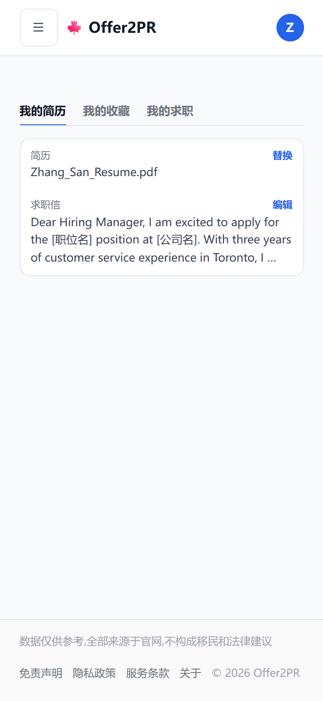
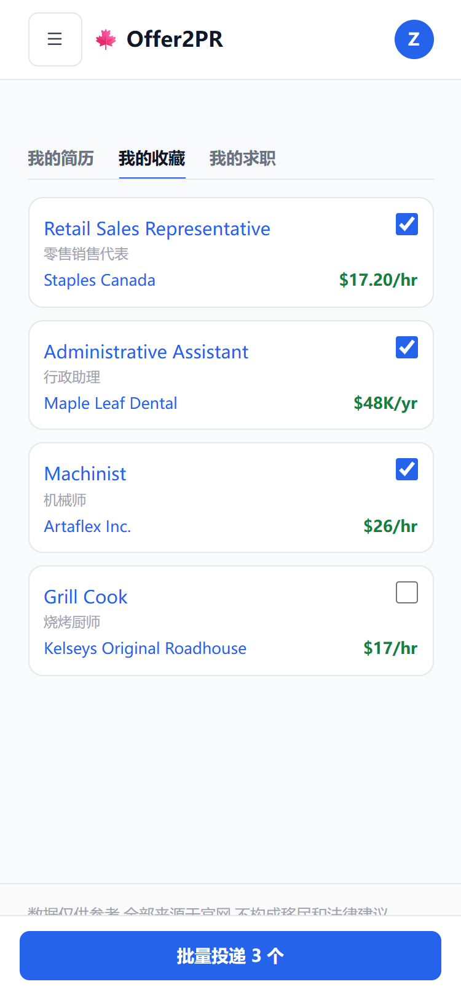
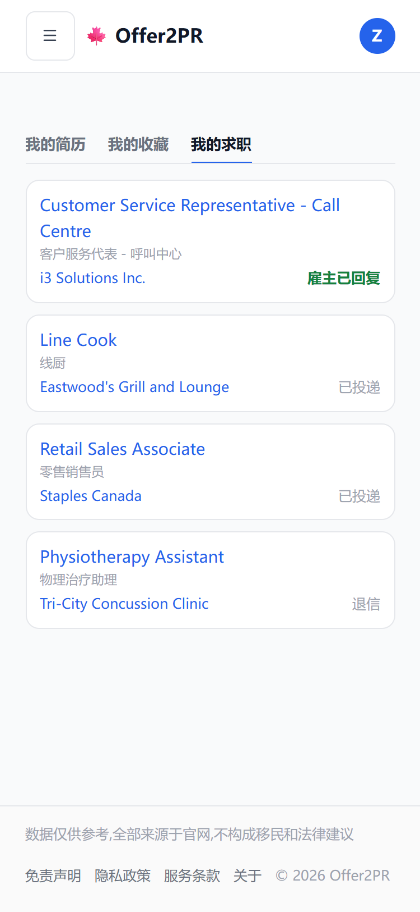
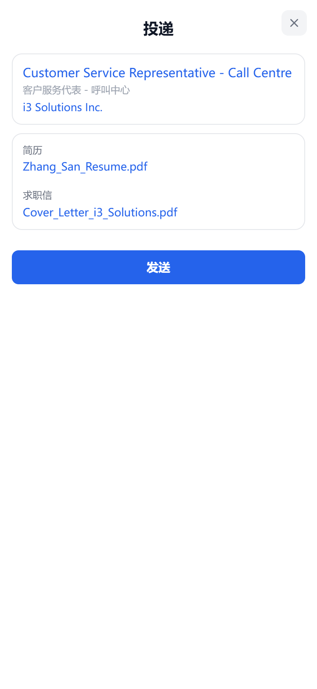
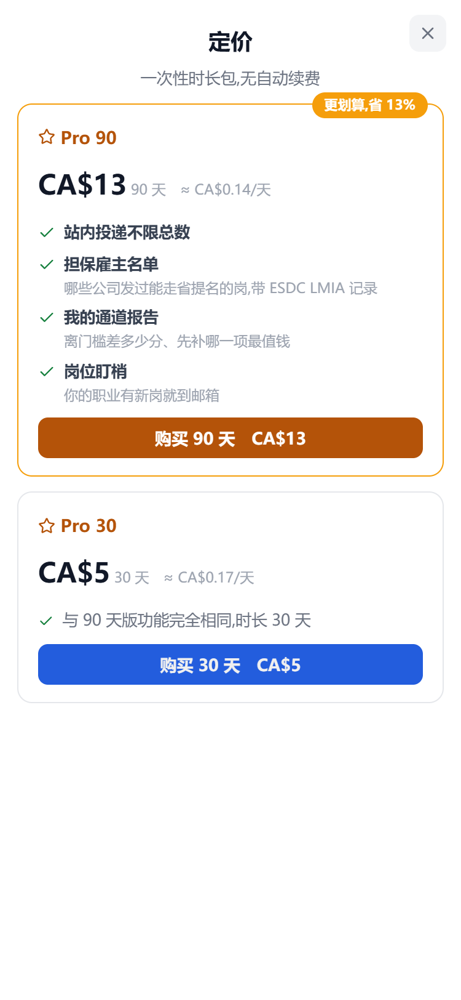

# 站内投递 批 2 / 批 3:简历与求职信、站内一键投递、中转回信、收藏批量投、3 封免费(2026-09-23)

> 接批 1(投递邮箱入库,板上只放有邮箱的岗):docs/design/站内投递批1-投递邮箱入库-20260923.md。
> Frank 09-23 定:「投递简历全走我们的网站」「注册,上传简历,帮他投递简历。默认只能投 3 个,继续投就收费」
> 「用我们的邮箱合适吗?如果收到信息,肯定我们知道哪些有回复」「先浏览,然后挨个加入收藏,然后在批量投递」。
> 效果图第一版后 Frank 09-23 改:「不光是要简历 还需要 cover letter 吧」「别去原贴投递啊。不用显示还可免费投 2 封。
> 就是用户投第四封自动弹出统一的付费页面」「之前不是有统一的吗」。
> 第二版后再改:「退出登录怎么在上面的选项卡里显示了」「上面那个选项卡太简陋了吧」「我的求职页面,看着乱的一笔」
> 「定价页不需要显示免费卡」「能尽量少显示就尽量少显示」「很多卡片和选项卡都是现成的」。
> 本稿等效果图过了再动工。

## 形:全用现成件,能少显示就少显示

- 账户页顶上 = 通用选项卡 `Tabs`(tabs 桶,下划线态;08-12 立的「不能用按钮代替」),三个页签:我的简历、我的收藏、我的求职。账户页现在那条是按钮自造的,换掉;「退出登录」撤出(头像下拉里本来就有);左右两栏改一栏。
- 岗位一律用职位卡 `JobCard`(card 桶,全站唯一一套),只填三行:标题、标题译名、公司;右格按场景放一样东西。
- 其余块用通用白卡 `card` + 键值行 `CardKV`;按钮用 `Button`;投递框用弹框 `Modal`(手机上全屏)。
- 不做:统计三格、状态筛选、回信预览、剩余几封、邮件正文框、回复邮箱框。

## 批 2:我的简历与求职信 + 站内一键投递 + 中转回信

### 用户故事

1. 作为求职者,我在「我的简历」上传一份 PDF 或 Word 简历(5MB 以内),以后投递都附这一份;点文件名预览,点「替换」换一份。没传过的时候这里只有一个「上传简历」钮。
2. 作为求职者,「我的简历」里还有一封求职信模板,职位名、公司名两处是占位,投递时自动换成这一岗的;点「编辑」改,也可以上传自己写好的(抽出文字当模板)。
3. 作为求职者,我在职位页 / 职位弹框点「投递」,弹出投递框:这一岗的职位卡、两个附件(我的简历、按这一岗生成的求职信 PDF,点开能看能改这一封)、「发送」钮。收件方不显示雇主邮箱;邮件正文自动生成、回复邮箱用我注册的邮箱,都不在框里显示。
4. 作为求职者,发完后这一岗的投递栏变成「已投递」,这条自动进「我的求职」。
5. 作为求职者,「我的求职」一张卡一个岗,卡右边一个状态:雇主已回复(绿)、已投递、退信;雇主回复的排最前。点卡看这条的全部往来。
6. 作为求职者,雇主回信时我的邮箱收到转发(标题带岗位名);我直接回复那封转发邮件,雇主看到的还是同一串往来。
7. 作为求职者,发出去被退信时,这条变「退信」。退信的雇主邮箱记为失效,这个岗从板上撤下,不再给别人投。
8. 作为站长,每条投递、每封回信都有记录:哪个雇主回了、几天回的 —— 这份回复率数据以后用来给岗位排序、做付费卖点。

### 发信与回信怎么走

- **发件人**:我们的域名,显示「张三 via Offer2PR <apply@offer2pr.com>」。Resend 只能用验证过的域名发,不能冒用用户的 gmail。
- **回复地址**:每条投递一个专属中转地址 `reply-<令牌>@reply.offer2pr.com`。雇主回信 → Resend 收信 → 推到我们的接口 → 记进这条投递 → 立刻转发到用户邮箱(转发邮件的回复地址仍是中转地址,整段往来都经过我们)。
- **求职信**:每封发出前按模板换好两处占位、生成 PDF 附上(`Cover_Letter_<公司名>.pdf`);发出去的那封文字存进这条投递。
- **邮件正文**:固定一小段(称呼 + 附上简历和求职信 + 职位名 + 署名),不给改。
- **转发必须可靠**:面试邀请卡在我们这里没转出去 = 我们害用户错过面试。转发失败重试,站内也能看到原文。
- **用户知情**:第一次投递前明确告诉用户「雇主回信经 Offer2PR 转给你,我们记录回复情况」,隐私政策同步写上。
- **看不到的部分**:简历上有用户的电话和邮箱,雇主直接打电话或直接发邮件给用户,我们记不到 —— 回复率只能算下限。

### 数据

- `user_resumes`:用户号、原文件(bytea,≤5MB)、文件名、类型、大小、抽出的文字、上传时刻、求职信模板(文字)。一人一份现行简历(替换即覆盖)。
- `applications`:用户号、岗位号、雇主邮箱(只存不下发)、中转令牌、邮件标题、邮件正文、求职信正文(换好占位的那一封)、状态(已投递 / 雇主已回复 / 退信)、发出时刻、首次回复时刻、Resend 消息号。
- `application_messages`:回信(发件人、标题、正文、收到时刻、是否已转发)。
- `bounced_emails`:退过信的雇主邮箱与首次退信时刻;板上筛「有邮箱」和投递前都跳过这些。
- 投递栏不再向前端下发雇主邮箱;`/api/jobs/applyhow` 收紧为登录可用或退役。

### 你要亲手做的

- 域名后台给 `reply.offer2pr.com` 加一条 MX(指向 Resend 收信),Resend 后台开通收信并配回调地址。
- Resend 套餐:免费档每天 100 封、每月 3,000 封;量上来要升级(约每月 20 美元)。

## 批 3:收藏后批量投 + 3 封免费 + 付费

### 用户故事

1. 作为求职者,「我的收藏」一张职位卡一个岗(标题、译名、公司、薪资),右上角一个勾选框;勾了几个,底栏就是「批量投递 N 个」一个钮。
2. 作为求职者,点「批量投递」,每个岗各发一封(求职信按岗换好),逐封发出(每封隔几分钟,每天最多 20 封);「我的求职」里能看到每条。
3. 作为免费用户,我累计能免费投 3 封;页面上不显示剩余几封。投第 4 封时直接弹出全站统一的定价弹框(PricingModal,和 /pricing 同一套价卡),不另做付费框。
4. 作为免费用户,批量投递超出额度时:额度内的几封照常排队发出,同时弹出定价弹框;没发的岗留在收藏里保持勾选,付费后接着投。
5. 作为付费用户,我不限总数(每天最多 20 封,防止被雇主邮箱当成垃圾邮件)。

### 统一价卡跟着改(/pricing 与定价弹框同一份)

- 撤免费卡;Pro 卡顶上那行「免费版全部功能,另加:」一并撤(免费卡不在了,这行指向看不见的东西)。
- Pro 90 卖点第一条加「站内投递不限总数」(只有粗体一行,不带小字);Pro 30 那句「与 90 天版功能完全相同」不用动。
- 三语同步,改的是价卡文案,不 fork。

### 待你拍板

- 付费用哪一套:沿用现在的 30 天 / 90 天时长包,还是 09-03 定的每月 5 加元 / 每季 13 加元订阅(还没实施)。
- 3 封免费是「每人一辈子 3 封」(默认)还是「每月 3 封」。
- 求职信生成 PDF 要加一个依赖 `pdf-lib`(纯 JS、MIT、无原生件);不加的话求职信只能写进邮件正文、没有附件。推荐加。

## 不等批 2 就能先上的

- 账户页:选项卡换通用 `Tabs`、撤「退出登录」、改一栏。
- 统一价卡:撤免费卡和「免费版全部功能,另加:」。

## 效果图(375px 手机;生产页注入现成件的真类名拍的,账户头像、岗位、数字为占位)

**我的简历**(通用选项卡 + 一张白卡:简历、求职信模板)

**我的收藏**(职位卡 + 勾选框;底栏一个钮)

**我的求职**(职位卡,右边只放状态)

**投递框**(弹框;职位卡 + 两个附件 + 发送)

**第 4 封:弹出统一定价弹框**(真 PricingModal;免费卡与「免费版全部功能,另加:」已撤;「站内投递不限总数」是要加的一行;价格待拍板)

