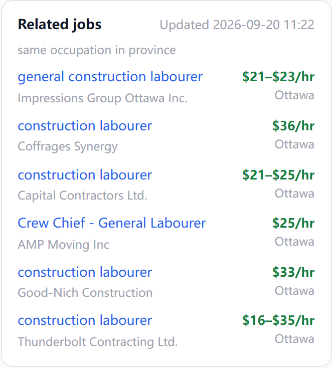

# 站内链接与收录(2026-09-20)

> 起因:Frank 2026-09-20「现在又是好多没收录」→「职位页 也 改成像 公司页那种吗」→「那要把 相似岗位 和 相似雇主 做准确了」→「有完整方案吗」。
> 主线哪一格:流量入口。Google 来的求职者是全站唯一的陌生人来源,收录上不去,后面的付费动线没有人走。
> 状态:2026-09-20 Frank「按你推荐来」—— 稿末三件全按推荐:批二做且与批一同推、批三 canonical 改法认(批一二上线后单独一批)、`EMPTY_RELATED` 下个清理批撤。批一 + 批二已写完过四道闸(tsc / eslint / vitest 499 / build)。
> 2026-09-20 下午 Frank「都改完」:批三同日做完(原计划批一二上线后单独一批;归因靠提交时刻分开看)。批一二 = ffe4f835 已上线验过;批三见下文「批三实做」。

## 用户故事

- 作为 Googlebot,我抓到任何一个职位页,都能顺着页面里的链接走到它的公司、同公司的其他岗、同城同职业的岗;抓到公司页能走回它的职位和同类公司。我不用只靠站点地图认识这个站。
- 作为从 Google 落到职位页的求职者,我看完这个岗不合适,下面就有同城同职业的另外六个岗,而不是只剩关页(现状:67.5% 的人只看一页)。
- 作为看「相关职位」的人,我看的是兽医岗,推给我的就是兽医岗,不是心脏科医生。
- 作为 Frank,每一批上线后我能用一条 curl 数出「爬虫在这个页型上能看到几条站内链接」,两周后在 Search Console 看三个数判断有没有用,而不是凭感觉。

## 现状(全部 2026-09-20 实测)

### Search Console

| 项 | 读数 |
|---|---|
| 已收录 / 未收录 | 12.2K / 105K(报表数据停在 9/13,与 09-17 读数相同,不是新塌方) |
| 已发现、目前未抓取 | 85,931(站点地图报上去了,Google 没来抓) |
| 已抓取、目前未收录 | 3,010 |
| 下架岗 noindex | 14,682(设计如此) |
| 软 404 | 1,211 |
| 抓取统计 | 90 天 22.1 万次,集中在 7 月下旬两个峰,8 月中起贴地;100% 返回 200、平均 320ms |
| 招聘富结果 | 有效 0(截至 9/18) |
| 近 7 天 | 点击 13、展示 437 |

按站点地图分片拆开:

| 分片 | 已收录 | 未收录 |
|---|---|---|
| jobs-0 | 2,930 | 2,070(已抓取未收录 1,083、已发现未抓取 753、软 404 219) |
| jobs-8(中段抽查) | 0 | 5,000,全部「已发现未抓取」 |
| companies-0 / 1 / 2 | 0 | 15,000,全部「已发现未抓取」 |

`/companies/` 路径近 3 个月:展示 15、点击 0。

09-16 请求编入索引的 `/jobs/54336105`:当天被抓取、抓取成功、允许收录,结论仍是「已抓取、目前未收录」,发现栏「无引用站点地图、无引用页面」。

### 爬虫眼里的站内链接(Googlebot 标识拉服务端 HTML,数 `href`)

| 页型 | 指向职位 | 指向公司 | 指向城市 | 备注 |
|---|---|---|---|---|
| 首页(职位板) | 50 | 0 | 0 | 公司名链到 `/jobs?q=公司名`,那是 301 到搜索结果,不是公司页;没有翻页链接(`/?page=2` 能开,但页面里没有指向它的 `<a>`) |
| 职位详情页(在招) | 0 | 0 | 0 | 08 月 E8-11 B2 瘦身只留 JD;公司名是开弹框的钮 |
| 职位详情页(下架) | 0~6 | 0 | 0 | 相关职位卡只给下架岗 |
| 公司页 | 7 | 6 | 0 | 全站唯一成网的页型,但它自己零收录 |
| 雇主板 `/employers` | 0 | 50 | 0 | 没有翻页链接 |
| 把脉页 `/start` | 0 | 105 | 0 | 城市表的城市名没有算进来的链接 |
| 城市详情页 `/city/省/城`(272 个) | 0 | 0 | 0 | 不在站点地图里;只有一条回职位板的链接 |
| 职业页 `/occupations` | 0 | 0 | 0 | 338 条 `/?q=职业码`,而职位板所有筛选变体的 canonical 都指回首页,等于不算 |

**结论**:8 万职位页 + 1.5 万公司页,能被「别的页面」链到的只有首页露出的 50 个岗、雇主板第一页 50 家、把脉页 105 家。其余全靠站点地图单点投喂 —— 站点地图告诉 Google「有这页」,站内链接才告诉它「这页值得抓」。全站已收录的页几乎都挤在 jobs-0 一片,后面的分片原封不动,符合「抓取配额只够吃一片」的样子。

### 原因排序(诚实版)

1. **站内链接缺失**(本稿处理):技术上确定、能修、不推翻任何拍板。
2. **8 万网址一次性上报,稀释配额**(批四候选,先观察):推翻 09-14 全量提交的做法,要数据支持再动。
3. **内容与 Job Bank 原帖同源**(本稿不处理):Google 对「已抓取未收录」不给理由,同源是最可能的那个。解法是职位页服务端直出本站独有内容(vs 工资中位、通道档、雇主 LMIA 记录),工作量最大,等前两条见效与否再决定。

不承诺修完 1 就收录回升 —— 1 是必要条件,不一定充分。所以每批后都有可量的验收,两周观察窗到点再决定下一步。

## 方案:分四批,一批一种变换

### 批一:职位页接回「相关职位」卡 + 相似职位口径(已写完,待推)

- 在招岗也出相关职位卡(原只给下架岗)。形态不新造:现成的 `JobRelated` 卡 + `JobMiniRow` 行(09-19 起就是带 `href` 的真链接,点击拦成弹框)。卡在 JD 卡之后,不挡阅读。
- 同公司组:该公司其他在招岗 ≤ 3(不变)。
- 同职业组口径改四档:① 职业码全等且同城 ② 职业码全等同省 ③ 同 4 位前缀且同城 ④ 同 4 位前缀同省;档内最新在前;一家雇主只出一条;剔重复帖;取 6 条。
- 埋点来源分开记(在招页 `open` / 下架页 `closed`),能单独看这张卡在在招页上有没有人点。



口径实测(生产库只读,随机 300 条在招岗):

| | 旧口径 | 新口径 |
|---|---|---|
| 推荐里职业码全等 | 58% | 97% |
| 推荐里同城 | 8% | 50% |
| 第一条即「同职业同城」 | — | 204 / 300 |
| 推满 6 条 | — | 288 / 300 |
| 一条也推不出 | — | 9 / 300 |

旧口径实撞:兽医(Richmond BC)推心脏科医生、家庭医生;medical orderly 推药房助理、牙科助理;QC 小城的岗推全省随机城市。新口径同样本:6 条全是同名职业,Montréal 清洁岗 6 条全在 Montréal、6 家不同雇主。

速度:原 `LEFT(noc,4) = …` 用不上索引,每次扫全省(ON 5 万行约 200ms);改「前缀 ~ 前缀 + 9」范围写法走现成 `idx_jobs_noc`,约 7ms,不动生产表结构。以前这条只有下架页跑,现在 8 万在招页都跑,必须快。(试过上界用冒号,0.2ms 但一条没查出 —— 库的排序规则下冒号排在数字前,已记在 SQL 注释里。)

已知不准、本批不治:

- 大筐职业码(`00012` 高管)里财务经理会推到消防队长 —— 要标题相似度,等分类地基。
- 4,749 条没职业码的在招岗出不了同职业组,只出同公司组。
- 职业码本身分错的岗,相关职位跟着错(截图里 Horticulture Labourer 被分成建筑小工,推的是一排 construction labourer)—— 属 classify 域。
- 公司名没归一(「Noord Prestige」/「NOORD PRESTIGE INC.」)会漏过「排除本公司」—— 属 names 域。

验收:Googlebot 标识拉本地 3 个在招岗页,职位链接 0 → 6 / 4 / 6;375px 无横向溢出;tsc 零错、eslint 零错、vitest 499 全过。

### 批二:公司名成真链接(职位页 + 职位板)

- 职位详情页:实做时发现 B2 瘦身后正文里**根本没有公司名**(只在 `<title>` 里),不是「钮改链接」—— 改为标题下补一行公司名,真链接直达公司页(页到页跳转,不开弹框)。
- 职位板(首页)手机卡公司名:现链到 `/jobs?q=公司名`(301 到搜索)→ 改链公司页,左键照旧开弹框(#315 原行为不变)。桌面表格的公司格不动(#175 拍板「一格一个动作」摘了 href;手机卡与表格同在服务端 HTML 里,爬虫从卡上拿链接就够)。
- 没有 slug 的公司(无公司页)退回原来的搜索链。

实测(本地,Googlebot 标识):职位页 `/companies/` 链接 0 → 1;首页 0 → 40,`/jobs?q=` 45 → 0。

为什么值:公司页 1.5 万零收录;职位页是唯一有收录的页型。职位页 → 公司页 → 公司页上的在招职位与相似雇主 → 别的职位页 / 公司页,站内才成网。

验收:Googlebot 标识拉职位页,`/companies/` 链接 0 → 1;首页 0 → ~45;点击仍开弹框(手机、桌面各验一次)。

### 批三:列表页可翻、城市页入网

- 职位板、雇主板的分页器输出真 `<a href="?page=N">`(上一页 / 下一页 + 页码),点击照旧客户端翻页。现状:第 2 页起的 7.9 万个岗,没有任何页面链向它们。
- 翻页变体的 canonical:`/?page=N` 自指(现全部指回首页,等于告诉 Google「别看这页」);筛选变体(`?prov=` `?q=` 等)维持指回首页不变,避免参数组合爆炸。**这一条动 canonical,是本稿唯一有 SEO 风险的改动,单独一批、单独观察。**
- 城市详情页(272 个)进站点地图 core 片(09-11 欠账 ③);城市页里加「本市在招最多的雇主」「本市最新岗」各几行真链接(数据现成:`stats_city` 快照 + 职位板同款查询,走 TTL 缓存不每请求现算)。
- 把脉页城市表的城市名链到城市详情页(若已是链接则只核对爬虫可见)。

**批三实做(2026-09-20,与原稿的出入)**

- 两个板都是「显示更多」式,没有翻页器可改。实做 = 通用 pager 桶新件 `PageLinks`:板底一行页码真链接(首页、末页、当前页 ±1 ±2、±10、±100 —— 只有「下一页」的话第 800 页要顺着爬 800 跳),人点了是整页跳转,「显示更多」钮照旧。页号沿用两个板现成的 0 起 `?page=N`。
- 职位板服务端此前**不认** `?page=`(`/?page=2` 拿到的还是第 1 页),先补:页面门按页号取那一页,板的状态机从「起步页」起算(首屏 = 第 N 页,「显示更多」接 N+1,换筛选回 0 并摘掉地址栏页号);「已显示 / 还剩多少条」改按页号算。雇主板服务端本来就认。
- 带页号落地不再按时区预选省(同 09-19「带搜索词进来不预选」的先例)—— 否则人点「全国第 4 页」会被弹回本省第 1 页(本地实撞)。
- 规范网址:无筛选的第 N 页自指、标题加「— Page N」;带筛选 / 搜索的版本照旧指回列表页(09-16 拍板不动)。雇主板带省的版本维持原样不给规范网址。
- 城市页:有在招岗的城市实为 2,924 个(原稿「272」是把脉页分页数,写错),一大半只有一两个岗;进站点地图的下限定在**在招 ≥ 20**(477 城,覆盖 87% 在招岗)。并进已提交的 `core.xml`(Google 不展开索引文件,新开分片还得去 GSC 手动提交),清单走 seo 域进程缓存。页上加「最新职位」「主要雇主」两张表,各 8 行真链接。
- 城市页入站链接(同日补做,Frank 再拍「都改完」):原先城市段五份数据(2,700 行)是挂载后才从 `/api/stats/city` 拉的,爬虫在 `/start` 上一条 `/city/` 链接都看不见,城市页只有站点地图一个入口。补两处 —— ① 职位详情页面包屑在省后面加城市一级(职位板 › 省 › **城市** › 分类…),链到该城详情页,8 万个职位页每页一条;② 把脉页城市段表 1 的第一页 10 行改服务端直出(页面门取 `loadCityStats` 前 10 行递进去当起步数据,全量照旧挂载后整份替换;其余三张表空着不渲,不多占首屏)。实测(本地,Googlebot 标识):`/start` 城市页链接 0 → 10;`/jobs/55023843` 面包屑出 `/city/NS/Baddeck`;把脉页无 Hydration 报错,挂载后全量照常替换(城市页链接 112 条)。

实测(本地,Googlebot 标识):`/?page=3` 首条岗与第 1 页不同、规范网址自指、标题带 Page 4;落地后「显示更多」接第 4 页,100 行零重复;`/city/ON/Ottawa` 职位链接 0 → 8、公司链接 0 → 8;`core.xml` 19 → 496 条。

验收(原稿):首页出现 `?page=2` 链接;`/?page=2` canonical 自指;`/city/ON/Ottawa` 指向职位 ≥ 5、指向公司 ≥ 5;站点地图 core 片行数 19 → 291。

### 批四(观察窗之后再定,现在不做)

- **站点地图瘦身**:只报值得收的岗(有整理版正文 / 近 30 天 / 雇主直发),7.6 万 → 一两万,让配额集中。推翻 09-14 全量提交,要批一~三上线两周后的曲线支持才动。
- **相似雇主换口径**:同行业 15 类 + 同城、按规模相近排(现状按在招数排,Tim Hortons / McDonald's / Canadian Tire 霸每家的榜;`companies.industry` 是岗位大类多数派不是行业,3.6 万在招雇主仅 1 万有值)。依赖 09-18 设计稿批二的 15 类行业数据落库,**落库前公司页现有卡不动、也不把它铺到职位页**。
- **职位页独有内容直出**(治同源):vs 工资中位、通道档、雇主 LMIA 记录服务端直出。

## 不做的

- 不再「请求编入索引」:09-16 三条实测当天被抓、仍不收,救不了。
- 不为 SEO 造聚合落地页(「渥太华护士职位」这类):那是内容农场路线,与「真实数据」的价值主张相悖。
- 不改 JSON-LD:已收录页 Google 能认出有效 JobPosting,标记没问题。
- 不在职位页挂 AI 顾问入口(新动线默认不挂,Frank 既有拍板)。

## 节奏与验收

| 时点 | 动作 |
|---|---|
| 批一 + 批二 | 同一次推送(同一目的,免两次部署两次等效果) |
| 推后当天 | 验生产换版;Googlebot 标识拉线上职位页 / 首页数链接 |
| 批三 | 批一二上线后单独一批(动 canonical,要能单独归因) |
| 10-04 前后 | 读 GSC 三个数:抓取次数曲线、「已发现未抓取」8.6 万走向、公司页收录是否从 0 起步;另看埋点 `rel-job` 的 `from=open` 点击量 |
| 到点判定 | 动了 → 议批四;没动 → 主因是同源,议独有内容直出 |

观察窗内不再加码 SEO,主线回原位。

每批的可复跑探针(写进收口自查):

```bash
UA="Mozilla/5.0 (compatible; Googlebot/2.1; +http://www.google.com/bot.html)"
curl -s -A "$UA" https://offer2pr.com/jobs/<id> | grep -o 'href="/\(jobs\|companies\|city\)/[^"]*"' | sort -u | wc -l
```

## 落在哪一层

全部是展示层(`cms/`)改动:SQL 住 `lib/db/sql.ts`,取数住 `lib/jobs`,形态住 `components/jobs` / `components/companies` / 通用 table 桶的分页器。不动 etl、不动 mart、不动生产表结构。批三城市页两组行若要新 SQL,先查索引(`jobs.city`)再上。

## 待 Frank 拍

1. 批二做不做、是否与批一同推(推荐:做,同推)。
2. 批三的 canonical 改法(翻页自指、筛选仍指首页)认不认(推荐:认;这是分页站点的常规做法)。
3. `EMPTY_RELATED` 常量批一之后无人使用,头上挂着 08 月决策注释,现只补记一笔没删 —— 清理批撤还是留(推荐:下个清理批连桶导出一起撤)。
