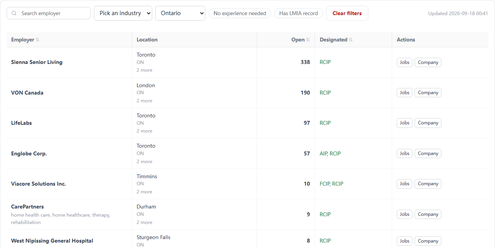
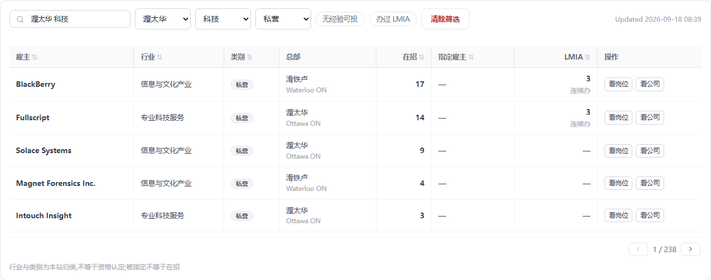
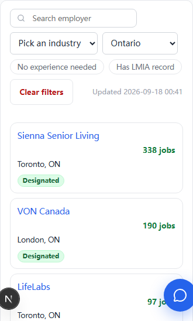

# 雇主分类与搜索 —— 用户故事版(2026-09-18)

> 起因:2026-09-17 夜 Frank 连问「雇主也需要分类别」「比如搜渥太华科技公司」「也要分总部和分部吧」「还要知道哪些市政府部门 事业单位 或者私营企业」「用户看公司主要从几个维度看」「各个行业 / 各个地区 top 几看不看」,2026-09-18「按默认走,先出设计稿」。
> 一句话定位:**雇主板从「一张按星级排的榜」改成「按地点 × 行业 × 类别切雇主的板」**,搜索框能听懂「渥太华 科技公司」这句人话。
> 承接 [分类清洗-20260915](分类清洗-20260915.md) 的公司段(批 3~6 尚未开工),本文是它的展示层与搜索层,数据层只补它没写的三样(类别五档、总部、LMIA 连续办)。
> 执行顺序:数据层(类别 → NAICS → 总部)→ 展示层(雇主板)→ 两处 top 段。改错层下游白干,顺序不许倒。

---

## 用户故事

### 故事一:小周,学签在读,想留在渥太华

**她是谁**:渥太华读研,毕业后想留在本地走 OINP。她只知道「渥太华有不少科技公司」,一个名字都说不上来。

**她的痛**:雇主板搜索框只认英文名,她没有名字可搜;行业下拉是「STEM / 技工 / 餐饮零售」这类按岗位归的组,一家医院因为招 IT 也算 STEM。

**她怎么用**:
1. 搜索框打「渥太华 科技」。板把「渥太华」认成城市、「科技」认成行业(信息与文化产业 + 专业科技服务),城市下拉与行业下拉直接显示选中值。
2. 类别下拉选「私营」,把国家研究委员会、加拿大银行这类她投不了的挑掉。
3. 从上往下按在招岗数扫:BlackBerry、Fullscript、Solace…,看到 BlackBerry 总部在滑铁卢,心里有数。
4. 点「看公司」进公司页,底部「渥太华同行业在招」一段告诉她这家在同城同行里排第几,顺手把其余几家也收了。

**做成的标志**:三个词、零名字,一屏之内拿到一张可投名单。

### 故事二:老张,旅转工

**他是谁**:访客身份,雇主愿意办 LMIA 才能落地。他要的不是「办过一次」的雇主,是「年年都办」的雇主。

**他怎么用**:开「办过 LMIA」开关,「LMIA」列看数字和「连续办」灰注(2024、2025 两年都有获批记录)。农业和低薪流的数字不在这一列,他不会被鱼加工厂的 2,000 个名额骗进去。

**要如实给他的真相**:LMIA 近两年总量砍半、仅永居流归零(见「LMIA 证据」),这条通道在收窄。列上只给技能类,口径注写明。

### 故事三:小陈,想进政府或公立机构

**她是谁**:永居在手,想要稳定和福利,目标是市政府或医院、学区。

**她怎么用**:类别下拉选「市镇政府」或「公立机构」,城市选自己住的城市,得到一张只有这两类雇主的表。她知道联邦机关多数要公民,「联邦机关」是单独一档,不会混进来。

**做成的标志**:类别一选,表里没有一家是她投不了的。

---

## 雇主的四个维度

用户看公司的六个问题里,前三个决定点不点(在哪、干什么、是谁的),后三个决定投不投(招不招我这类人、能不能帮我走移民、值不值得去)。本文做前三个加「名字」,后三个已在板上(在招、指定、LMIA)或留公司页。

| 维度 | 值域 | 来源 | 空值口径 |
|---|---|---|---|
| 地点 | 总部(市 + 省)。招聘地点(发过岗的城市清单)只留在数据里给公司页用,**不上雇主板**(2026-09-18 Frank「招聘地点去掉吧」) | 总部:库里已有文本(AI 简介、官网简介、维基页信息框)提「headquartered in / 总部位于」;招聘地点:雇主池 `citiesActive` 现成 | 总部提不到时列里显主场城市(发岗最多的城市),不标「总部」字样;两者都没有显「—」。**不叫「分部」**:我们只知道它在哪发过岗,不知道那里有没有办公室 |
| 行业 | NAICS Canada 2022:存 3 位子部门,显示 2 位部门(20 个),只显部门中文名,**代码不上板**(2026-09-18 Frank「灰注去掉,只留中文名」;代码存库,公司页再显) | 三层(分类清洗稿公司段):① Jobillico 122 标签人工映射表 ② qwen 读简介在 20 部门内选或弃权 ③ **没正文的按在招岗 NOC 多数派兜底,标「推断」**(09-18 默认) | 兜底也算不出(无岗)留空 |
| 类别 | 五档:联邦机关 / 省政府 / 市镇政府 / 公立机构 / 私营 | mart 段 14 现成名字规则(09-05 拍的四档),把「省市政府」拆成省、市两档(实测 439 家里 370 家是 City of / Ville de / Municipalité 形) | 规则没命中 = 私营。慈善、协会、非营利也落私营,不另立档(名字上判不准,加档 = 替官方编答案;正确来源是 CRA 慈善名录,另一批) |
| 名字 | 英文名;中 / 韩别名(人工核定表立起来前只显英文,09-13 拍) | 现成 | — |

## 雇主板

### 筛选行(照职位板形态)

`搜索 / 城市 / 行业 / 类别 / 「无经验可投」/ 「办过 LMIA」/ 清除筛选 / Updated`。**不出已选胶囊行**(2026-09-18 Frank「这种胶囊的也去掉吧」):搜索认出的维度直接落进对应下拉框显示,改下拉即改筛选。省下拉退役,城市下拉带省(值 = 城市 + 省码,显示照 CityNameCell)。≤640 手机:搜索 + 城市 + 行业露出,类别与两枚开关折进「更多筛选」(职位板 foldfilters 同形)。

### 搜索:跨列多词(照职位板搜索机器)

- 按空格拆词,≤4 词,词间 AND,每词自己跨维 OR。省全名先粘回去(职位板已有)。
- 每词依次认:**城市**(cities 三语名 + 英文)→ **省**(省码 / 三语全名)→ **行业**(20 部门三语名 + 别名表:「科技 / IT / tech」= 51 + 54,「医疗」= 62,「餐饮」= 72,「建筑」= 23…,别名表人工核定,我填 Frank 抽查)→ **类别**(「市政府 / 事业单位 / 公立 / 私企 / 联邦」)→ 剩下的才按**雇主名** ILIKE(英文名 + 中韩别名)。
- 认成维度的词落进对应下拉框(「科技」这类归并别名在行业下拉里是一项,值 = 51 + 54),不认得的词留在名字分支。
- 后端:`employer_pool.name` 与别名列建 pg_trgm GIN(DDL 里 09-13 留的「批二可换 trgm」);城市 / 行业 / 类别三列各建 btree,新筛选参数上线必查索引(08-08 实撞)。
- 防抖 300ms 保留(雇主板现状),职位板每键即搜不改。

### 列(桌面八列,手机卡片)

`雇主 / 行业 / 类别 / 总部 / 在招 / 指定雇主 / LMIA / 操作`(2026-09-18 Frank「招聘地点去掉吧」:原九列的「招聘地点」撤)

- 行业:只显部门中文名,不带代码灰注;推断的加「推断」灰注。
- 类别:通用 tag 桶 gray 变体。
- 总部:CityNameCell 双行形(中文主文案 + 英文灰注);提不到总部时显主场城市。
- **LMIA 一格**(列名就叫「LMIA」,2026-09-18 Frank「就叫 lmia 不行吗」:限定词是数据口径不是用户文案):数 = 近两年高薪流 + 全球人才流获批份数(2025 全年 39,852 个职位、18,709 家雇主,主体是 TEER 2 / 3 的卡车司机、木工、餐厅经理、焊工、机修;软件两职业合计 3.4%),「连续办」灰注 = 2024、2025 两年都有记录;0 显「—」。农业 / 低薪流不上板,只在公司页担保记录卡按流拆开。
- 排序键:默认在招岗数降序;行业 / 类别 / 指定 / LMIA 可点排序;裸 LMIA 总量永不入排序(08-29)。
- 口径注(保留类文案):「行业与类别为本站归类,不等于资格认定;被指定不等于在招」。

### 效果图(注入生产样式 DOM,真样式;行业 / 总部为示意值,待分类段跑出)

| 端 | 现状 | 建议 |
|---|---|---|
| 桌面 1440 |  |  |
| 手机 375 |  |  |

## 两处 top 段(不做榜页)

- 榜没人看(雇主板 90 天 14 访客;67.5% 的访客只看一页,入口出口都是职位详情页),top 在**用户已经站在一家公司 / 一个城市上**的时候才有用。
- **公司页**:「在招职位」卡下加一段「{城市}同行业在招」,同城同 2 位部门按在招岗数前 10,行 = 名次 + 名字 + 岗数,「看全部」落雇主板带参数 URL。
- **城市详情页**(把脉页城市段批三,尚未立项):按行业分段各前 5,同一套查询。
- 单位必须是「地区 × 行业」或「地区 × 类别」:纯地区榜是水量榜(渥太华按在招岗数前五 = 童装连锁、军人福利、眼镜连锁、租车、军人福利法文名),对技能类申请人一家都投不了。省一级不做榜。
- 每个「城市 × 行业」的固定地址就是雇主板带参数的 URL(`/employers?city=Ottawa,ON&sector=54`),SEO 与小红书落地页零新页面。

## LMIA 证据(2026-09-17 用本站抓的 ESDC 季度获批表算)

| | 2024Q1 | 2026Q1 |
|---|---|---|
| 获批职位 | 68,148 | 33,216 |
| 农业占比 | 35% | 55% |
| 高薪流 | 15,063 | 6,319 |
| 低薪流 | 27,321 | 8,009 |
| 仅永居流 | 1,217 | 40 |
| 非农业里医疗占比 | 2.9% | 5.5% |

推论:LMIA 作为移民工具已死(仅永居流对应 2025-03 EE 取消工作 offer 加分),剩下的是劳工进口(高薪流头号职业卡车司机,低薪流头号鱼加工厂工人)。对技能类申请人它接近噪音,只对技工画像还有意义。「申请人在境内还是境外」ESDC 表没有这一列,本站不替官方下这个结论。

## 数据层

- **companies** 加列:`naics_sector`(2 位)、`naics_subsector`(3 位)、`naics_method`(label / model / noc-infer)、`hq_city`、`hq_province`、`hq_source`(出处 URL,空 = 没提到);老列 `industry` 本批不动(分类清洗稿:切完消费者再退役)。
- **employer_pool** 加列:同上六列 + `sector5`(五档)+ `lmia_continuous`(bool)。池由 seed 收尾库内重算,列随 companies 同步。
- **维度表** `naics_sectors`(20 部门 + 99 子部门,三语名人工核定,归 statcan 域产物);按新维度表六步走,`docs/sql/` 手写 DDL 先行,补 `payload_locked_documents_rels` 列。
- **类别五档**:mart 段 14 `sector_of` 在政府规则前加市镇规则;`SECTOR_GOVERNMENT` 改名 `SECTOR_PROVINCIAL`,新增 `SECTOR_MUNICIPAL`;消费者(雇主门槛判定)三档合并判「公共部门」不变。
- **总部提取**:`etl/company` 域加一步 `hq`,qwen 读 aiBrief / description / 维基页正文提「总部所在市 + 省」,答案必须是 cities 表里的城市,提不到答空;出处落 `hq_source`。只读库里已有文本与已存 wiki_url,不为总部去抓新页(懒查询铁律)。
- **LMIA 连续办**:mart 汇装时按雇主名归一后看 2024、2025 两个自然年技能类获批是否都 > 0。
- **搜索词典**:cities 三语名、省名表、`naics_sectors` 三语名、行业别名表(constants,人工核定)、类别词表(i18n 三语)。

## 质量闸

- 类别:五档抽 50 家人眼核,误伤 0(09-05 原型标准)。
- 行业:模型层试点 100 家 Frank 核,弃权率与准确率报数;兜底层单独报数并标「推断」。
- 总部:抽 50 家,每条能点出处;出处里没有「总部」字样的算错。
- 搜索:20 句金标(「渥太华 科技公司」「多伦多 市政府」「温哥华 医院」「Ottawa tech」「BlackBerry」…)逐句断言三个下拉的选中值与首行。
- 页面:375 不横滚、英文文案不折行、tsc / eslint / vitest 四道闸;上线拉 `/employers?city=Ottawa,ON&sector=54` 验换版。

## 分批

| 批 | 做什么 | 验收 |
|---|---|---|
| 0 | 本文 | Frank 点头 |
| 1 类别五档 | mart 段 14 拆市镇;池表 `sector5`;DDL | 抽 50 家零误伤;池表分布报数 |
| 2 类目与映射 | statcan 域 NAICS 表(20 / 99 三语);Jobillico 映射表补完 27 空格;行业别名表 | 条数与官方一致;映射表 Frank 抽查 |
| 3 行业试点 | `etl/classify` 公司段:标签层 + 模型层 + NOC 兜底;抽 100 家给 Frank 核 | 准确率 / 弃权率报数 |
| 4 池表接线 | companies / employer_pool 加列;总部提取步;LMIA 连续办;seed 六步 | 在招雇主行业填充率、总部填充率报数 |
| 5 雇主板换版 | 筛选行、跨列搜索、八列、手机折叠;效果图已过 | 搜索金标 20 句全过;四道闸;生产换版 |
| 6 两处 top 段 | 公司页「同城同行业在招」;城市详情页并入城市段批三 | 效果图已过(公司页);城市页另立 |

## 已拍 / 待拍

**2026-09-17 ~ 18 已拍**(Frank「按默认走」):
1. 没正文的雇主用在招岗 NOC 多数派兜底行业并标「推断」。
2. 「分部」叫「招聘地点」。
3. 总部提取连维基页一起读(只读已存 wiki_url)。
4. LMIA 缩成一格 + 「连续办」标记;农业 / 低薪流不上板。
5. 类别拆五档,省市分开(Frank「省市区分开比较好吧」)。
6. 非营利不另立档(默认)。
7. top 做成段不做页;单位 = 地区 × 行业 / 类别;省一级不做榜。
8. 「招聘地点」列撤,只留总部(Frank「招聘地点去掉吧」)。
9. 已选胶囊行撤,搜索认出的维度直接落下拉框(Frank「这种胶囊的也去掉吧」)。
10. 行业格不带 NAICS 代码灰注,只留中文名(Frank「灰注去掉,只留中文名」)。
11. LMIA 列与开关文案不带「技能类 / 高薪类」限定词,就叫「LMIA」「办过 LMIA」;排除农业 / 低薪 / 仅永居三流是数据层口径,留在本文与代码注释(Frank「就叫 lmia 不行吗」)。

**待拍**:
- 行业别名表(「科技」= 51 + 54 这类归并)由我填、Frank 抽查 —— 同 Jobillico 映射表做法。
- 模型试点要盒子在局域网,排在 Frank 在家的时段。

## 状态

- 2026-09-18:设计稿 + 五张效果图。同日 Frank「招聘地点去掉吧」「这种胶囊的也去掉吧」「灰注去掉,只留中文名」:列撤、已选行撤、代码灰注撤、LMIA 去限定词、效果图重拍。
