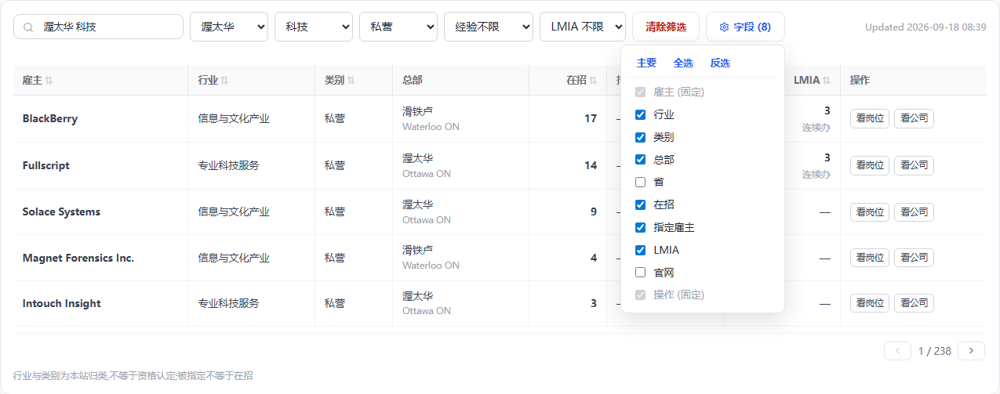

# 雇主分类与搜索 —— 用户故事版(2026-09-18)

> 起因:2026-09-17 夜 Frank 连问「雇主也需要分类别」「比如搜渥太华科技公司」「也要分总部和分部吧」「还要知道哪些市政府部门 事业单位 或者私营企业」「用户看公司主要从几个维度看」「各个行业 / 各个地区 top 几看不看」,2026-09-18「按默认走,先出设计稿」。
> 一句话定位:**雇主板从「一张按星级排的榜」改成「按地点 × 行业 × 类别切雇主的板」**,搜索框能听懂「渥太华 科技公司」这句人话。
> 承接 [分类清洗-20260915](分类清洗-20260915.md) 的公司段(批 3~6 尚未开工),本文是它的展示层与搜索层,数据层只补它没写的三样(类别五档、总部、LMIA 连续办)。
> 执行顺序:数据层(类别 → NAICS → 总部)→ 展示层(雇主板)→ 两处 top 段。改错层下游白干,顺序不许倒。

---

## 用户故事

### 故事一:小周,学签在读,想留在渥太华

**她是谁**:渥太华读研,毕业后想留在本地走 OINP。她只知道「渥太华有不少科技公司」,一个名字都说不上来。

**她的痛**:雇主板搜索框只认英文名,她没有名字可搜;行业下拉是「STEM / 技工 / 餐饮零售」这类按岗位归的组,一家医院因为招 IT 也算 STEM。

**她怎么用**:
1. 搜索框打「渥太华 科技」。板把「渥太华」认成城市、「科技」认成行业(信息与文化产业 + 专业科技服务),城市下拉与行业下拉直接显示选中值。
2. 类别下拉选「私营」,把国家研究委员会、加拿大银行这类她投不了的挑掉。
3. 从上往下按在招岗数扫:BlackBerry、Fullscript、Solace…,看到 BlackBerry 总部在滑铁卢,心里有数。
4. 点「看公司」进公司页,底部「渥太华同行业在招」一段告诉她这家在同城同行里排第几,顺手把其余几家也收了。

**做成的标志**:三个词、零名字,一屏之内拿到一张可投名单。

### 故事二:老张,旅转工

**他是谁**:访客身份,雇主愿意办 LMIA 才能落地。他要的不是「办过一次」的雇主,是「年年都办」的雇主。

**他怎么用**:LMIA 下拉选「办过 LMIA」或「连续办 LMIA」,表上多出「LMIA」列,看数字和「连续办」灰注(2024、2025 两年都有获批记录)。农业和低薪流的数字不在这一列,他不会被鱼加工厂的 2,000 个名额骗进去。

**要如实给他的真相**:LMIA 近两年总量砍半、仅永居流归零(见「LMIA 证据」),这条通道在收窄。列上只给技能类,口径注写明。

### 故事三:小陈,想进政府或公立机构

**她是谁**:永居在手,想要稳定和福利,目标是市政府或医院、学区。

**她怎么用**:类别下拉选「市镇政府」或「公立机构」,城市选自己住的城市,得到一张只有这两类雇主的表。她知道联邦机关多数要公民,「联邦机关」是单独一档,不会混进来。

**做成的标志**:类别一选,表里没有一家是她投不了的。

---

## 雇主的四个维度

用户看公司的六个问题里,前三个决定点不点(在哪、干什么、是谁的),后三个决定投不投(招不招我这类人、能不能帮我走移民、值不值得去)。本文做前三个加「名字」,后三个已在板上(在招、指定、LMIA)或留公司页。

| 维度 | 值域 | 来源 | 空值口径 |
|---|---|---|---|
| 地点 | 总部(市 + 省)。招聘地点(发过岗的城市清单)只留在数据里给公司页用,**不上雇主板**(2026-09-18 Frank「招聘地点去掉吧」) | 总部:库里已有文本(AI 简介、官网简介、维基页信息框)提「headquartered in / 总部位于」;招聘地点:雇主池 `citiesActive` 现成 | 总部提不到时列里显主场城市(发岗最多的城市),不标「总部」字样;两者都没有显「—」。**不叫「分部」**:我们只知道它在哪发过岗,不知道那里有没有办公室 |
| 行业 | NAICS Canada 2022:存 3 位子部门,显示 2 位部门(20 个),只显部门中文名,**代码不上板**(2026-09-18 Frank「灰注去掉,只留中文名」;代码存库,公司页再显) | 三层(分类清洗稿公司段):① Jobillico 122 标签人工映射表 ② qwen 读简介在 20 部门内选或弃权 ③ **没正文的按在招岗 NOC 多数派兜底,标「推断」**(09-18 默认) | 兜底也算不出(无岗)留空 |
| 类别 | 六档:联邦机关 / 省政府 / 市镇政府 / 原住民政府 / 公立机构 / 私营(批一实做时多出「原住民政府」:拆前非市镇的 70 家政府里 34 家是 First Nation / 部落议会,既不是省也不是市,硬塞任一档都是错档;2026-09-18 Frank 追认「原住民政府那一档保留」) | mart 段 14 现成名字规则(09-05 拍的四档),把「省市政府」拆成省、市两档(实测 439 家里 370 家是 City of / Ville de / Municipalité 形) | 规则没命中 = 私营。慈善、协会、非营利也落私营,不另立档(名字上判不准,加档 = 替官方编答案;正确来源是 CRA 慈善名录,另一批) |
| 名字 | 英文名;中 / 韩别名(人工核定表立起来前只显英文,09-13 拍) | 现成 | — |

## 雇主板

### 筛选行(照职位板布局,2026-09-18 Frank「可以参考下 job 页面的布局吗」「省份筛选加了吗」)

职位板的排法 = `搜索 / 省 / 类别 / 大类 / 更多筛选 ▾ / 清除筛选 / …右端 Updated / 字段`。雇主板逐位照抄:

`搜索 / 省 / 城市 / 行业 / 类别 / 更多筛选 ▾ / 清除筛选 / …右端 Updated / 字段 (n)`

- **省下拉保留**(上一版并进城市下拉是错的:职位板第一个下拉就是省,决策页直达链接 `?prov=SK` 也靠它);城市下拉跟着省联动,只列该省城市。
- 「更多筛选」折叠区放经验(经验不限 / 无经验可投)与 LMIA(LMIA 不限 / 办过 LMIA / 连续办 LMIA)两个下拉,钮形照职位板(secondary + 三角)。**整行全是下拉与钮,不用胶囊开关**(Frank「这种也设计成下拉框?」)。
- **不出已选胶囊行**(Frank「这种胶囊的也去掉吧」):搜索认出的维度直接落进对应下拉框显示,改下拉即改筛选。
- ≤640 手机:搜索 + 省 + 城市露出,行业、类别与折叠区两项全进「更多筛选」。
- **外框也照职位板**(Frank「也改成职位板那样」):筛选行直接铺在页面灰底上,表格单独一个带边框的白壳;08-27 换装批「筛选行与表包在同一张白卡里」的形撤。翻页与口径注在壳外。**筛选行与表壳间距 12px**(2026-09-18 Frank「筛选和表格的缝隙太大了吧」:现状 30px = 筛选区下边距 12 + 占位 18 的加载条;加载条改成叠在表壳顶边的细条,不占高度)。

### 搜索:跨列多词(照职位板搜索机器)

- 按空格拆词,≤4 词,词间 AND,每词自己跨维 OR。省全名先粘回去(职位板已有)。
- 每词依次认:**城市**(cities 三语名 + 英文)→ **省**(省码 / 三语全名)→ **行业**(20 部门三语名 + 别名表:「科技 / IT / tech」= 51 + 54,「医疗」= 62,「餐饮」= 72,「建筑」= 23…,别名表人工核定,我填 Frank 抽查)→ **类别**(「市政府 / 事业单位 / 公立 / 私企 / 联邦」)→ 剩下的才按**雇主名** ILIKE(英文名 + 中韩别名)。
- 认成维度的词落进对应下拉框(「科技」这类归并别名在行业下拉里是一项,值 = 51 + 54),不认得的词留在名字分支。
- 后端:`employer_pool.name` 与别名列建 pg_trgm GIN(DDL 里 09-13 留的「批二可换 trgm」);城市 / 行业 / 类别三列各建 btree,新筛选参数上线必查索引(08-08 实撞)。
- 防抖 300ms 保留(雇主板现状),职位板每键即搜不改。

### 列:默认六列 + 「字段」钮自选(照职位板)

默认 `雇主 / 行业 / 类别 / 省 / 市 / 在招 / 操作`(七列)。**省、市分两列**(2026-09-18 Frank「省 市 是不是分两个字段」:职位板就是两列,各自可排序;上一版「总部」一列把省码塞进灰注是把两个字段揉成一个)。值默认就是总部所在(2026-09-18 Frank「灰注去掉,默认就是总部」);提不到总部的用主场城市顶上(单地点雇主主场即总部,占池子绝大多数)。板上不出现「总部」两个字,是不是总部在公司弹框与公司页里说。筛选行尾加「字段 (n)」钮(2026-09-18 Frank「应该加一个字段按钮,可以自定义字段,类似于 job 页面」),点开面板勾选:雇主(固定)、行业、类别、省、市、区、在招、指定雇主、LMIA、官网、操作(固定);顶上「主要 / 全选 / 反选」三钮,选择落 cookie —— 形与行为全照职位板字段面板。

- **指定雇主、LMIA 两列默认不勾**:在招雇主 35,832 家里指定的只有 455 家(1.3%,渥太华 426 家里 1 家),近两年办过 LMIA 的 3,665 家、两年都办的 996 家(2.8%),默认显着就是两整列「—」。
- **筛了自动出列**:LMIA 下拉选了「办过 / 连续办」、或直达链接带 `program=AIP` 这类指定参数进来时,对应字段自动勾上(契约不断),用户可再手动关。
- **实现边界**:职位板的字段面板住 jobs 桶(和冻结列、列宽机器长在一起),雇主板走通用 table 桶。按「通用形态单一出口」不许 fork —— 字段面板做进通用 table 桶(列声明加 `optional` / `fixed`,面板件 + cookie 键由桶出),雇主板先用;职位板换装过来另立搬家批,本批不动它。
- **区默认不勾**(2026-09-18 Frank「需要加个区吗」):在招岗 48% 带区、公司 55% 有地址,默认摆出来半列是空的;但渥太华这类城市区是真维度(科技公司扎堆 Kanata),所以进字段面板可选、进「更多筛选」随城市联动、进搜索词典(「Kanata 科技」认得)—— 与职位板的区同一个待遇。
- **操作列固定保留**(Frank「操作列可以保留,之后有人点按钮,方便我之后收费」):收费原则是事实免费、代劳收费,操作列就是将来放代劳动作的位置(盯这家、一键投…)。「看岗位」「看公司」两钮的点击本批起就埋点(`employer-act`,kind = jobs / company),以后定价有数可看。
- 手机卡片流没有列,不出字段钮(2026-09-18 Frank「招聘地点去掉吧」:原九列的「招聘地点」撤)

- 行业:只显部门中文名,不带代码灰注;推断的加「推断」灰注。
- 类别:纯文字,不用胶囊(2026-09-18 Frank「这个不需要显示胶囊」:整列同一个值时一排胶囊是噪音);手机卡片上放在总部那一行右侧,同为纯文字。
- 省:界面语言全名(09-11 省份显示约定)。市:只显界面语言城市名,**不带英文灰注**(2026-09-18 Frank「英文 城市 也去掉」;09-11 拍的 CityNameCell 双行形在本板改判 —— 省已单独成列,灰注里的英文名与省码都成了重复;译名表外的小地方直接英文主文案,照旧)。不挂「总部」灰注。
- **LMIA 一格**(列名就叫「LMIA」,2026-09-18 Frank「就叫 lmia 不行吗」:限定词是数据口径不是用户文案):数 = 近两年高薪流 + 全球人才流获批份数(2025 全年 39,852 个职位、18,709 家雇主,主体是 TEER 2 / 3 的卡车司机、木工、餐厅经理、焊工、机修;软件两职业合计 3.4%),「连续办」灰注 = 2024、2025 两年都有记录;0 显「—」。农业 / 低薪流不上板,只在公司页担保记录卡按流拆开。
- 排序键:默认在招岗数降序;行业 / 类别 / 指定 / LMIA 可点排序;裸 LMIA 总量永不入排序(08-29)。
- 口径注(保留类文案):「行业与类别为本站归类,不等于资格认定;被指定不等于在招」。

### 效果图(注入生产样式 DOM,真样式;行业 / 总部为示意值,待分类段跑出)

| 端 | 现状 | 建议 |
|---|---|---|
| 桌面 1440 |  |  |
| 桌面,字段面板打开并勾上指定雇主与 LMIA | |  |
| 手机 375 |  |  |

### 点雇主名开公司弹框(照职位板)

现状:雇主名是纯文本,点了没反应 —— 2026-09-13 Frank「后面已经有操作列,没必要加 link」定的(namecell.tsx 文件头)。2026-09-18 Frank「雇主弹框也加上,类似于 job 页面」**改判**:那条管的是「名字成链跳走」,这次是「名字开框不离开板」,职位板的公司格就是这个行为。雇主板上点雇主名,开的是职位板那一个公司弹框(advisor 桶 GROUP_COMPANY + companies 桶 CompanyPanel,同一件不另做),不离开板;操作列「看公司」仍是完整页链接,「看岗位」不变。

- 现在的 CompanyPanel 按岗位号取公司(`/api/jobs/company`);雇主板没有岗位号,要补一条按 slug 取的路(与 `/companies/[slug]` 页面同一份数据,免额度)。没有公司页的池行(无 slug)雇主名保持纯文本,不开框。
- 弹框里的中文对照、在招职位、相似雇主全是现成行为(09-17 终态:开关默认关、后台预翻)。
- 手机卡片点标题同样开框(职位板手机卡同形)。

### 搜索词典(草稿,待 Frank 抽查;代码随批五的搜索解析器一起落)

**行业别名 → NAICS**(三语词都认;值可以是部门也可以是子部门)

| 别名(中 / 英 / 韩) | NAICS | 备注 |
|---|---|---|
| 科技、IT、互联网、软件、tech、software、테크、소프트웨어 | 51、54、334 | 见下「已知局限」 |
| 医疗、医院、健康、诊所、health、healthcare、의료 | 62 | |
| 餐饮、餐厅、酒店、住宿、restaurant、hotel、hospitality、요식、숙박 | 72 | |
| 建筑、施工、工程、construction、건설 | 23 | |
| 制造、工厂、manufacturing、제조 | 31-33 | |
| 零售、商店、超市、retail、소매 | 44-45 | |
| 批发、wholesale、도매 | 41 | |
| 物流、运输、货运、仓储、logistics、trucking、transport、물류、운송 | 48-49 | |
| 金融、银行、保险、finance、bank、insurance、금융、보험 | 52 | |
| 地产、房地产、real estate、부동산 | 53 | |
| 教育、学校、大学、education、school、교육 | 61 | |
| 农业、农场、farm、agriculture、농업 | 11 | |
| 能源、石油、矿业、采矿、oil、gas、mining、energy、에너지 | 21、22 | |
| 艺术、娱乐、体育、arts、entertainment、예술 | 71 | |
| 20 个部门与 99 个子部门的三语正名 | 各自的码 | 来自 `naics_sectors` 维度表,不进别名表 |

**类别词 → 类别**:联邦、federal、연방 → federal;省政府、provincial、주정부 → government;市政府、市政、市镇、municipal、city hall、시청 → municipal;原住民、first nation、indigenous、원주민 → indigenous;事业单位、公立、公共机构、public、공공 → public;私企、私营、民营、private、민간 → 私营(sector 为空)。「政府」「government」单独出现 = federal + government + municipal + indigenous 四档。

**已知局限(要 Frank 拍)**:「科技」并 54 会把律所、会计所、建筑设计所一起带进来 —— NAICS 54 整个部门只有一个子部门 541,软件公司在 4 位的 5415(计算机系统设计),而 09-16 拍的是「存 3 位」。三条路:① 接受噪音;② 只对 54 这一个部门多判一位到 4 位(54 是全表唯一「部门 = 子部门」的大杂烩,多判一位不破坏「3 位以下官方也靠人工」的理由,因为 5411 律所 / 5412 会计 / 5413 建筑工程 / 5415 计算机 / 5416 咨询 这一层边界很清楚);③ 「科技」只认 51 + 334,宁漏不滥。建议 ②。

## 两处 top 段(不做榜页)

- 榜没人看(雇主板 90 天 14 访客;67.5% 的访客只看一页,入口出口都是职位详情页),top 在**用户已经站在一家公司 / 一个城市上**的时候才有用。
- **公司页**:「在招职位」卡下加一段「{城市}同行业在招」,同城同 2 位部门按在招岗数前 10,行 = 名次 + 名字 + 岗数,「看全部」落雇主板带参数 URL。
- **城市详情页**(把脉页城市段批三,尚未立项):按行业分段各前 5,同一套查询。
- 单位必须是「地区 × 行业」或「地区 × 类别」:纯地区榜是水量榜(渥太华按在招岗数前五 = 童装连锁、军人福利、眼镜连锁、租车、军人福利法文名),对技能类申请人一家都投不了。省一级不做榜。
- 每个「城市 × 行业」的固定地址就是雇主板带参数的 URL(`/employers?city=Ottawa,ON&sector=54`),SEO 与小红书落地页零新页面。

## LMIA 证据(2026-09-17 用本站抓的 ESDC 季度获批表算)

| | 2024Q1 | 2026Q1 |
|---|---|---|
| 获批职位 | 68,148 | 33,216 |
| 农业占比 | 35% | 55% |
| 高薪流 | 15,063 | 6,319 |
| 低薪流 | 27,321 | 8,009 |
| 仅永居流 | 1,217 | 40 |
| 非农业里医疗占比 | 2.9% | 5.5% |

推论:LMIA 作为移民工具已死(仅永居流对应 2025-03 EE 取消工作 offer 加分),剩下的是劳工进口(高薪流头号职业卡车司机,低薪流头号鱼加工厂工人)。对技能类申请人它接近噪音,只对技工画像还有意义。「申请人在境内还是境外」ESDC 表没有这一列,本站不替官方下这个结论。

## 数据层

- **companies** 加列:`naics_sector`(2 位)、`naics_subsector`(3 位)、`naics_method`(label / model / noc-infer)、`hq_city`、`hq_province`、`hq_source`(出处 URL,空 = 没提到);老列 `industry` 本批不动(分类清洗稿:切完消费者再退役)。
- **employer_pool** 加列:同上六列 + `sector`(类别,列名与 companies.sector 一致;批一已产出,DDL = docs/sql/employer-pool-sector-20260918.sql)+ `lmia_continuous`(bool)+ `district`(总部地址过 mart 地点段得出,没地址的用在招岗的区多数派;渥太华社区归区照既有约定)。池由 seed 收尾库内重算,列随 companies 同步。
- **维度表** `naics_sectors`(20 部门 + 99 子部门,三语名人工核定,归 statcan 域产物);按新维度表六步走,`docs/sql/` 手写 DDL 先行,补 `payload_locked_documents_rels` 列。
- **类别拆档**(批一实做):判定自 mart 段 14 迁入 `etl/names` 基建叶(雇主池也要按名字判,域间不许互借函数);判序 联邦 → 市镇 → 原住民 → 省级 → 公立。`government` 字面量**不改名**、语义收窄为省级(库里与 cms 判定都认这个字面量,改名 = 平白多一次数据迁移);新增 `municipal` / `indigenous`。cms 两处消费者(雇主门槛判定、把脉页雇主类别列)先接住新值再放数据。
- **总部提取**:`etl/company` 域加一步 `hq`,qwen 读 aiBrief / description / 维基页正文提「总部所在市 + 省」,答案必须是 cities 表里的城市,提不到答空;出处落 `hq_source`。只读库里已有文本与已存 wiki_url,不为总部去抓新页(懒查询铁律)。
- **LMIA 连续办**:mart 汇装时按雇主名归一后看 2024、2025 两个自然年技能类获批是否都 > 0。
- **搜索词典**:cities 三语名、省名表、`naics_sectors` 三语名、行业别名表(constants,人工核定)、类别词表(i18n 三语)。

## 质量闸

- 类别:五档抽 50 家人眼核,误伤 0(09-05 原型标准)。
- 行业:模型层试点 100 家 Frank 核,弃权率与准确率报数;兜底层单独报数并标「推断」。
- 总部:抽 50 家,每条能点出处;出处里没有「总部」字样的算错。
- 搜索:20 句金标(「渥太华 科技公司」「多伦多 市政府」「温哥华 医院」「Ottawa tech」「BlackBerry」…)逐句断言三个下拉的选中值与首行。
- 页面:375 不横滚、英文文案不折行、tsc / eslint / vitest 四道闸;上线拉 `/employers?city=Ottawa,ON&sector=54` 验换版。

## 分批

| 批 | 做什么 | 验收 |
|---|---|---|
| 0 | 本文 | Frank 点头 |
| 1 类别五档 | mart 段 14 拆市镇;池表 `sector5`;DDL | 抽 50 家零误伤;池表分布报数 |
| 2 类目与映射 | statcan 域 NAICS 表(20 / 99 三语);行业别名表(本文「搜索词典」段,Frank 抽查)。~~Jobillico 映射表补完 27 空格~~ 撤:那 27 格是 09-16 口径下**故意留空**的跨部门标签(如 Computer Software 横跨 51 / 54),不是没填完 | 条数与官方一致;别名表 Frank 抽查 |
| 3 行业试点 | `etl/classify` 公司段:标签层 + 模型层 + NOC 兜底;抽 100 家给 Frank 核 | 准确率 / 弃权率报数 |
| 4 池表接线 | companies / employer_pool 加列;总部提取步;LMIA 连续办;seed 六步 | 在招雇主行业填充率、总部填充率报数 |
| 5 雇主板换版 | 筛选行全下拉、跨列搜索、默认六列 + 通用 table 桶字段面板、点雇主名开公司弹框(补按 slug 取数)、手机折叠;效果图已过 | 搜索金标 20 句全过;四道闸;生产换版 |
| 6 两处 top 段 | 公司页「同城同行业在招」;城市详情页并入城市段批三 | 效果图已过(公司页);城市页另立 |

## 已拍 / 待拍

**2026-09-17 ~ 18 已拍**(Frank「按默认走」):
1. 没正文的雇主用在招岗 NOC 多数派兜底行业并标「推断」。
2. 「分部」叫「招聘地点」。
3. 总部提取连维基页一起读(只读已存 wiki_url)。
4. LMIA 缩成一格 + 「连续办」标记;农业 / 低薪流不上板。
5. 类别拆五档,省市分开(Frank「省市区分开比较好吧」)。
6. 非营利不另立档(默认)。
7. top 做成段不做页;单位 = 地区 × 行业 / 类别;省一级不做榜。
8. 「招聘地点」列撤,只留总部(Frank「招聘地点去掉吧」)。
9. 已选胶囊行撤,搜索认出的维度直接落下拉框(Frank「这种胶囊的也去掉吧」)。
10. 行业格不带 NAICS 代码灰注,只留中文名(Frank「灰注去掉,只留中文名」)。
11. LMIA 列与开关文案不带「技能类 / 高薪类」限定词,就叫「LMIA」「办过 LMIA」;排除农业 / 低薪 / 仅永居三流是数据层口径,留在本文与代码注释(Frank「就叫 lmia 不行吗」)。
12. LMIA 列默认不显,筛了 LMIA 才出列(Frank「默认不显,开了开关才出列」)。
13. 筛选行两枚胶囊开关改下拉:经验两档、LMIA 三档(Frank「这种也设计成下拉框?」)。
14. 类别格纯文字不用胶囊(Frank「这个不需要显示胶囊」)。
15. 加「字段」钮自选列,照职位板;指定雇主、LMIA 默认不勾,筛了自动勾(Frank「应该加一个字段按钮」)。第 12 条并入本条。
16. 点雇主名开公司弹框,与职位板同一件(Frank「雇主弹框也加上」)。
20. 加「区」:字段面板可选默认不勾,筛选进「更多筛选」,搜索词典认区名;操作列固定保留并埋点,留作收费位(Frank「需要加个区吗?操作列可以保留…方便我之后收费」)。
19. 市格不带英文灰注,一格一行(Frank「英文 城市 也去掉」)。
18. 省、市分两列,值默认就是总部,板上不标「总部」字样(Frank「省 市 是不是分两个字段」「灰注去掉,默认就是总部」)。
17. 外框照职位板:筛选行铺灰底、表格单独白壳,白卡外框撤(Frank「也改成职位板那样」)。筛选行逐位照职位板布局;省下拉保留,城市随省联动;经验与 LMIA 进「更多筛选」(Frank「可以参考下 job 页面的布局吗」「省份筛选加了吗」)。

**待拍**:
- 行业别名表(「科技」= 51 + 54 这类归并)由我填、Frank 抽查 —— 同 Jobillico 映射表做法。
- 模型试点要盒子在局域网,排在 Frank 在家的时段。

## 状态

- 2026-09-18:**批一(类别拆档)代码完成并推送**,五个提交:① 判定纯搬家进 names 叶(59,690 名零差异)② 拆档 ③ 公立档误判修两处 ④ 雇主池行带 sector + DDL 文件 ⑤ cms 接住新值。
  - 全量公司名逐条比对人眼核过:371 家政府 → 市镇、34 家 → 原住民政府、10 家联邦归位(Department of Finance / Justice Canada、Correctional Service of Canada、BC RCMP)、39 家原先漏在私营的补上(草原省 RM、魁省 MRC / Canton / Paroisse、Indian Band / Cree Nation 等)、2 家误判放回私营(Nippon Trends Food Service Canada、Ministère of seafood);省级剩 24 家全是部厅。
  - 公立档顺带修:四家商业银行(Royal / National / General / Wealth One **Bank of Canada**)原被判公立;带公司后缀的私企 10 家(University Plumbing & Heating Ltd.、私立医院等)。代价 1 家(CHEO 研究所 Inc.)留账。
  - 雇主池分布(71,111 家):公立 ~350、市镇 233、联邦 72、省级 26、原住民 25,其余私营;在招雇主里非私营合计约 490 家。198 家没有公司页的雇主也判出了类别。
  - 2026-09-18 Frank「授权,跑 DDL,原住民政府那一档保留」:生产 DDL 已跑(列 + 索引核过),cms 装载器 / collection 已接 sector;随后清 seed_state('employer_pool') → employers 域重建 → upload → seed → 抽查分布。
  - **批一收口**(生产 089deda7):seed 200 / 56s 只重灌雇主池一张表。库内分布 71,140 家:私营 70,447、公立 337、市镇 232、联邦 73、省级 26、原住民 25;在招雇主里非私营 491 家(市镇 204、公立 181、联邦 72、原住民 20、省级 14)。companies.sector 随下一轮汇装自动换新值。
- 2026-09-18:**批二(类目表)完成**:statcan 域第 7 段 `scrape_statcan_naics`(`python etl/statcan/main.py --only naics`,只进 TOOLS 不进定时链)→ `raw/statcan/naics.json`,20 部门 + 99 子部门,119 个中 / 韩名人工核定(自校:条数 20 / 99 且译名表与官方代码一一对应)。官方结构表原文进 crawl 层。旁证:NAICS 91 公共管理的子部门正是 911 联邦 / 912 省 / 913 市镇 / **914 原住民**,与批一的类别档一一对应。行业别名表落在本文「搜索词典」段待抽查。
- 2026-09-18:设计稿 + 五张效果图。同日 Frank「招聘地点去掉吧」「这种胶囊的也去掉吧」「灰注去掉,只留中文名」:列撤、已选行撤、代码灰注撤、LMIA 去限定词、LMIA 列改筛了才出、两枚胶囊开关改下拉、类别格去胶囊、加字段钮、点名开弹框、筛选行照职位板重排并加回省下拉、效果图重拍(桌面多一张 LMIA 态)。
