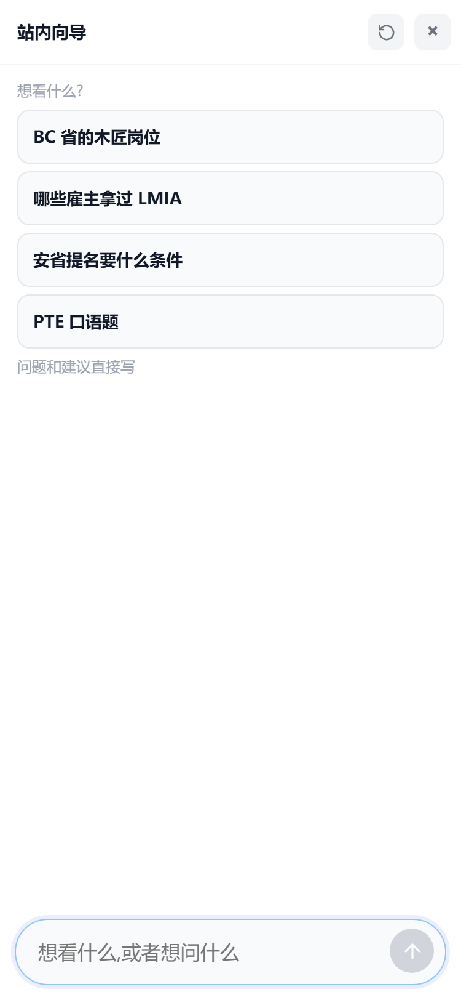
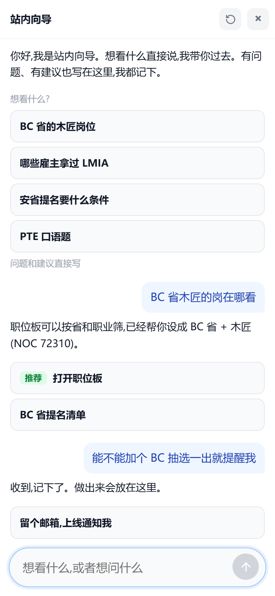
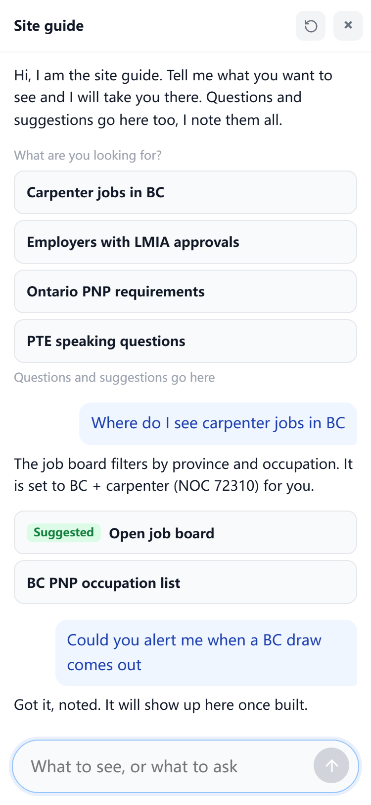

# AI 顾问改站内向导 —— 用户故事版(2026-09-04)

> 2026-09-04 Frank 拍板方向:「AI 顾问改成主要功能用于搜集用户的问题和网站导航得了」,同日追加两条:「首先应该打个招呼,自我介绍之类的」「也要能搜集用户的建议和问题」。本稿把这三句话落成动线与边界,已拍与待拍见 §6,**未逐条点头不动代码**。
> 一句话定位:**右下角挂件不再替人下判断,只干三件事 —— 打招呼说清自己能干什么、把人带到站内该看的那一页、把用户的问题和建议原样记下来。**
> 为什么改:近 30 天 219 轮问答里绝大多数是三条示例题(自测),最近 7 天真实提问 7 轮;Frank 定性「AI 顾问烂的一逼比不过 GPT」([[advisor-quality-gate]])。答不过 GPT 的事不做,做 GPT 做不了的:它不知道本站有哪些页、也收不到本站用户的问题。
> 顺带撞见:**匿名打开挂件是一片空白**(示例题、输入框提示都没渲染,见图 0),现状本身就坏着。
> 执行三批:批一数据层(问题表 + DDL)→ 批二 lib 新域 `guide` 替 `consult` → 批三挂件瘦身换文案。改错层下游白干,顺序不许倒。

---

## 故事一:小王,从谷歌招聘落到一个职位页,想看同类的岗

**他是谁**:搜「carpenter job BC」从 Google 招聘富结果落到 `/jobs/[id]`(最大入口,[[google-jobs-is-main-channel]]),看完这一岗就想走 —— 67.5% 的会话只看一页,他不知道站上还有职位板、省提名清单、雇主板。

**他怎么用**:
1. 右下角点开挂件,第一条是向导的开场白(我是谁、能带路、问题建议都记);下面四条胶囊是站上有的东西(BC 省的木匠岗位 / 哪些雇主拿过 LMIA / 安省提名要什么条件 / PTE 口语题),胶囊从他当前页带出的职业与省生成。
2. 他打字问「BC 省木匠的岗在哪看」。向导一句话答:职位板可以按省和职业筛,已经帮他设成 BC + 木匠;下面两张选项卡:**打开职位板**(推荐,带参 `/jobs?prov=BC&noc=72310`)、**BC 省提名清单**。
3. 点卡即跳页,挂件收起。整轮零判断:向导只说「在哪、怎么筛」,不说「有没有戏」。

**做成的标志**:三步内落到一个筛好的页面;答复里没有一个数字是模型算的(数字只来自跳转目标页本身)。

## 故事二:小李,问了一件站上没有的事,又提了个建议

**他是谁**:两个一年制课程读完,想知道能不能换三年 PGWP(真实提问,chat_logs 2026-08-10)。这问题没有哪一页能答。看完 BC 抽选表,又想要「一出新抽选就提醒我」。

**他怎么用**:
1. 打字问 PGWP。向导识别不出任何站内目的地,归为**问题**,答一句:**这个站上还没有。已经记下,做出来会放在这里。** 下面一张选项卡:**留个邮箱,上线通知我**。
2. 再打「能不能加个 BC 抽选一出就提醒我」。向导归为**建议**,答:**收到,记下了。做出来会放在这里。** 同一张留邮箱卡。
3. 他点了,填邮箱,回车。邮箱只在他主动留时才存,与那条记录同一行。
4. 没有「换个说法再问」「再多说两句」这类退回 —— 记下来就是答复本身。

**做成的标志**:问什么、提什么都不会得到错误态;原文一字不改进了表,问题与建议分得开。

## 故事三:Frank,每周翻一遍问题清单

**他是谁**:站主。痛点盘点([[painpoint-driven-methodology]])一直缺真实原料,现在挂件就是收集口。

**他怎么用**:
1. Payload 后台开 `asks` 表:按时间倒序、按类别(nav / question / suggestion)分组;后两类就是痛点盘点的原料,建议单独一列看「用户想要什么功能」。
2. 同一句话被多人问 → 计数靠 `thread`(首轮提问哈希,沿用 chat_logs 口径,不指向人)。
3. 做成功能后把状态改 `built`,留了邮箱的一封通知(邮件走既有 `api/mail`)。

**做成的标志**:后台能回答「用户最常问什么、最想要什么功能、有多少是站上没有的」。

---

## 1. 边界判定(CLAUDE.md「新建域 / 替换域」三问)

- **回答什么问题**:「这句话该去站上哪一页 / 站上没有」。一句话说清,边界在。
- **和已有域怎么切**:`consult` 回答的是「他的处境走得通吗」(工具循环 + 出口闸 + 事实渲染),`guide` 只做路由,**不循环、不取事实、不裁决**。切法判据 = 有没有工具循环:guide 没有,一次结构化输出即止。
- **寿命**:consult 将死,guide 幸存。按铁律「将死的依赖幸存的」:consult 里唯一值得留的行为是职业检索(`search_occupations` 的 SQL 取数),先搬进 guide(或并入 `noc` 域),consult 反向取,再整目录删。`lib/advisor`(职位页场景解读卡)**不在本案范围**,它答的是「这一岗对我意味着什么」,与向导无关。
- **样板**:`lib/agent/` 域形制;新域九抽屉里预计只用 constants / prompts / schemas / types / functions / routes + 两门。

## 2. 目的地目录(向导能带去的页)

| 目的地 | 路由 | 可带参数 |
|---|---|---|
| 职位板 | `/jobs` | 省、NOC、市、关键词 |
| 职业目录 | `/occupations` | 大类 |
| 在招雇主 | `/employers/hiring` | 省、行业 |
| 指定雇主 | `/employers/designated` | 省、试点 |
| 雇主对比 | `/employers/compare` | 公司 slug |
| 把脉 | `/start` | 职业、省 |
| PR 决策 | `/plan/pr` | 无 |
| PTE 刷题 | `/pte/[type]` | 题型 |
| 新闻 | `/news` | 无 |
| 案例 | `/cases` | 无 |
| 榜单 | `/rankings/[slug]` | slug |
| 时间线 / 资源 / 定价 / 账户 | 各自路由 | 无 |

目录住 `guide/constants.ts`(主题_角色:`DEST_ROUTE`、`DEST_PARAMS`),加一页 = 加一行。模型只许从这张表里选,选不出就在 question / suggestion 里二选一。

## 3. 路由脑:一次调用,结构化输出

- 用现成 `lib/llm`,一次 JSON 出参:`{ kind: 'nav' | 'question' | 'suggestion', dest: 目录键 | null, params: {…}, say: 一句话 }`,schema 住 `guide/schemas.ts`,校验不过整格作 question。
- 开场白不过模型:纯文案(i18n `chat.hello`),挂件打开即渲染为线程第一条,随线程滚动不消失(同 2026-08-05 示例块铁律)。
- 职业词 → NOC 走搬来的职业检索(库里查),省名 → 省码走 `lib/location`;模型只出「哪一类」,不出码。
- 模型失败 / 超时 / 限流 → 一律当 question 记下,用户看到的还是「已经记下」。**没有错误态**,唯一例外是日配额帽(沿用 `quota` 三层帽)。
- 提示词住 `guide/prompts.ts`,不进 i18n。RULE 沿袭一条:say 里不许出现任何数字与判断词,只许说页与筛法。

## 4. 数据层:`asks` 表(批一,docs/sql 手写 DDL 先行)

| 列 | 说明 |
|---|---|
| id / created_at | Payload 自带 |
| thread / turn | 沿 chat_logs 口径,首轮哈希串追问,不指向人 |
| lang | zh / en / ko |
| path | 提问时所在页(带参),知道他从哪问的 |
| question | 原话,截 2,000 |
| kind | nav / question / suggestion |
| dest | 目录键,非 nav 为 NULL |
| params | jsonb,带去的参数 |
| say | 向导那一句 |
| email | 只在用户主动留时写,否则 NULL |
| status | new / answered / built,Frank 在后台改 |
| ms / err | 耗时与失败码(留痕,catch 不静默) |

`chat_logs` 停写不删表(复现率仪表盘的历史还在)。`payload_locked_documents_rels` 补列,照 [[new-etl-dim-table-checklist]]。

## 5. 挂件换装(批三):瘦身,不换壳

- **留**:ChatLauncher 壳(开合避让红线一条不动)、线程 + composer、选项卡形态(空态与答复下同一种,2026-08-09 铁律)。
- **删**:查询过程折叠条、官方来源、Activity / Memory 面板、有帮助 / 没帮助、错误分型引导(tooShort / noOcc / guard 等)、三条示例题。
- **加**:开场白一条(线程首项,纯文案)。
- **文案**(新词条逐条过四类 [[no-internal-copy-on-site]]):

| key | zh | en | 类 |
|---|---|---|---|
| chat.title | 站内向导 | Site guide | 字段 |
| cw.open / cw.hint | 找东西 / 想看什么?问一句 | Find something / Looking for something? Ask | 动作 / 空态引导 |
| chat.hello | 你好,我是站内向导。想看什么直接说,我带你过去。有问题、有建议也写在这里,我都记下。 | Hi, I am the site guide. Tell me what you want to see and I will take you there. Questions and suggestions go here too, I note them all. | 空态引导 |
| chat.ph | 想看什么,或者想问什么 | What to see, or what to ask | 空态引导 |
| chat.why | 想看什么? | What are you looking for? | 空态引导 |
| chat.ask | 问题和建议直接写 | Questions and suggestions go here | 空态引导 |
| chat.noted | 这个站上还没有。已经记下,做出来会放在这里。 | Not on this site yet. Noted. It will show up here once built. | 状态 |
| chat.gotIt | 收到,记下了。做出来会放在这里。 | Got it, noted. It will show up here once built. | 状态 |
| chat.notify | 留个邮箱,上线通知我 | Leave an email, get notified | 动作 |
| chat.opt.rec | 推荐 | Suggested | 字段(既有) |

## 6. 已拍与待拍

已拍(2026-09-04 Frank):
- 路由脑用模型,一次结构化调用(§3)。
- 范围只含右下角挂件;职位页的 AI 解读卡(`lib/advisor`)不动。
- 打开先打招呼、自我介绍(开场白,§5)。
- 问题与建议都收,分两类记(§4 `kind`)。
- 老循环整删,建 `guide` 新域整个替换(consult 目录、评测批、chat_logs 写入一起退役,只搬职业检索)。

待拍:无。批次纪律一批一 session:批一数据层 → 批二 guide 域 → 批三挂件换装。

## 7. 效果图(生产页 DOM 注入拍摄,375px)

- 图 0 现状(匿名打开即空白):`img/向导-现状匿名空白-手机-20260904.png`
- 图 1 空态 zh:`img/向导-空态-手机-zh-20260904.png`
- 图 2 对话 zh(开场白 + 故事一 + 建议一轮):`img/向导-对话-手机-zh-20260904.png`
- 图 3 对话 en:`img/向导-对话-手机-en-20260904.png`

