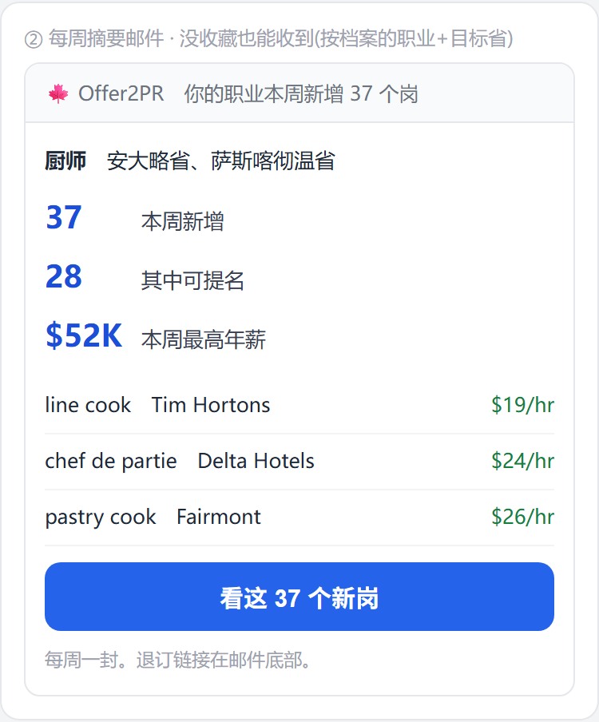
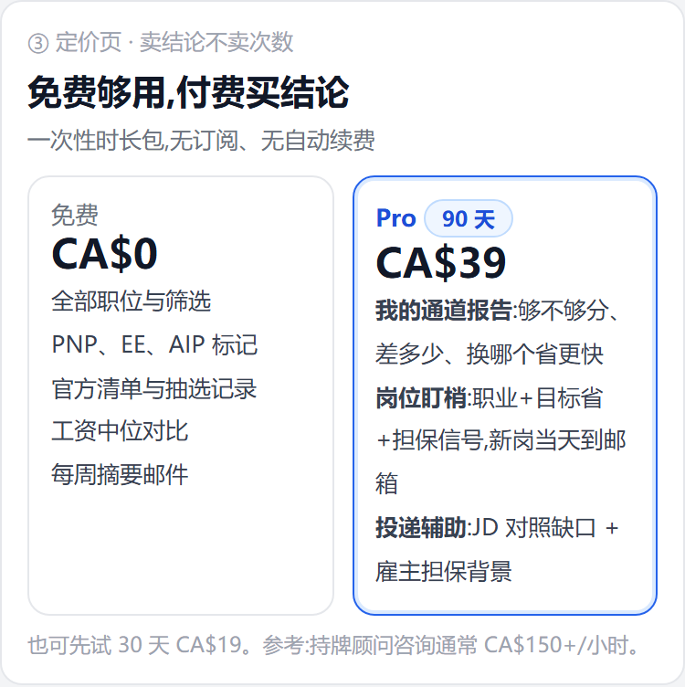

# E5-07 · 收费方案落地(结论收费 + 留存钩)

> 立项 2026-07-27(Frank「先弄收费方案吧,用户点进来能留住」)。策略见
> [收费方案-20260727.md](../../design/收费方案-20260727.md);本文只讲**怎么做**,一步一勾。
> 效果图(375 真样式,非示意):

| 付费墙(三问结果页) | 每周摘要邮件 | 定价页 |
|---|---|---|
|  |  |  |

## 1. 整体目标

把付费面从「使用量」改成「结论」,同时补上**回访理由** —— 现在站里没有任何机制把人叫回来,
这是「留不住」的根,不是价格问题。

## 2. 验收标准

- [x] 周报**不再要求「有收藏」**:只要有档案(职业或目标省)就能收到,内容=你的职业本周新增 N 岗 / 其中可提名 M / 最高年薪
- [ ] 三问结果页出现**付费墙**(未做:见下方 3.2 说明):事实(在招、可提名、中位年薪)免费直显;「按你的分数哪个省最快」打码 + 解锁钮
- [x] 定价页按**结论**重写:Pro 三条=我的通道报告 / 岗位盯梢 / 投递辅助;免费列全部事实数据 + 每周摘要
- [x] 主推 90 天 CA$39(30 天 CA$19 作试水档),文案不提「次数」
- [x] umami 五步漏斗事件齐全:`quiz-done → quiz-register → weekly-optin → pay-click → pay-success`

## 3. 实现步骤

- [x] **3.1 周报补档案分支**(最低成本、最高杠杆)。现状:`api/alerts/run` 的 C 段要求 `saved-jobs` 非空,
      刚答完三问的新用户一封收不到。改:无收藏时回落到档案维度(`profile.nocs` / `profile.provinces`),
      SQL = `status='open' AND date_posted >= 今天-7 AND noc = ANY(...) AND province = ANY(...)`,
      同时给出 `count(*) FILTER (WHERE pnp_eligible)` 与 `max(salary_annual)`。两种来源共用同一封模板。
- [ ] **3.2 结果页付费墙**(2026-07-27 有意暂缓,不是漏了):E12-09 跨省对照已上线、有真结论可锁了,
      但**这块结论目前是免费的**(PNP 弹框里就能看)。要在结果页立墙,等于把已经放出去的东西收回来,
      这跟 07-25 拍板的「付费面调整一律先看用量」冲突 —— 先让 `pay-click` 与打分卡的用量跑几周,
      Frank 拿数据拍板收不收、收哪一段,再动 `lib/plan.ts`。**在此之前定价页不写「通道报告要付费才有」**。
- [x] **3.3 定价页重写**(`/pricing` 文案 + `price.f*` 键):三条结论式卖点替换现有九条功能清单;
      免费列写全事实数据。三语。
- [x] **3.4 埋点补齐**:`weekly-optin`(周报订阅/退订)、`pay-click`(点解锁)两个事件缺失,补上才有漏斗。
- [x] **3.5 价格排序**:定价页把 90 天卡放主位(视觉权重高于 30 天),文案不加「推荐」这类营销词,靠版式表达。

## 4. 涉及目录 / 文件

| 路径 | 角色 |
|---|---|
| `cms/src/app/api/alerts/run/route.ts` | 周报 C 段:补档案分支 |
| `cms/src/app/(frontend)/jobs/EntryQuiz.tsx` | 结果页付费墙 |
| `cms/src/app/(frontend)/pricing/*` + `jobs/i18n.ts` | 定价页文案 |
| `cms/src/lib/plan.ts` | 若要收回某项免费面,只动这里(暂不动) |

## 5. 红线与坑

- **事实免费**是立身之本:职位、标记、清单、抽选、中位薪资一律不收费,收了等于砸获客。
- 锁块**不许打码假内容**:E12-09 没上线就别渲染锁块。打码一段编出来的字=对付费用户撒谎。
- 周报**不硬发**:既无收藏也无档案 → 不发(现有「无内容不硬发」的判断保留)。
- 退订链接与频率(每周一封)不动;新分支同样受 `weeklyOptOut` 与 200 封/轮上限约束。
- 付费面调整**先看用量**(沿用 2026-07-25 拍板),不靠拍脑袋加锁。

## 6. 完成定义(DoD)

- [x] 定价页三语按结论重写、90 天主位、文案不提次数;`pay-click`(登录判断之前发)与 `weekly-optin` 已补齐。
- [ ] 结果页锁块:等用量数据后由 Frank 拍板(见 3.2)。
- [ ] 生产复验 umami 五步漏斗跑通(要等真实流量)。
