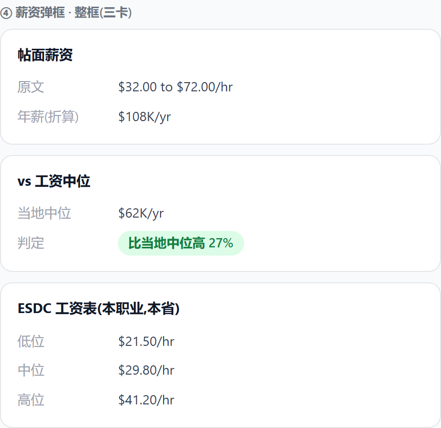

# E8-13 字段弹框深耕(通道直判 + 六弹框全量,批次 A/B)

> 缘起:#134「先深耕字段弹框」。07-25 评审 Frank 连拍收敛成四条总则:
> **①直判头牌——「这个岗能走 EE 还是 PNP 还是 AIP」一眼给答案;②文案一行放下不折行;③无废话(科普行/来源注全删);④设计文档必带功能效果图。**
> 砍掉的过度设计留痕:AIP 科普两行/在招岗数现查/薪资三点标尺/band 双行三数/来源注。

## ⓪ 通道弹框 · 三行直判(头牌)

- 点「通道」列 → 置顶新块「这个岗能走哪条通道」:PNP/EE/AIP 一行一判;既有通道档卡(#122 拆解)保留其下。
- 判定复用三处既有逻辑(PnpListSection/EeCategorySection/AIP 新三态),零新数据。

## ①-⑥ 各弹框

| ① PNP 判定改直判(四卡不动) | ② EE 直判(类别块不动) |
|---|---|
|  |  |

| ③ AIP 三态直判(空壳修)+跨省清单 | ④ 薪资整框三卡(帖面原文/中位+直判/ESDC 一行一条) |
|---|---|
|  |  |

| ⑤ 公司 担保季度明细 | ⑥ 分类 移民面貌三行 |
|---|---|
|  |  |

## ⑦ #136 默认排除已下架

- `buildJobsWhere` 无 `fStatus` 时补 `status <> 'closed'`(列表/SSR/api/match 一处生效);`fetchTotalAndProof` 同口径 40,011;`?fStatus=closed` 深链照旧。

## ⑧ 操作列冻结右侧(07-25 Frank 报:横滚时被右边截一半)

- 操作列 sticky 贴右+不透明底+左阴影,其余列从它底下横滚——镜像既有左冻结列(发布时间/公司/职位)同款基建。

## 实施要点(逐件)

- **通道直判**:immigration 组置顶三行块;AIP 判定=新 aipVerdict(job)(三态);PNP/EE 判定=各自 Section 既有命中逻辑抽薄函数复用,不重写。
- **AIP**:`hasFacts('aip')` 恒真;三态药丸(能走/走不了·不在名单/走不了·仅大西洋四省);命中清单去 `e.province===job.province` 限制;`fact.aipNote` 来源注**删**。
- **薪资(整框三卡)**:帖面卡=原文+年薪折算(照旧);对照卡=当地中位一行+判定药丸「比当地中位高/低 X%」;ESDC 卡=低位/中位/高位**一行一条**(横杠串「$45K – $62K – $86K」退役);band 缺=对应行不出。
- **PNP/EE**:判定行措辞改直判(「能走: AB 科技通道」/「能进类别抽选: 医疗类」/「无类别加成,走通用抽选」);EE 加「近两年该类别抽选 N 轮」一行(数据在库)。
- **公司**:担保记录加季度明细行(近 4 季各一行+更早合并,lmia 原始季度数据在库);来源注删。
- **分类**:尾加「移民面貌」三行:省清单命中药丸/全国在招/本省在招(pnp_occupations 反查+stats,零新抓取)。
- **i18n**:新键三语齐(en/ko 显式,#146 教训);全部文案一行铁律。

## 批次

| 批 | 内容 | 状态 |
|---|---|---|
| A(已拍) | ⓪通道直判 + ③AIP + ④薪资 + ⑦#136 | 获批即开工 |
| B | ①PNP + ②EE + ⑤公司季度 + ⑥分类面貌 | A 批生产复验后开工 |

## 验证与红线

- JD/分类弹框既有功能不碰(分类只加尾块);判定输入只用库内官方数;数据缺=行不出,不硬判。
- 验证(先 375px 后桌面):通道三态组合样本/AIP 三态/薪资高低两例/#136 api total 40,011+closed 深链;各件独立 commit。

## 实施勾选

- [ ] A1 #136 默认排除 closed + 副标题同口径
- [ ] A2 通道三行直判块
- [ ] A3 AIP 三态 + 跨省清单 + 来源注删
- [ ] A4 薪资整框三卡(横杠串退役,ESDC 一行一条)
- [ ] A5 操作列冻结右侧
- [ ] A6 生产复验 + 轮次表回填
- [ ] B批(PNP/EE/公司/分类)另起
