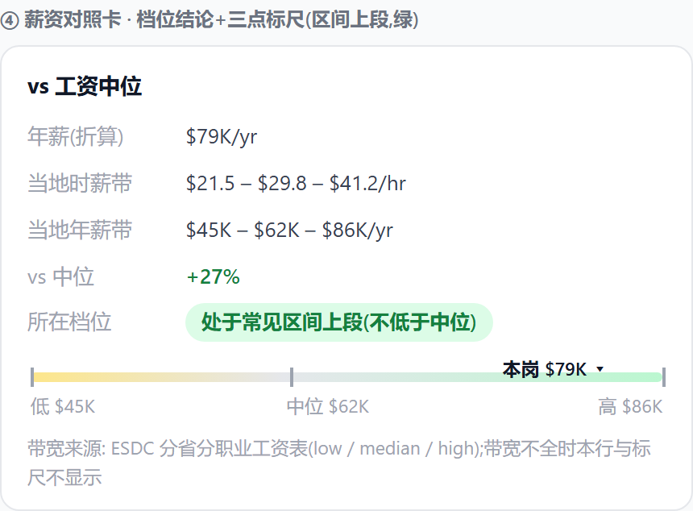
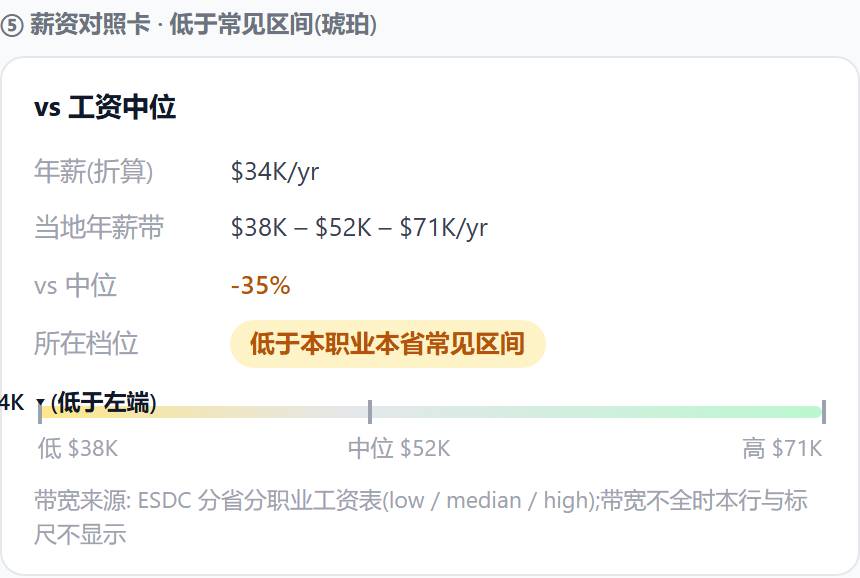

# E8-13 字段弹框深耕A批(AIP 补全 + 薪资档位结论 + #136 默认排除已下架)

> 缘起:#134 主线「先删移民价值按钮,先深耕字段弹框」(fd2de0b)→ 深耕方向文档
> [字段弹框深耕-20260725](../../design/字段弹框深耕-20260725.md) 2026-07-25 Frank 拍板「按推荐排序开工深耕A批,#136 也拍了默认排除 closed」。
> 本件=A批实施设计,获批后动代码。红线沿袭:零新抓取 · 宁可留空不瞎猜 · 禁裸数字档(#132)· 一条信息一个家。

## 1. 范围与不做

| 件 | 做 | 不做(留后批) |
|---|---|---|
| #136 | 职位板默认 WHERE 排除 closed(显式选「已下架」仍可看) | 不动详情页(closed Notice+noindex 照旧)、不动 sitemap(本就仅 active)、不动保存筛选提醒(本就 status=open) |
| AIP 弹框 | 三态结论行(空壳修)+ 命中列全部上榜省份 + 「AIP 是什么/意味着什么」两行人话 + 在招岗数现查行 | 名录页「在招岗位数」列(#130,ETL 聚合,单独一批);AI 解读 |
| 薪资弹框 | 对照卡加档位人话结论行 + low—中位—high 三点标尺(纯 CSS) | 无 band 数据时不出结论(只有中位→维持现状 vs% 行);Pro 分层不动(vs 中位已放开) |

## 2. 现状与数据面(已实证,全部现成)

- **#136**:`jobsSql.buildJobsWhere` 现无默认 status 条件(仅 `s('fStatus')` 显式过滤)→ 默认列表混 1,182 条 closed 且 status 列 default:false 无可见标记;`fetchTotalAndProof` 同病(07-25 已补 #125 去重,closed 仍含)。改后副标题/列表总数 41,193 → **40,011**。
- **AIP**:`FieldFactsInner field==='aip'` 现状=命中才有内容(`hasFacts` 返回 `!!job.aip`,未命中整弹框空壳=第25轮 AIP P3);命中匹配限 `e.province === job.province`(同雇主在其他大西洋省上榜看不见);`desigEmp`(2,931 行)已随 /api/dims 在客户端,**零新端点**。在招岗数:`/api/jobs?company=<名>` 既有精确公司名参数,total 免费带回(服务端 30s 计数缓存),弹框现查一行,**不做 ETL 预算**(lazy-first;名录页 2,931 行批量需求才走 #130)。
- **薪资**:`wageLowHourly/wageHighHourly/wageLowAnnual/wageHighAnnual/wageMedHourly/wageMedAnnual` **六字段已全在 JobRow**(band 行 `$X – $Y – $Z` 已渲),档位结论与标尺=纯前端计算,零 DDL 零 mart 改动。

## 3. 逐件设计

### 3.1 #136 默认排除已下架

- `buildJobsWhere`:`if (s('fStatus')) {…现状…} else conds.push(\`COALESCE(j.status,'open') <> 'closed'\`)` —— 一处生效,fetchJobsPage/fetchJobRows(SSR 首屏)/api/jobs/match 候选全走同 WHERE。
- `fetchTotalAndProof`:计数条件同步为 `DEDUPE_COND AND COALESCE(j.status,'open') <> 'closed'`(副标题=列表,一个口径)。
- 深链兼容:`?fStatus=closed` 显式看已下架照旧;状态筛选下拉不动。

### 3.2 AIP 弹框补全

三态效果图(命中 / 大西洋未命中 / 非大西洋省):

| 命中(NS 岗,含跨省行+在招岗数) | 大西洋未命中(现状=空壳,本批修) | 非大西洋省 |
|---|---|---|
|  |  |  |

`hasFacts('aip')` 恒真(对齐 pnp/ee 注释先例「未命中也要说,是结论不是空」)。卡内顺序:

1. **结论行(三态,底色药丸对齐 #171 四色)**:
   - 命中(绿):「该雇主在官方 AIP 指定雇主名单」
   - 大西洋四省未命中(灰):「该雇主不在 AIP 指定雇主名单 —— 本岗走不了 AIP 通道」
   - 非大西洋省(灰):「AIP 仅适用大西洋四省(NL/NB/NS/PE),本岗所在省不适用」
2. **命中清单(命中态)**:matches 去掉 `e.province===job.province` 限制 → 该雇主**全部**上榜行(地点、省、isTech 标照旧);跨省上榜=更强信号,一并可见。
3. **在招岗数行(命中态)**:「该雇主当前在招 N 岗」——打开时 fetch `/api/jobs?company=<名>&pageSize=1` 读 total,会话内按公司名缓存;失败静默不渲(不阻塞事实行)。
4. **人话两行(恒显,i18n 三语)**:
   - 「AIP 是什么」:大西洋移民计划=雇主驱动通道,只有名单内的指定雇主发的 offer 才能走。
   - 「对这个岗意味着什么」:命中=雇主具备发 AIP offer 的资格;你自己的语言/学历/工作经验条件仍需另行满足 —— **粗筛信号,非资格认定**(CLAUDE.md 口径原句风格)。
   - 既有 `fact.aipNote` 出处注保留在卡尾。

### 3.3 薪资档位结论 + 三点标尺(挂 vsMedian 对照卡)

| 区间上段(绿) | 低于常见区间(琥珀,超界 clamp 左端) |
|---|---|
|  |  |

- **档位判定(年薪对年薪,单一口径)**:`a=salaryAnnual` 对 `lYr/mYr/hYr`;四档人话(禁裸数、无魔法阈值):
  - a < lYr → 「低于本职业本省常见区间」(琥珀)
  - lYr ≤ a < mYr → 「处于常见区间下段(低于中位)」(灰)
  - mYr ≤ a ≤ hYr → 「处于常见区间上段(不低于中位)」(绿)
  - a > hYr → 「高于本职业本省常见区间」(绿)
  - `lYr/hYr` 任缺或 `a` 缺 → **整行不出**(band 不全不硬判;现有 vs% 行照旧兜底)。
- **三点标尺**:对照卡 band 行下一条横杆(纯 div:灰底圆角条 + low/中位/high 三刻度小注 + 本岗 ▲ 位置标,超界 clamp 到端点并保留档位文字说明);375px 首验。
- 结论行紧跟 vs% 行之后,复用 FactRow(k=「所在档位」);颜色仅两色(绿/琥珀)+灰,不新造色。

## 4. i18n 新键(三语,zh 文案为准)

| 键 | zh |
|---|---|
| aip.hit / aip.miss / aip.na | 上表三态结论 |
| aip.openJobs | 该雇主当前在招 {n} 岗 |
| aip.what | AIP 是大西洋四省的雇主驱动移民通道,只有官方名单内的「指定雇主」发的 offer 才能走 |
| aip.means | 命中=雇主具备发 AIP offer 的资格;语言、学历、工作经验等本人条件仍需另行满足,此标记是粗筛信号,非资格认定 |
| sal.tier / sal.tier.belowBand / sal.tier.lowerHalf / sal.tier.upperHalf / sal.tier.aboveBand | 所在档位 + 四档文案(§3.3) |
| sal.scaleLow / sal.scaleMed / sal.scaleHigh | 标尺三刻度小注(低/中位/高) |

en/ko 同批给全(makeT 缺键回退 zh,en 必须显式——#146 教训)。

## 5. 红线与验证法

- JD/分类弹框一行不碰(Frank 红线);GroupFactsSection 只在 aip/salary 两分支内改。
- 判定输入全部来自帖面与 ESDC 官方数(band),不引入推算;band 不全宁可不出结论行。
- 验证:①#136=生产 API total 40,011 + `?fStatus=closed` 仍可见;②AIP 三态各截一张(命中 NS 岗/大西洋未命中/安省岗)+命中跨省样本;③薪资档位四档各找真岗一例 + band 缺失岗确认无结论行;**先 375px 后桌面**(手机优先铁律);④换版探针=api/jobs total 数字变化。
- 回滚:三件互不依赖,各自独立 commit,可单独回退。

## 6. 实施勾选

- [ ] A1 #136:buildJobsWhere 默认排除 closed + fetchTotalAndProof 同口径
- [ ] A2 AIP:hasFacts 恒真 + 三态结论行 + 全省命中清单 + 在招岗数现查 + 人话两行 + i18n 三语
- [ ] A3 薪资:档位结论行 + 三点标尺 + i18n 三语
- [ ] A4 生产复验(§5 验证法全项)+ 轮次表回填
