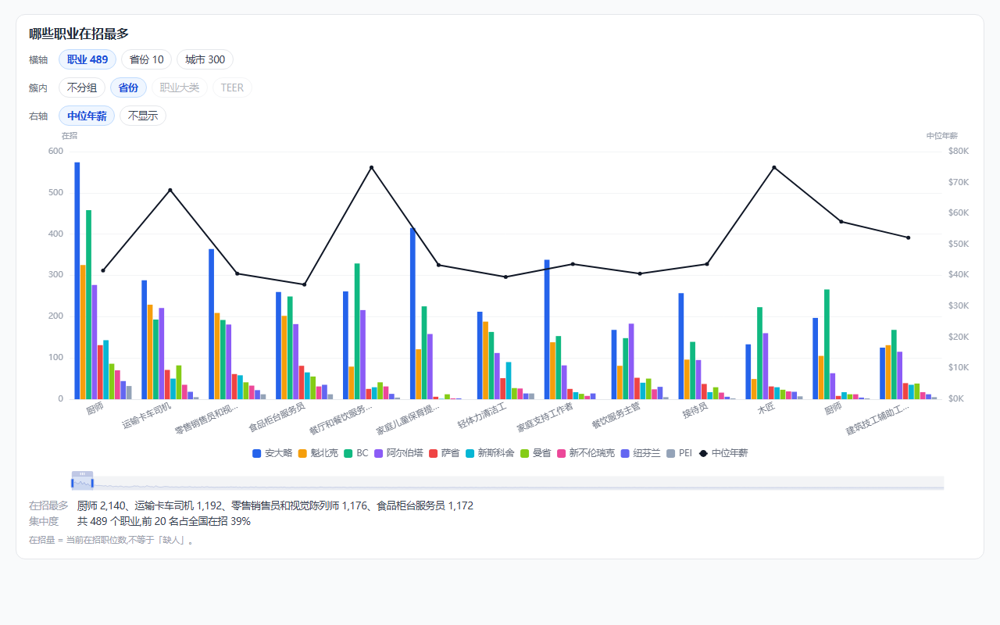
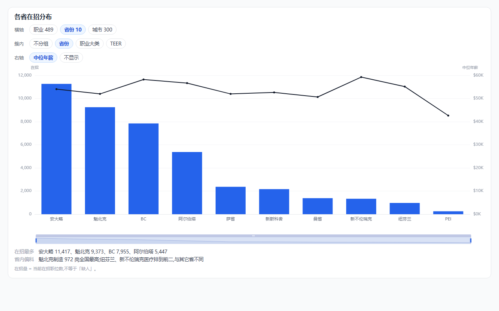
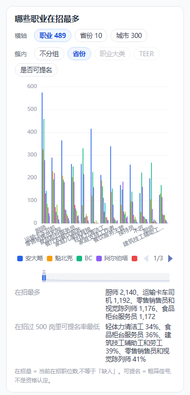

# E8-14 · 统计主图(就业市场分析)与趋势图

> 立项 2026-07-28(Frank「我觉得数据统计很重要」「这个大图要做全,这个作为我页面最主要的统计图之一」)。
> 现有 `/stats` 是省卡 + 难度档 + 大类/中类/小类三级钻取 + 跨省对比,**看不出「加拿大在招的盘子长什么样」**。
> 本文只做**一张主图 + 一张趋势图**与其数据底座;既有四图不动。
>
> 效果图(真数据、真 ECharts,非示意;可直接打开 [统计主图-效果图.html](../../assets/mockups/统计主图-效果图.html)):
>
> | 横轴=职业(双轴) | 横轴=省份 | 手机 375 |
> |---|---|---|
> |  |  |  |

## 1. 整体目标

一张图回答「**加拿大在招的是什么工作、在哪、值多少钱**」:

- **横轴可切**:职业(489)/ 省份(10)/ 城市(2,366),`dataZoom` 拖看全量;
- **簇内可切**:不分组 / 省份 / 职业大类 / TEER;
- **右轴叠中位年薪**:柱=岗数、线=薪资,一眼看出两者反向 ——
  厨师 2,140 岗 $41,600 vs 木匠 692 岗 $74,880。**「岗越多的地方钱越少」是这张图的主结论**,
  也是「有 4 万个岗」与「找不到工作」能同时成立的解释。

## 2. 验收标准

- [ ] 主图三种横轴 × 四种分组均可切,切换后 ECharts 不残影(照 #128 的 clear + notMerge + resize 三连)
- [ ] 双轴:左=在招岗数,右=中位年薪(可关);两轴独立刻度,薪资线不被岗数压平
- [ ] `dataZoom`(slider + inside)覆盖全量;职业态默认开前 12,城市态默认开前 14
- [ ] 职业名用**数据层短名**,不在前端裁字符串;短名缺失时才回退规则截断
- [ ] 图下「读出来」两行随切换动态算(不是写死文案)
- [ ] 375 无横滚(`scrollWidth − clientWidth = 0`);三语
- [ ] 趋势图(独立第二张):岗量与中位薪资随时间走;**上线前无历史,首日只有一个点,页面要说清「从 {日期} 起记录」**

## 3. 实现步骤

- [ ] **3.1 `stats_occupation`**(mart 新粒度):职业 × 省 —— noc / province / openJobs / medianSalaryAnnual /
      teer / titleZh / titleEn。上限 489×10,实测真实行数远小于此。
- [ ] **3.2 `stats_city`**(mart 新粒度):city / province / openJobs / medianSalaryAnnual(2,366 行)。
- [ ] **3.3 `title_zh_short` 短名列**(`noc_descriptions`):本地 Ollama qwen3.6 批量生成(≤6 字),
      **生成后按在招量前 60 逐条人工核**,其余抽样;官方全名 `title_zh` 原样保留,只作显示层短名。
- [x] **3.4 `stats_daily` 每日快照**(2026-07-28 先行落地:生产已建表 + 首日 118 行已灌):date / province / broad / openJobs / medianSalaryAnnual,seed 每轮追加一行。
      **历史追不回来,越早落地越值钱。**
- [ ] **3.5 DDL 先行**:`docs/sql/e8-14-*.sql`(四张表 + `payload_locked_documents_rels` 补列,见新表六步)。
- [ ] **3.6 前端主图**:`stats/charts.tsx` 加 `MarketChart`(复用既有 `EChart` 薄壳,**不 fork**);
      工具条三排(横轴 / 簇内 / 右轴)。
- [ ] **3.7 前端趋势图**:同页第二张,`stats_daily` 打底。
- [ ] **3.8 三语**。

## 4. 涉及目录 / 文件

| 路径 | 角色 |
|---|---|
| `etl/11_build_stats.py` | 新增 occupation / city / daily 三个粒度 |
| `etl/build_noc_short_titles.py`(新) | 本地 Ollama 生成短名 |
| `etl/09_build_mart.py` · `cms/src/app/seed/route.ts` · `cms/src/collections/*` | mart → DB |
| `docs/sql/e8-14-*.sql` | 生产 DDL 先行 |
| `cms/src/app/(frontend)/stats/charts.tsx` · `views.tsx` | 主图 + 趋势图 |

## 5. 红线与坑

- **口径:这是「Job Bank 上的在招」,不是「加拿大就业市场」**。实核(2026-07-28):42,793 个在招里
  Job Bank 直发 18,876(44%),其余 56% 是它聚合来的(indeed.com 10,461、Jobillico 3,361、
  Québec emploi 2,768、CareerBeacon 2,695、SaskJobs 1,505…)。**所以它≈Indeed+各省招聘板+政府直发的并集,
  覆盖面比「LMIA 广告板」宽得多**(此前把 LMIA 强制登广告当主因是错的,已推翻)。
  仍缺的是 LinkedIn 与公司自建 ATS,故大厂白领岗会缺席 —— 标题写「在招职位分布」,不写「就业市场」。
- **在招量 ≠ 缺人**:服务业岗多也可能是流动快。不许出现「最缺」这类断言。
- **提名率本轮不做**(Frank 2026-07-28「先不算提名率」):`pnp_eligible` 逐省判,魁省恒 false 而 QC 占全国
  在招 22%,混在一起算率会把每个职业系统性拉低。口径定了再上,连「是否可提名」分组一起。
- **退化组合要禁掉**:一个职业只对应一个大类与一个 TEER → 横轴=职业时这两个分组置灰;
  城市 × 大类需再切一层聚合,数据层没有前只给「不分组」。**宁可禁用,不画退化图。**
- **中位数不跨组合并**(沿用 E8-06):每根线的中位数在 SQL 里按该组自己算,不做跨省求平均。
- **职业名不在前端裁**:短名走数据层(3.3);前端规则只作兜底 ——
  纯规则会切出错名(「汽车服务技师卡车和公共汽车机械师及机械维修员」→「汽车服务技师**卡车**」),实测 485 个里
  规则跑完仍有 145 个超 7 字,证明规则救不了,必须有短名表。
- **echarts 用原生**(Frank「不要自己实现」):簇状柱 = 多 series 共 xAxis;缩放 = `dataZoom`;
  不手搓 div 柱子、不自己实现滑块。懒加载照旧(打开统计页才拉包)。

## 6. 完成定义(DoD)

- [ ] §2 全勾;生产复验:主图三种横轴实拍、双轴刻度正确、375 无横滚;
      `stats_daily` 连续两轮 seed 后有两行(证明快照在积)。
- [ ] STATUS 记一条:短名表人工核过的范围(前 60)与抽样结论。
