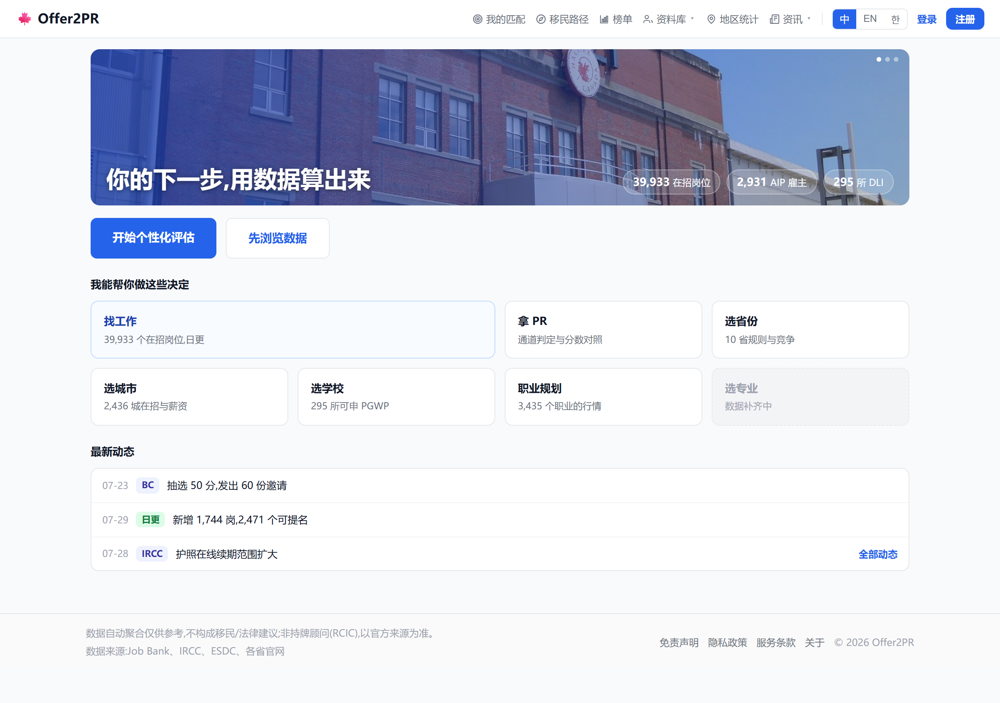

# L1-01 Landing 页(架构 v2.0 的用户目标层)

> 承接 [产品架构v2.0-决策智能平台.md](../../产品架构v2.0-决策智能平台.md) L1。本件 = **落地页本体**:三问式首屏 + 七目标入口 + 最新动态 + 信任带。
> 决策引擎(L2 报告契约)与实体页模板(L3)各自立项;本件只做**入口**,不改数据层。
> 效果图(真样式,取色来自 `ui/primitives.tsx`):[设计总表](../../assets/mockups/landing页-设计总表.html)

## 1. 目标与非目标

- 目标:① 首屏只答三问(这是什么、能帮我什么、我该点哪里);② 主按钮**开始个性化评估**唯一视觉重心,次按钮**先浏览数据**;
  ③ 七目标入口(找工作、拿 PR、选省份、选城市、选学校、职业规划、选专业)作次级排布,每个带**库内真数**小注;
  ④ 最新动态三行 = 回访钩的门面(抽选、日更、政策);⑤ 信任带 = 来源与覆盖,免责一行。
- 非目标:新问卷(**复用已上线的入口三问 `EntryQuiz`**,不另写);报告页改造(L2 立项);实体页(L3 立项);
  生活成本与专业数据(L4 缺口,本件只留灰态占位,**不上假入口**)。

## 2. 红线落地

| 红线 | 本件约束 |
|---|---|
| 宁可留空不瞎猜 | `选专业` 无数据源 → 灰态虚线、不可点、注「数据补齐中」;生活成本一字不提 |
| 事实免费 | 七入口全部免费可达;付费只在评估结果页出现(本件不设付费墙) |
| 文案不折行无废话 | 375px 下每条小注单行不截断(已验:标题/小注/动态行均无 ellipsis) |
| 不承诺结果 | 主按钮文案是「开始个性化评估」,不是「查你能不能移民」;页脚免责常在 |
| 数字必须真 | 所有数字来自库内查询,不写死;查不到就不显示该行 |

## 3. 路由与 SEO(**需 Frank 拍板**)

现状:`/` 直出职位板(2026-07-17 拍板),`/jobs` 301 回根。Landing 要占根域就得反转这条。

| 方案 | 做法 | 代价 |
|---|---|---|
| **A 直接切**(蓝图终态) | `/` = landing;职位板回 `/jobs`;反转 301,旧查询串转发 | 根域现被 Google 收录为职位板内容,**88% 流量来自自然搜索**;换内容后职位类查询排名可能掉,恢复以周计 |
| **B 先并行**(推荐先走) | `/` 保持职位板;landing 落 `/start`,顶栏加入口;两周后按埋点对比再切根 | 短期两个入口并存,需一次二选一收口 |

**建议 B → A**:landing 的价值(转化)可以先在 `/start` 上用数据验证;根域内容大改是不可逆动作,拿排名做赌注不值。
切 A 时必做:`/jobs` 设 canonical、landing 强内链到板与统计页、sitemap 与 GSC 重提交、旧深链参数保留转发。

## 4. 版式与文案(定稿)

- 首屏**只有标题与两个按钮**:「你的下一步,用数据算出来」+ 开始个性化评估 / 先浏览数据。
  副标「官方公开数据,不是传言」与灰注「三题,免费出结果」**已删**(2026-07-30 Frank:废话)——
  这类自夸与流程说明不进 UI,题数与免费与否点进去两秒自明。
- 手机两列网格,`找工作` 跨两列(它是现主产品,也是最大在招量);桌面四列,`找工作` 跨两格。
- **七卡保留**(2026-07-30 Frank 拍板),但在文档里挂回已采纳的三问旅程,不另立分类:

| 三问(2026-07-03 已采纳) | 首页卡片 |
|---|---|
| 投什么 | 找工作、职业规划 |
| 怎么拿身份 | 拿 PR |
| 去哪 | 选省份、选城市、选学校 |
| —(数据缺口) | 选专业:灰态不可点 |

- 小注一律「人话 + 真数」:39,933 个在招岗位、10 省规则与竞争、295 所可申 PGWP、2,436 城在招与薪资、3,435 个职业的行情。
- 最新动态每行「日期 + 来源标签 + 一句话」,末行右侧「全部动态」。行文本单行溢出省略,不折行。
- **首屏 banner 用 `PageBanner` 图版语法**(实景图 + 模块色暗化层 + 左下标题 + 右下数字胶囊 + 右上轮播点),
  只把定高 130 → 200(门面比二级页重),手机 150 且胶囊按原规则隐藏;需给 `MODULE_STYLE` 加 `home` 一档与一组 home 图。
- **信任带并入页脚**(2026-07-30 Frank):「数据来源」一行进 `SiteFooter` 全站生效(合规四件套之一);
  「覆盖」一行删 —— 数字与 banner 胶囊重复。
- 组件一律取自 `ui/primitives.tsx`(Button / Tag / 卡片色),**不新增配色**。
- **顶栏与页脚直接用 `SiteHeader` / `SiteFooter`,不为 landing 另做一套**:导航六项、语言段控、账户区、法务四链与免责全部照旧,
  断点也同源(≤640 导航收进汉堡且法务链撑触控靶,≤1350 副标语隐藏)。免责就是页脚那一条,页内不再重复写。
  已与生产站逐像素对过:桌面顶栏 48px、页脚 49px 单行;375 顶栏折两行 94px、页脚两段(中文 115 / 英文 135,差异来自文案长度)。

## 5. 数据与实现

- 页面:`app/(frontend)/start/page.tsx`(B 方案)→ 切 A 时把内容移到 `page.tsx`、职位板还给 `jobs/page.tsx`。
- 数字来源(一次聚合查询,进程内缓存 10 分钟,手法照 `jobs/page.tsx` 的 `ssrDimsCache`):
  在招岗数与昨日新增(jobs)、省数(provinces)、城市数(cities)、DLI 数(dli)、职业统计数(stats_occupation)、
  AIP 指定雇主数(designated_employers)、最近抽选(pnp_draws / ee_draws)、政策新闻(news)。
- 主按钮:复用 `jobs/EntryQuiz.tsx`。**不复制组件** —— 把它从 `jobs/` 提到 `(frontend)/quiz/`,jobs 与 landing 同一处 import;
  答案照旧写 `QUIZ_KEY` 与档案落库,结果页沿用 `QuizResult`。
- 次按钮:进职位板(B 方案 → `/`;A 方案 → `/jobs`)。
- 灰态 `选专业`:渲染为 `` 非 `<a>`,无 cursor 无 hover。
- 埋点(umami):`landing_cta_quiz`、`landing_cta_browse`、七入口各一个 `landing_goal_{key}` —— 切 A 与否看这组数。

## 6. 验收

- [ ] 375px 全页零横滚;标题、小注、动态行**无折行无截断**
- [ ] 七入口链接全部可达;`选专业` 不可点
- [ ] 数字与库内一致(抽查 3 项),缓存 10 分钟内刷新;查询失败时该行整条不渲染而非显示 0
- [ ] 主按钮拉起入口三问,答完能落档案与本地记忆(与职位板同一份组件)
- [ ] 顶栏页脚与全站同组件同结构(桌面单行 48/49px,375 顶栏两行、法务链触控靶 ≥36)
- [ ] 免责一行在位(页脚原文,不另写)
- [ ] 埋点三类事件在 umami 可见
- [ ] 桌面 1280 与手机 375 截图归档 `docs/assets/mockups/`
- [ ] (切 A 时)`/jobs` canonical、sitemap 重提交、旧深链参数转发验证

## 7. 落地记录

待施工。设计定稿 2026-07-30。
