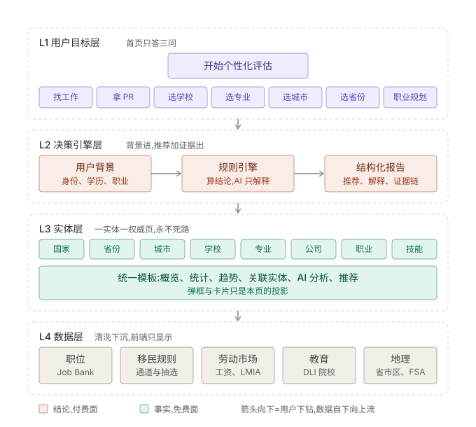
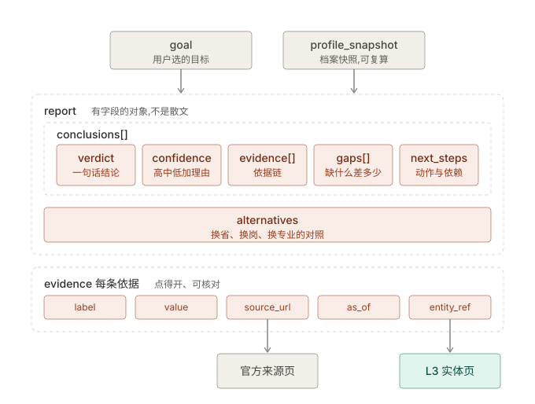
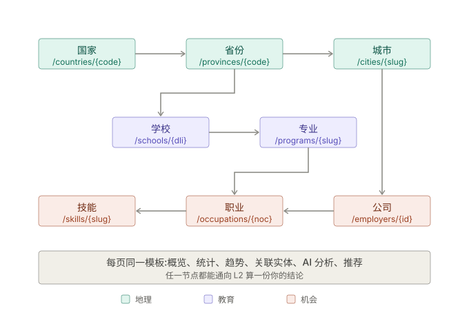

# Offer2PR Product Architecture v2.0

> **From a Data Platform to a Decision Intelligence Platform**
> 2026-07-30 Frank 口述定稿。性质:**产品蓝图**,不是短期改版说明 —— 后续任何页面/功能重构按本文的层次与原则落地;
> 扩展到美国或其他国家时**沿用同一架构,不推倒重来**。
> 上位关系:定位见 [prd.md](../prd.md);功能归属见 [模块架构总图.md](模块架构总图.md);主线顺序见 [design/全链路选择-20260726.md](design/全链路选择-20260726.md);收费界线见 [design/收费方案-20260727.md](design/收费方案-20260727.md)。
> 本文只定**结构**。具体页面的功能效果图在各自实现文档里出(循「设计文档带效果图」规矩),本文不画像素。

---

## 1. 产品愿景

**帮助用户基于真实数据,做出更好的学习、工作、移民、居住决策。**

我们回答的是「**我下一步该怎么办**」,不是「这里有一些数据」。

**我们不是**:

| 不是 | 因为 |
|---|---|
| 招聘网站 | 职位只是决策的一种输入。比覆盖率必输给 Job Bank/Indeed(他们是上游) |
| 移民信息站 | 政策条文到处都有。我们卖的是「政策 × 你的处境」算出来的结论 |
| 学校目录 | DLI 名单是公开的。我们的价值是「这所学校/这个专业 → 哪条通道 → 哪些岗」 |

**判定式**:任何新功能上线前问一句 —— 它让用户离「下一步该怎么办」更近了,还是只多了一屏数据?后者不做。

---

## 2. 四层架构



珊瑚色一层是**结论(付费面)**,青色与灰色是**事实(免费面)** —— 界线只有这一条。

数据向上流(L4 → L1),用户向下钻(L1 → L3)。**L2 是产品的心脏,也是付费面**;L3/L4 是事实,免费且是 SEO 与口碑的来源(循「事实免费、结论收费」)。

### L1 用户目标层(首页)

用户看到的是**目标**,不是模块名。七个目标入口:

`找工作` · `拿 PR` · `选学校` · `选专业` · `选城市` · `选省份` · `职业规划`

首页**只回答三个问题**:

1. **这是什么**(一句话)
2. **能帮我什么**(七个目标,就是答案)
3. **我现在该点哪里**(主按钮)

- **主按钮:开始个性化评估** —— 唯一的视觉重心。
- 次按钮:浏览数据 —— 给不想填表的人一条路(也是 SEO 落地页入口)。

> **七入口与单一主按钮的关系(定死,免得两版打架)**:七个目标是**能力声明 + 深链入口**,不是七个并列的大按钮。
> 视觉上主按钮独占重心;七入口作次级排布。点任一目标 → 进同一套评估流程,只是**预设了目标参数**(如「选省份」= 目标锁定省对比)。
> 一套引擎,七个入口。不做七条独立流程。

### L2 决策引擎层

- **输入**:用户背景(身份现状、学历、职业/NOC、语言、工作年限、资金、家属、目标时限、地域偏好)。
- **输出**:**推荐 + 解释 + 数据证据**,三者必须同时出现,缺一不发。

规则:

1. **问最少但关键的问题**。每多一题必须能改变结论,否则删掉。当前「入口三问」是这条流程的起点,按需分级追问(渐进式表单,不是长问卷)。
2. **产出结构化报告,不是自由文本**。报告是有字段的对象(结论 / 依据 / 缺口 / 下一步 / 证据链),可存、可复算、可对比、可分享。**禁止**把一段 LLM 散文当报告。
3. **每一个结论回链数据依据**。结论旁边就是「依据:XX 省官方清单第 N 行 / 2026-06 抽选分数线 / 库内 N 个在招岗」,点击直达 L3 实体页或官方源。
4. **结论由规则引擎算,AI 只负责解释与措辞**。AI 不产生结论、不编造事实(grounded);规则表变了,历史报告可复算。
5. **不承诺结果**。给对照与缺口,不说「你一定能拿 PR」;≠ 资格认定的免责话术保留。

报告骨架(字段级契约,各功能共用):

```
report = {
  goal,                    // 用户选的目标
  profile_snapshot,        // 算这份报告时的档案快照(可复算)
  conclusions: [           // 有序、可排序
    { verdict,             // 一句话结论
      confidence,          // 高/中/低 + 为什么
      evidence: [ {label, value, source_url, as_of, entity_ref} ],
      gaps:     [ {缺什么, 差多少, 怎么补, 预计周期} ],
      next_steps: [ {动作, 关联实体, 依赖} ] } ],
  alternatives             // 换省/换岗/换专业的对照方案
}
```



`evidence.source_url` 回链官方来源页、`evidence.entity_ref` 回链 L3 实体页 —— **证据链是硬字段,不是文案**。

### L3 实体层(Entity Layer)

**八类实体**:国家 · 省 · 城市 · 学校 · 专业 · 公司 · 职业 · 技能。

每个实体页**结构固定**(同一模板,只是数据不同):

| 区块 | 内容 | 目的 |
|---|---|---|
| 概览 | 这是什么、关键身份信息 | 3 秒看懂 |
| 统计 | 库内可算的事实(在招量、薪资中位、抽选线、配额) | 事实层 |
| 趋势 | 时间序列(月度在招、历次抽选、清单变动) | 判断方向 |
| 关联实体 | 上下游实体链接(省 ↔ 市 ↔ 学校 ↔ 专业 ↔ 职业 ↔ 公司 ↔ 技能) | **永不死路** |
| AI 分析 | 基于本页事实的解读(grounded) | 从事实到理解 |
| 推荐 | 「下一步」:回 L2 算一份针对你的结论 | 从理解到行动 |

三条硬约束:

- **单一真相源**:一个实体只有**一个**权威页面。弹框、卡片、列表里的实体展示都是这个页面的**轻量投影**(同数据源、同组件),不是另写一份。信息不一致的根都在复制。
- **永不死路**:任何实体页都至少有一条通向相关实体的路,以及一条通向 L2 的路。用户不该被迫用浏览器后退键。
- **URL 即结构**:`/provinces/{code}`、`/cities/{slug}`、`/schools/{dli}`、`/programs/{slug}`、`/employers/{id}`、`/occupations/{noc}`、`/skills/{slug}`。一实体一稳定 URL = SEO 面 + 分享面 + 引用面。



三条链:**地理**(国家 → 省 → 市)、**教育**(省 → 学校 → 专业)、**机会**(市 → 公司 → 职业 → 技能);教育链从省分出、在职业上汇合。
「关联实体」区块渲染的就是这张图上的边 —— **边是数据,不是每页手写的链接**。

### L4 数据层

现有模块按**领域**归置(现状能力,详见 [模块架构总图.md](模块架构总图.md)):

| 领域 | 现有数据 |
|---|---|
| 职位 | Job Bank 全国全职业 + ATS,清洗后 jobs/companies |
| 移民规则 | PNP 通道清单与抽选、联邦 EE 类别与抽选、AIP 指定雇主、紧缺职业清单 |
| 劳动市场 | ESDC 工资中位、LMIA 记录、NOC/TEER 分类 |
| 教育 | DLI 院校名单 |
| 地理 | 省/市/区维度、FSA |

铁律不变:**清洗下沉数据层,seed 只入库,前端只显示**。L2 需要的一切都必须是库内字段,不在前端算。

---

## 3. 设计原则(五条,新功能照此判)

| # | 原则 | 含义 | 反面例子 |
|---|---|---|---|
| 1 | **目标优先** | 先解决用户要完成的事,再展示数据 | 首页放一张全国统计大图 |
| 2 | **证据优先** | 所有推荐都有数据依据,不做黑盒结论 | 「推荐你去 SK」但不说因为什么 |
| 3 | **万物互联** | 任何页面都能自然导向相关职业/学校/城市 | 学校页是终点,看完只能退出 |
| 4 | **循序渐进** | 先给简单清晰的答案,再允许深入查看数据 | 一上来 20 列表格 + 6 个筛选器 |
| 5 | **单一真相源** | 每个实体只有一个权威页面,避免重复与不一致 | 省信息在弹框、统计页、报告里各写一遍 |

---

## 4. 现状 → 蓝图:差距与顺序

已有的都能复用,**不需要重写数据层**。缺的是 L1/L2 和 L3 的统一化。

| 层 | 现状 | 差距 |
|---|---|---|
| L1 | 首页即职位板,直接给数据 | 目标层缺失。需要「三问 + 主按钮」的首页 |
| L2 | 入口三问、match.ts 档案匹配、AI 顾问弹框(各自独立) | 缺**统一报告契约**与证据链;结论散在弹框里,不可存不可比 |
| L3 | `/jobs`、`/employers`、`/occupations`、`/stats`、DLI 在库 | 结构不统一;省/市/学校/专业/技能**没有实体页**;弹框与页面各写一份 |
| L4 | 全链路已跑通,日更 | **专业(program)、生活成本**无数据源 —— 「选专业」「选城市」在数据侧先补,不然是空壳 |

**建议顺序**(每步独立可上线,不做大爆炸重构):

1. **报告契约先行(L2 骨架)** —— 定 `report` 结构 + 证据链组件。已有的三问结果与档案匹配先接进来,立刻就有「可存的报告」。这是付费核 A(通道报告)的地基。
2. **实体页模板(L3)** —— 一个模板组件 + 六区块,先落省与城市(数据已在),再落职业与公司(把 `/occupations`、`/employers` 收敛进模板),弹框改为模板的投影。
3. **首页改造(L1)** —— 三问 + 主按钮 + 七入口;职位板降为「浏览数据」下的一页。
4. **数据补口(L4)** —— program 数据源、生活成本源可信度评估。**先确认能拿到可信数据再立项**,拿不到就不上「选专业/选城市」入口(宁可留空不瞎猜)。

---

## 5. 可扩展性(为什么扩到美国不用重来)

- **国家是实体,不是常量**。所有规则(通道、清单、分数线、配额)存在**规则表**里,不写死在代码里;L2 引擎读表,不读 if-else。
- **L3 模板与国别无关**:省/州、市、学校、专业、职业、公司在任何国家都是同一组关系。
- **L4 按领域而非按来源组织**:换国家 = 换抓取源 + 填规则表,L2/L3 不动。
- 三语(zh/en/ko)i18n 已在位,文案层不是障碍。

---

## 6. 红线(继承,不因重构放松)

1. 只用**官方公开数据 + 库内事实**;不做「哪个省更好」的主观推荐。
2. 信号是**粗筛,≠ 资格认定**;不承诺结果(PR 由 IRCC 决定)。
3. 非持牌顾问(非 RCIC)免责声明常在。
4. 宁可留空,不瞎猜。数据缺口就说缺口,不用 AI 填空。
5. 事实免费、结论收费;界线永远落在「事实 → 结论」这一步,不落在「看几次」。
