# 功能盈利点检查(迭代式整改 · 第 20 轮 · 2026-07-17 凌晨 · 发版后回归:E9 新面四件入图,#47/#49 生产复验闭环,新发现 #50-#53)

> **迭代工作台文档**。工作法:每轮 = **全量截图(电脑+手机)→ 统一检查 → 逐功能整改意见 → 实施 → 下一轮复查**;整改项闭环后标 ✅,一轮一轮迭代到整个项目完善。
> **轮次记录**:第 1-19 轮(2026-07-09 建档 → 2026-07-16 深夜)沉档至 [整改轮次存档.md](整改轮次存档.md);工作台只保留当前轮。
> **当前轮次**:**第 20 轮 2026-07-17 凌晨(dd,E9 闭环两件上线后的发版回归轮)**:① **重点复验三件全过**——**#47 生产复验 ✅ 终闭环**(「本周新增 TOP 50」零 intern/零 CARZAN,SSR grep 双证,05d 护栏随 00:01 seed 生效)、**#49 保持 ✅**(图 9 占位「这家公司是否曾提名国际学生走萨省PNP成功获批?」/图 12「这家公司招聘的…」双端纯中文)、**JD 段落格式保真生产复验 ✅**(REPARSE 回填后 SaskEnergy 聚合帖双端恢复六段落,图 18/M14);② **E9 新面四件全部入图**:每日分类榜(新图 24/M21,20 行全数据+榜单导航 chips)、收藏钮(新图 25,「★ 已收藏」琥珀态)、推荐横幅(新图 26/M22,「根据你最近浏览:AB」+双 CTA,截图脚本造画像手法)、我的求职(新图 27/M23,收藏岗+状态下拉+移除);③ 其余 41 屏零回归(#21/#30/#32/#34/#41/#42/#43/#44/#46/#48 全保持);④ **新发现四件只记不改**:**#50(P2)AI 顾问断言用户身份/状态**(匿名态「由于你是PGWP持有人」图 15/M12;「意味着你已有SaskEnergy的具体职位承诺」图 17/M13)、**#51(P3)推荐横幅 CTA 数字按已载入行计数**(「看这些岗(5)」,AB 实际 604,全量换入后跳变)、**#52(P2)手机卡片流无收藏入口**(E9-01 闭环第一环在手机断链,改卡片需效果图先行)、**#53(P3)手机「我的求职」移除钮 × 换行脱节**(M23 左下角孤立);⑤ 截图脚本随轮进化:新增四镜头+rec-banner 画像注入手法;citation 特写裁剪坐标左缘切字待微调(上轮备忘言中)。
> **第 20 轮收口后当晚追加(用户拍板「你先完善功能闭环,明天我来发帖」)**:**#50-#53 四连修当晚实施+生产复验全过(30cc20d)**——#50 advisor 身份红线(新鲜样本 It Takes A Village Daycare:AI 段改口「**若你持 PGWP 或国际学生身份**…」条件句,零断言;旧缓存随数据轮换血)、#51 横幅 CTA 全量换入前显「看这些岗 →」无数字(路由阻断法实测)、#52 手机卡片标题行右侧 ☆/★ 星标钮(匿名点=注册框实测弹出;登录点=★ 琥珀;效果图 mobile/card-star.jpg 待 Frank 过目,不合意一句话改)、#53 我的求职下拉+× 包组不换行(mobile/my-jobs.jpg 已刷修复版)。**手机端闭环打通:发现→卡片→星标收藏→我的求职跟踪全链可走。**
> 口径:分层真相以 `cms/src/lib/plan.ts` 为准;截图为 **offer2pr.com 生产站第 20 轮实拍(2026-07-17 凌晨,E9-01/02 上线后、seed 00:01 全绿)**(电脑 1440×900 / iPhone 13;匿名态 + 测试号 `fable5d@test.local`)。
> 结构:**一图一题**,子标题号=图号(电脑 图 1-27 / 手机 图 M1-M23);整改编号全局唯一;P0/P1/P2=优先级。

(第 3 轮总判断已沉档 → [整改轮次存档.md](整改轮次存档.md))

---

## 第 21 轮素材(2026-07-18 用户口头批,九条,#54-#62 —— 只记待拍板,实施前布局类效果图先行)

| # | 条目 | 用户原话/截图 | 初判 | 类型 |
|---|---|---|---|---|
| #54 | 注册/登录弹层参考 careerbeacon | 「这个登录页如何」(大标题文案+社交钮横排+or sign up with+邮箱密码+主CTA) | 骨架值得借:社交在上/邮箱在下/单列;**并入 E11-03 Google 登录**的 AuthForm 改版(只上 Google 一枚,LinkedIn/FB 不做——受众不符+维护成本) | 待 E11-03 |
| #55 | ETL 每类抓取分目录/分容器 | 「每一类抓取都拆分成一个 docker 一个脚本,分目录分类管理」 | **目录归位=对**(脚本散在 etl/ 根,应归 etl/sources/<源>/ 或 etl/<源>/);**每类一容器=过度**(现「每源一调度单元 sources/* META + 角色容器」已隔离故障;15+ 容器违 Ponytail)。先出小设计文档再动(design-before-refactor) | 设计文档先行 |
| #56 | 「字段(10)」钮挪与薪资同行最右 | 「放到最右边和薪资放到一行,现在看着别扭」 | 小布局改,快刀 | ✅ 已闭环(e5fdea1,2026-07-18 晚实施+生产复验:更新时间+字段钮挂薪资行最右 marginLeft:auto,「仅雇主直发」独立收尾行;图 56-验收-筛选区.png) |
| #57 | 常见图表多级下钻 | 「为什么只能下钻一次,是不是要用开源图表插件」 | 下钻层级是交互设计不是库问题:先做**两级下钻+面包屑**(自绘可承载);要富交互(tooltip/动画)再评估 echarts 按需引入(bundle 代价) | 效果图先行 |
| #58 | wizard/档案省份显示全名 | 「省份需要显示全名吧」(ON/BC chips) | **对,违反 E11 原则 B(零黑话)**——chips 显示省全名(三语),码存幕后 | ✅ 已闭环(e5fdea1:i18n 新 `pr.*` 三语省全名键(含 QC 备用),ProfileForm+OnboardingWizard 两处 chips 全接,值仍存两字码零数据层改动;生产复验含 no_bare_codes 断言;图 58-验收-档案省份.png) |
| #59 | 筛选区重设计 | 「检索功能看着这么恶心」(5 行 label+下拉) | 成型 UI 重设计:方向=常用一行(省/大类/PNP/薪资)+「更多筛选」折叠;**效果图先行** | 效果图先行 |
| #60 | 常见图表区空白 | 「中间和右边大量空白」(4 卡 3+1 布局) | grid auto-fit 流式(2×2 或等宽拉通),与 #57 同区一并 | ✅ 已闭环(e5fdea1:`auto-fit minmax(min(100%,420px),1fr)`——1100 容器恒 2×2 等宽(生产实测 2×526px),任何宽度不再 3+1,窄屏单列;下钻逻辑没动,#57 另批;图 60-验收-图表区.png) |
| #61 | 二级标题位置 | 「这种二级标题是不是应该放到上面」(榜单导航 chips 行) | 待截图确认具体页面语境后小改 | 待澄清 |
| #62 | 「我的收藏」独立模块 | 「我的收藏应该也是一个模块吧」 | **已拍板=A**:账户页侧栏+顶栏下拉加「我的收藏」独立入口(直达收藏列表);归 D4 | ✅ 已闭环(e5fdea1:账户新 `favs` 节=纯收藏列表(SavedJobsList 加 favs 变体,无状态下拉/周报开关),侧栏排「移民档案→我的收藏→我的求职」,顶栏下拉深链 `?sec=favs`;「我的求职」看板原样,生产回归过;图 62A-验收-收藏节/下拉.png) |
| #63 | 账户下拉 Supabase 风 | 「参考这两个图」(Supabase 下拉截图) | 分区分隔(身份/功能/设置/升级/退出)+ **通栏实心「升级 Pro」钮**(现为文字条目)+ 退出置底;与 #62A 一并改 | 效果图先行 |
| #64 | 定价页卡片式 | 「参考这两个图」(Supabase pricing 截图) | **v3 定稿**:免费/Pro30/Pro90 三卡(90 天标「更划算·省31%」+每天单价);「当前方案」态;图标一律 SVG(Icons.tsx);**清单一行只说一件事**(「PNP/EE/AIP 标记」拆三行——此原则通用于全站功能清单);/pricing 与升级弹框同一套卡片组件 | ✅ 效果图 v3 定稿 |

**第 21 轮素材(续二,2026-07-18 晚批,#67-#72 —— 当晚全部实施+生产复验闭环,0731f6f)**

| # | 条目 | 用户原话 | 落地 | 状态 |
|---|---|---|---|---|
| #67 | 全站页面宽度统一+公共套壳组件 | 「每个页面的宽度应该是一样的吧,新的页面也应该按照这个宽度套壳」「我应该需要一个公共的组件」 | primitives 新增 **`PageShell`(1320 轨,与 SiteHeader 头轨同宽)**,新页面一律套它;/news 列表+详情已套(详情阅读列 860 居中保行长);**存量页(stats1100/榜单1100/pathways860/账户860/定价760)迁移归 #65 余批**,与筛选区/Sidebar 一批做 | ✅ /news 已闭环;存量页迁移待 #65 余批 |
| #68 | /news「只看重要」筛选删 | 「这个去掉」 | chip+state+i18n 键(news.impOnly ×3)全删;重要红徽标/头条梯队保留 | ✅ 已闭环 |
| #69 | /news 列表小色块换真实图片 | 「这部分也整个真实的图片进来吧,大小裁剪也要包含吧」 | ListTile 换省地标实景图(/img/regions 复用),96×64 objectFit:cover 裁剪;缺图 onError 退 v4 淡色字标 | ✅ 已闭环(生产 60 缩略图实证) |
| #70 | /news 头条区加轮播 | 「这部分应该加个轮播的功能」 | 大卡恢复轮播(**推翻 v4「轮播退役」**):5s 自动+圆点+左右箭头+hover 暂停,右列恒显其余 4 条;控件锚图区内不随文字区漂移 | ✅ 已闭环(生产三态实测:点击切换/自动轮播/hover 暂停) |
| #71 | AI 顾问标题「思考中」后缀删 | 「这个后面不要显示思考中」 | 弹框标题行 `advisor.generating` 后缀删(键 ×3 清);等待态由正文区「努力思考中」占位承担 | ✅ 已闭环 |
| #72 | 图片 Wikimedia 水印去掉 | 「图片的水印去掉」 | 角标 overlay 删;**CC BY/BY-SA 致谢不能全删**——挪 img title 悬停+SOURCES.md 留档 | ✅ 已闭环 |

---

# 第一部分 · 电脑端(按用户旅程)

## 一、入口与转化旅程

### 图 1 · 首页职位板(流量底盘)

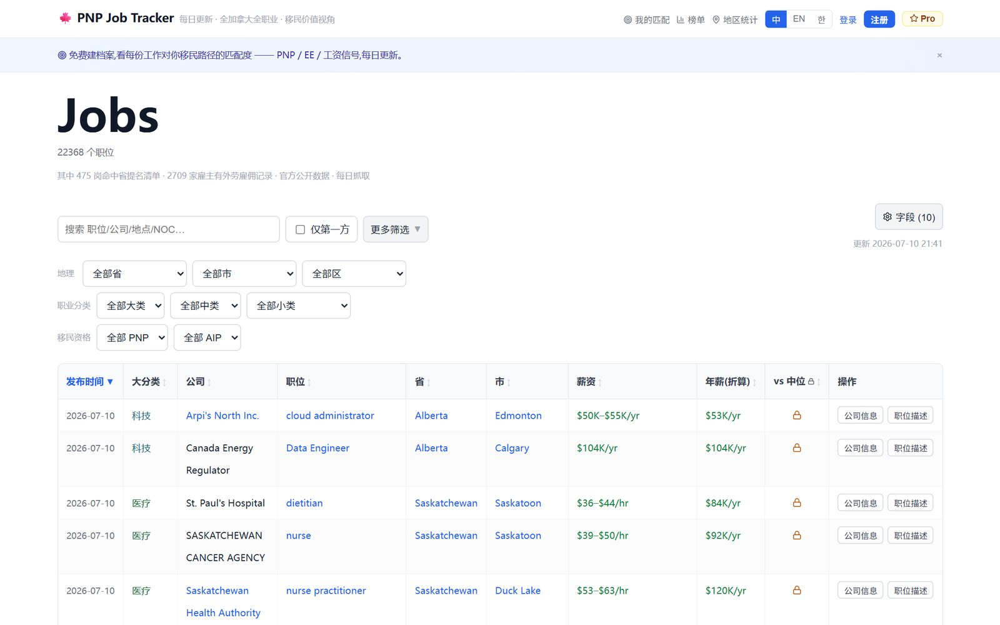
*图 1 · 首页:价值主张横幅 + 四级筛选 + vs 中位锁列(匿名态)*

> **第 2 轮**:✅ 维持通过。
> **第 16 轮**:**#34/#40 生产复验 ✅(本图)**——标题「22680 个职位」=库内真实总数无小注;「更多筛选」横条已无,来源/状态/经验/评分/薪资五行常驻,「字段 (10)」+「更新 2026-07-11 13:21」紧贴表格右上;**#35 回滚态复验 ✅**(1100px 断言:表格=父容器内容盒全宽、可横滚、无小注——首轮 fullWidth=False 是断言没扣父容器 padding,数值复核 1055=1100−2×22.5 恰好全宽)。
> **第 16 轮追加(用户拍板「这两个放到一行」,54bc144)**:更新时间+字段按钮并入**薪资筛选行右侧**(右对齐),省一行高度;生产复验:同行同 y/右贴边/下拉开合正常/窄屏照旧隐藏,本图已刷为合行版。
> **第 16 轮追加二(用户二次拍板「之前不是折叠的吗」→ 恢复折叠,a4ecf5c)**:五行常驻太占竖向,「更多筛选 ▼」折叠恢复(默认收起,开关带激活筛选计数);更新时间+字段挪到**开关行右侧**同一行(「放一行」拍板延续)。生产复验:收起/展开/再收起、字段同行、窄屏照旧。本图已刷为折叠版——首屏可见岗位行 1→4。#40 状态注:「删折叠」部分被本次推翻,「字段紧贴表格上方」由开关行继承。
> **第 18 轮**:✅ 零回归(本图)——标题「30482 个职位」=库内真实总数(迁移后数据自然增长),差异化证言行「其中 669 岗命中省提名清单 · 3568 家雇主有外劳雇佣记录」随数据刷新;折叠筛选+「更新 2026-07-16 17:53」+「字段 (10)」布局保持;首行数据 2026-07-16 = 迁移后日更恢复实证。
> **第 20 轮**:✅ 零回归(本图)——「30722 个职位」/证言行「670 岗 · 3592 家」随数据刷新;**操作列新增「☆ 收藏」钮(E9-01)首位入镜**,公司信息/职位描述次之;「更新 2026-07-16 23:46」= 1h 节奏保持。

### 图 2 · 注册框(匿名点锁列触发)

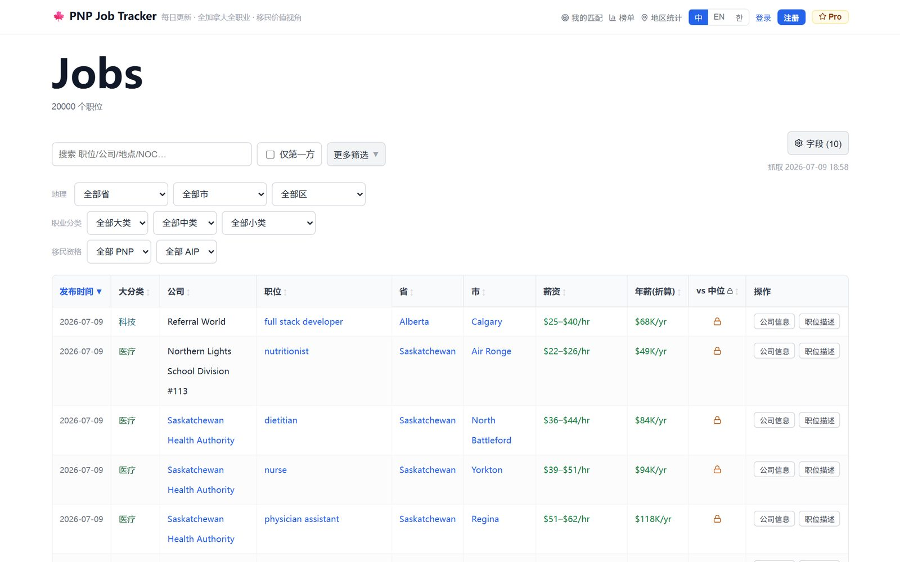
*图 2 · 匿名点 Pro 锁列 → 弹注册框(注册与购买分离)*

> **第 2 轮**:✅ 维持通过。

### 图 3 · 登录框

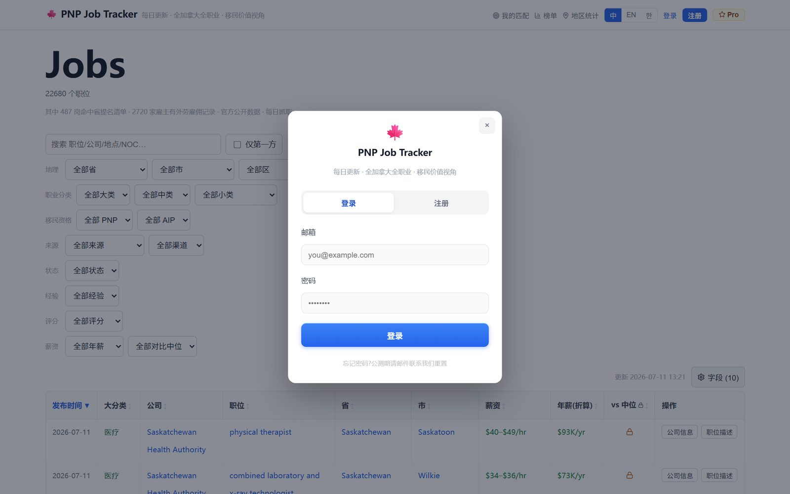
*图 3 · 登录框(全站唯一登录入口)*

> **第 2 轮**:✅ 维持通过。
> **第 18 轮追加(用户实机反馈,4fd584d)**:**登录被密码 8 位校验拦死**——密码输入框 `minLength=8` 对登录/注册两个 tab 都生效,老短密码账号(如 admin 侧建的 6 位)浏览器直接弹「Please lengthen this text to 8 characters or more」永远进不来。修:minLength 只挂注册态,登录态不做长度前置校验(密码对不对由服务端说了算)。

### 图 4 · 定价页 /pricing

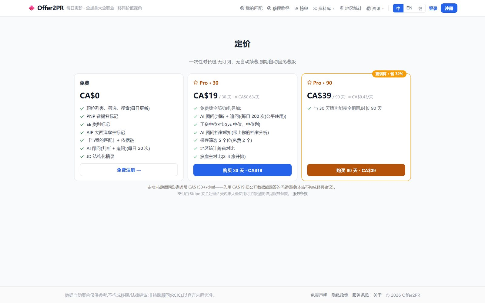
*图 4 · 定价页:对照表 9 行(含新增两行)+ CA$19/39 + 新支付文案*

> **第 2 轮**:
> - **#4 ✅ 闭环**——对照表补上「保存筛选 + 匹配邮件日报」「地区统计跨省对比」两行,复查见图。
> - **#2 ✅ 闭环(本页部分)**——页脚改「支付由 Stripe 安全处理」,不再列举未开通的支付宝;服务条款三语同步改「以结账页显示为准」。

### 图 5 · 升级弹框(临门一脚)

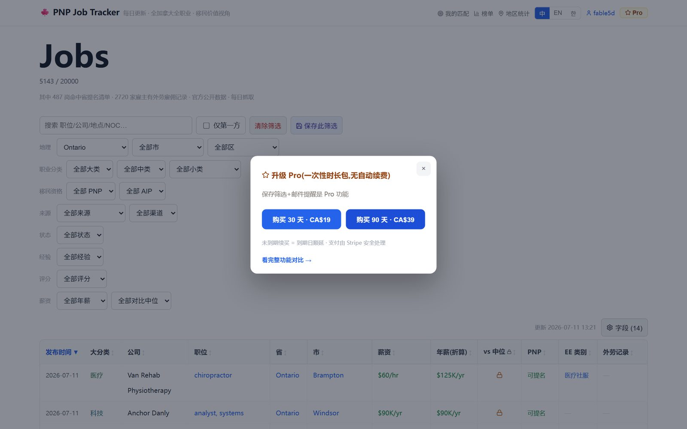
*图 5 · 升级弹框:场景化理由 + 两档价格 + 新注脚*

> **第 2 轮**:**#2 ✅ 闭环**——注脚「支付由 Stripe 安全处理」,复查见图。

### 图 6 · Stripe 结账页(收款终点)

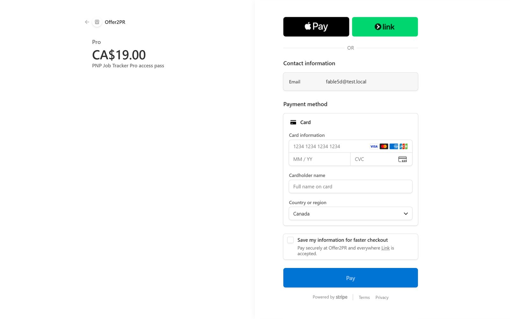
*图 6 · Stripe live 结账页:商家名已改「Offer2PR」,CA$19,卡+Link*

> **第 2 轮(当日追改)**:**#1 ✅ 名称闭环**——用户改完 Stripe Public business name,复拍确认结账页显示「Offer2PR」(本图)。尾巴:品牌图标/支持邮箱未确认是否一并设置;Alipay 审批状态未报——留第 3 轮口头确认,不重开整改项。

## 二、直接收钱的 Pro 功能

### 图 7 · 账户档案表单(匹配的输入端)

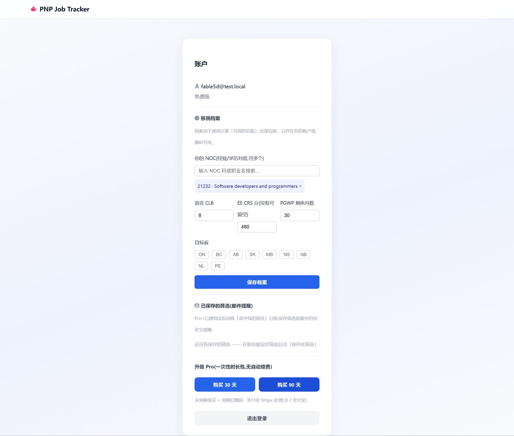
*图 7 · /account:NOC chip + CLB/CRS/PGWP + 已保存筛选 + 购买按钮(注脚已改)*

> **第 2 轮**:✅ 维持通过;#2 的账户页注脚已随 i18n 键闭环。

### 图 8 · 「我的匹配」视图(付费核·免费额度钩子)

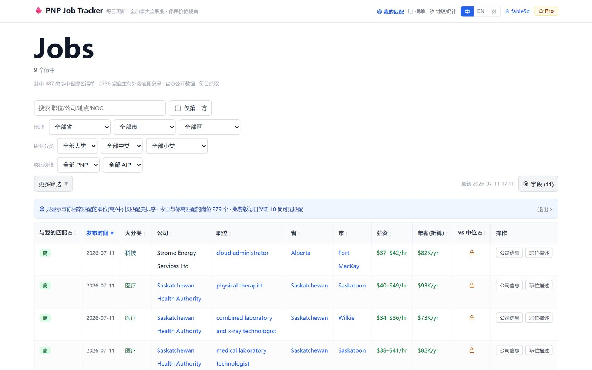
*图 8 · 「我的匹配」视图:免费前 10 岗横幅 + 「高」chip*

> **第 2 轮**:**#11 ✅ 闭环**——列选择器已移除「与我的匹配」死勾选项(DOM 验证:33→32 项,匹配项消失)。
> **第 16 轮**:**新发现 #42(P2)**——筛选/匹配态标题「8 / 20000」的分母是全量拉取护栏(2 万行载入上限),不是库内真实总数 22680:「/20000」整数太圆像写死,且与 #34「标题不谎报」口径不一致(升级弹框背景「5143 / 20000」同病,见图 5)。修法:分母改真实总数,或措辞改「8 个命中(已载入 2 万行内)」——**措辞需拍板**。
> **第 17 轮**:**#42 ✅ 闭环(本图)**——拍板「只报命中数」:匹配态「9 个命中」、筛选态「5167 个命中」(图 5 背景),分母整个消失,双端同验。

### 图 9 · 匹配依据链弹框(杀手结论)

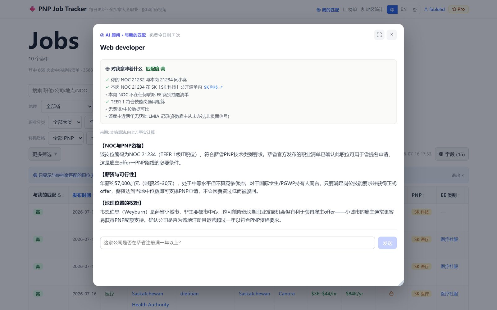
*图 9 · 依据链:NOC 同小类 ✓ / AB 清单 ✓ / CRS 差分 / LMIA 中性(术语随 #6 更新)*

> **第 2 轮**:✅ 维持通过;依据链措辞随 #6 换新(「职业在省提名通道清单内」)。
> **第 16 轮**:**#36 生成占位实拍(本图)**——输入框占位=模型基于本轮回复生成的本岗专属问题「萨省物理治疗师执业证是否已获得或认证中?」,非罐头;正文无 ❓ 泄漏。
> **第 18 轮**:**#44 ✅ 闭环(本图)**——建议占位「这家公司是否在萨省注册满一年以上?」:整句中文、雇主用「这家公司」指代,零英文公司名嵌入(4d1ccfe 语言纯度约束生效);「免费今日剩 7 次」额度提示照常。
> **第 19 轮**:**新发现 #49(P2)**——缓存换血后本图占位复发公司名裸嵌「TABOCHE TECHNOLOGY过去是否成功提名过国际学生/PGWP持有人?」(图 15 同病「ERA是否…」):#44 的 prompt 约束在但模型不稳定遵守。修法:前端兜底,capSug 把 job.company 及其子串替换「这家公司」。头像下拉按钮(F fable5d ▾)本图入镜 ✓。
> **第 20 轮**:**#49 生产复验 ✅(本图)**——占位「这家公司是否曾提名国际学生走萨省PNP成功获批?」整句中文+「这家公司」指代,前端兜底扛住缓存换血;依据链 ✓✗• 逐条照旧。

### 图 10 · vs 工资中位锁列(Pro 列)

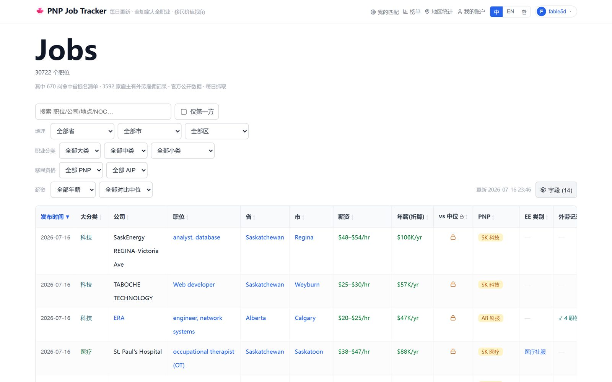
*图 10 · 登录免费态:信号列全开,vs 中位整列 🔒*

> **第 2 轮**:✅ 维持通过。

### 图 11 · Pro 跨省对比 gate

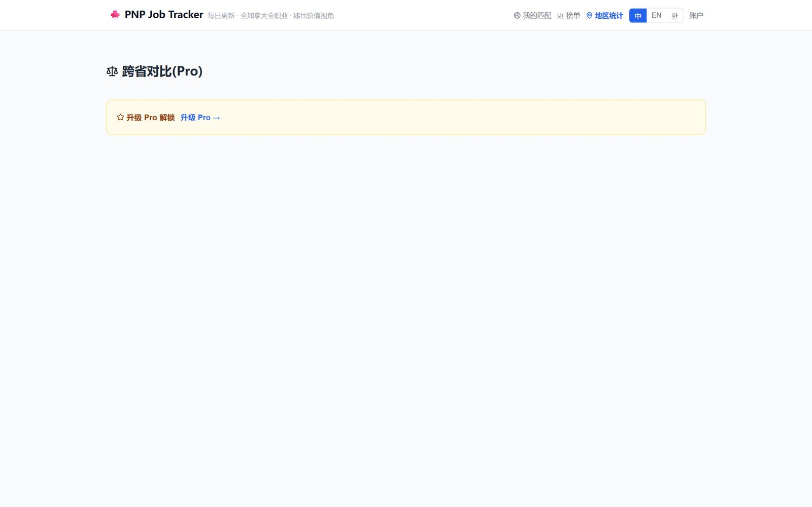
*图 11 · /stats/compare 未解锁 gate*

> **第 2 轮**:定价页已摆上它(#4 闭环);卖点厚度(RNIP/生活成本)仍是产品 backlog,非本清单项。

### 图 12 · 公司 AI 顾问弹框

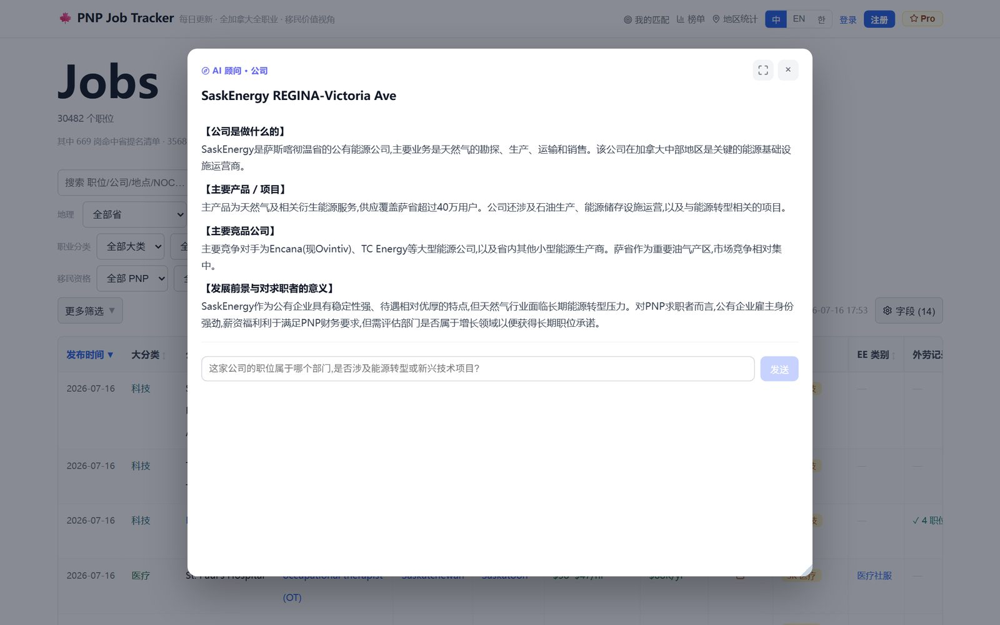
*图 12 · 公司 AI 顾问:诚实拒答 + 追问框*

> **第 2 轮**:**#5 ✅ 闭环**——匿名 advisor 额度 40→8/日、jobtext 200→20/日,与免费注册档对齐(代码级,生产已部署;env 可覆盖)。
> **第 10 轮**:**#25 ✅ 闭环(生产实测)**——匿名配额打满后开顾问:琥珀卡「今日免费次数已用完(每日重置)。注册登录后有独立额度,Pro 每日 200 次」+「登录 / 注册 →」CTA 实测开注册框,不再甩「生成失败(429)」;EN 文案同验。**#27 ✅ 闭环(生产实测)**——「该公司在榜职位」行点击开本站职位描述弹窗(叠层显示,关掉回列表,不再外跳官方),去「— 城市」尾缀;「… +133」改「展开其余 133 个 ▾」,点开 8→141 全量(commit 078a3d8)。
> **第 16 轮**:**#36 终态 ✅/#37 ✅/#39 ✅ 闭环(本图=fde5ae1 修复后补拍)**——① chip 整个消失,建议问题=输入框占位,Tab 实测填入、与占位逐字相等;② **复验揪出兜底死代码**:首拍 SHA 弹窗正文结尾裸奔问句「SHA在Saskatoon地区有哪些具体空缺职位及薪资范围?」且占位退罐头——capSug/extractSug 的正则字符类是两个半角 `?`,全角 `？` 不在,中文问句永不命中;当轮修复(fde5ae1)后复拍:裸问句被摘进占位、正文收口干净;③ #39 同名岗灰色城市尾缀实拍(METRIC AIR 两条 gas technician 各带「· Mississauga」;SHA 列表重名岗同理),不重名行无尾缀。
> **第 18 轮**:**#44 ✅ 同证(本图)**——建议占位「这家公司的职位属于哪个部门,是否涉及能源转型或新兴技术项目?」纯中文+「这家公司」指代;#43 零星号残渣保持。本图样张换 SaskEnergy(单岗公司,「在榜职位」块按「>1 才显示」设计隐藏,非回归——JobsTable.tsx:1562 代码实证)。

## 三、免费信任层

### 图 13 · PNP 弹框(命中行 + 省抽选事实块)

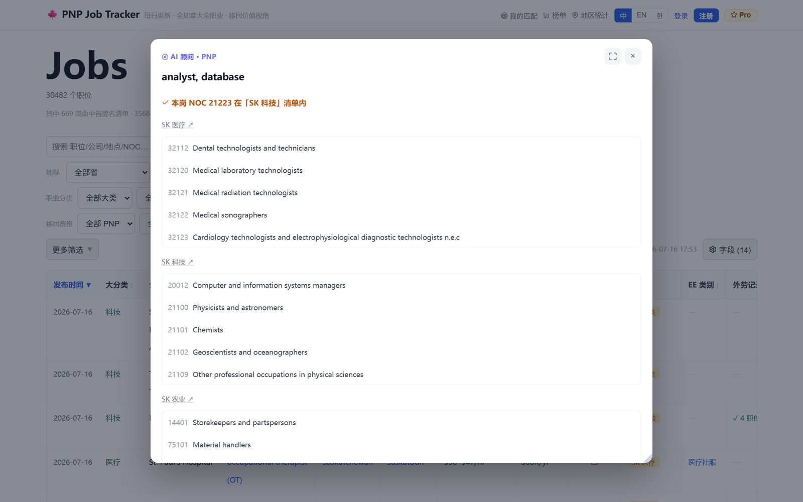
*图 13 · PNP 弹框:命中行 + AAIP 最近抽选(WEOI 标注)+ 清单*

> **第 2 轮**:✅ 维持通过。

### 图 14 · EE 类别弹框(转化桥)

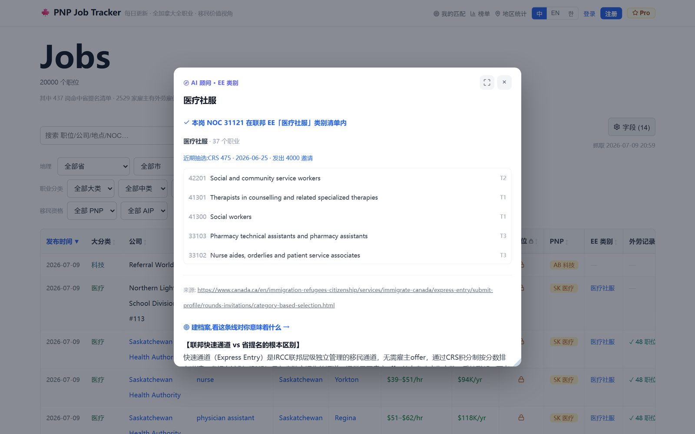
*图 14 · EE 类别弹框:命中行高亮「← 本岗」*

> **第 2 轮**:✅ 维持通过。
> **第 16 轮**:**新发现 #43(P3)**——顾问 AI 正文 markdown 强调符原样露出:「通常\*\*不需要雇主offer\*\*」(本图 AI 段;图 15/图 9 及手机端同病)。正文是 pre-wrap 纯文本渲染,模型输出的 `**` 不会变粗只会碍眼。修法:打字机吐字前剥连对 `**`(与 #31 JD 剥残渣同族、前端一处),或 prompt 明令禁 markdown(前端剥更稳)。
> **第 18 轮**:**新发现 #46(P2)**——本图 AI 正文整段**繁体中文**(「聯邦移民部」「獨立通道」「兩條不同的軌道」),M11 同现(同岗同字段命中同一份缓存)——模型偶发输出繁体且初判缓存把它固化,该岗 EE 弹窗所有用户都看繁体;其余弹窗(图 9/12/15/17)均简体。修法:advisor SYSTEM 回复语言约束明示「简体中文」(与 #44 同一行代码域),旧缓存随过期换血。
> **第 19 轮**:**#46 ✅ 闭环(本图)**——zh 明令 Simplified ONLY+举例(6c6d008),同岗 EE 弹窗 AI 段双端全简体(「联邦快速通道…完全分开」),缓存随 21:17 数据轮自然换血。

### 图 15 · LMIA 外劳记录弹框

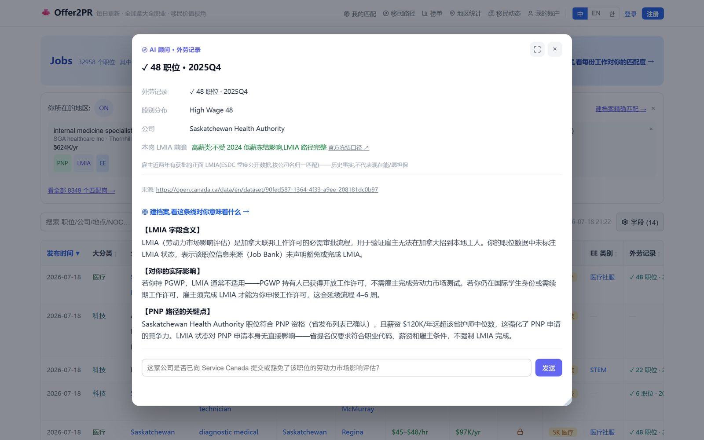
*图 15 · 外劳记录弹框:✓ 职位数·季度 + 股别前瞻 + 免责口径*

> **第 2 轮**:✅ 维持通过。
> **第 16 轮**:**#36 兜底修复后补拍(本图)**——首拍本图正文末行也裸奔问句「雇主是否主动赞助 LMIA 或仅走 PNP?」+占位罐头(与图 12 同病同因);fde5ae1 后补拍:占位=「萨省卫生局此职位是否需要先通过物理治疗师执照考试或已获认证?」,正文收口。
> **第 17 轮**:**#43 ✅ 闭环(本图)**——顾问正文 `**` 强调残渣零出现(「通常**不需要**LMIA」类写法已被 renderAI 剥净),双端 AI 弹窗全验;建议占位照常生成。
> **第 20 轮**:**新发现 #50(P2,本图+M12 同现)**——AI 段对**匿名未建档**用户断言身份:「由于**你是PGWP持有人**(已获加拿大工作许可),ERA 无需走LMIA流程即可雇用你」——受众假设当用户事实说,grounded 红线同族(图 17 评分弹框同病「意味着**你已有**SaskEnergy的具体职位承诺」,第一方帖≠用户有 offer)。修法:advisor SYSTEM 补红线「不得断言用户身份/档案状态;无档案时受众假设一律条件句(如『若你持 PGWP…』);岗位属性(第一方/清单命中)不得表述为用户状态」,与 #44/#46 同一代码域。

### 图 16 · citation 来源行(特写)

*图 16 · 口径注 + open.canada.ca 来源链*

> **第 2 轮**:✅ 维持通过。

### 图 17 · 评分弹框

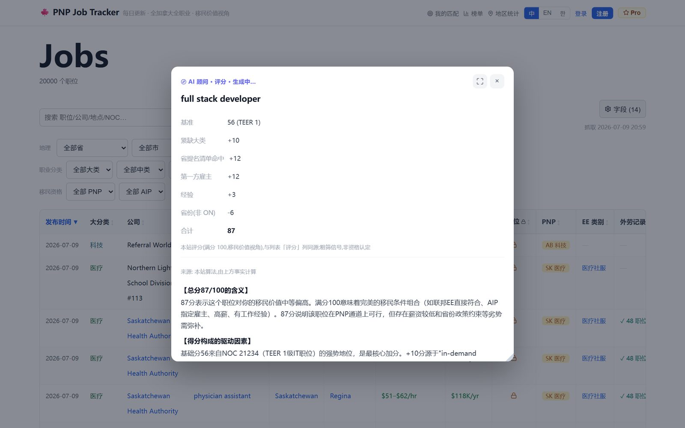
*图 17 · 评分构成明细(「省提名清单命中」标签随 #6 更新)*

> **第 2 轮**:✅ 维持通过;明细标签随 #6 换新。
> **第 20 轮**:明细/口径注 ✅ 保持;**#50 同族样本(本图+M13)**——AI 段「直接雇主offer(+12)**意味着你已有**SaskEnergy的具体职位承诺」:「第一方雇主帖」被说成「你已有 offer」,岗位属性≠用户状态,随 #50 一并修 prompt。

### 图 18 · JD 职位描述弹框

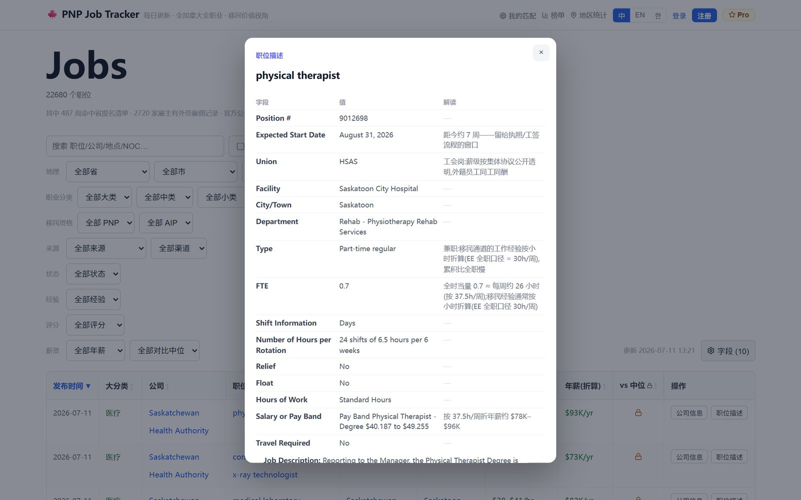
*图 18 · JD 弹框:结构化摘录 + 底部官方来源行*

> **第 2 轮**:**#12 ✅ 闭环(无需改)**——代码考古:2026-07-06 已拍板「republish 合规官方入口=底部极简来源行,取代顶部按钮」,现状即设计意图。
> **第 10 轮**:**#26 ✅ 闭环(生产实测,本图即空态样张)**——无正文帖不再干巴巴:「本站暂未收录这条帖子的正文——新帖正文通常次日到位,部分聚合源不提供」+「查看官方原帖 ↗」大按钮直达;EN 文案同验。
> **第 12 轮**:本图刷为有正文样张(Arpi's North 帖);bullet 拆行(第 11 轮三连修②)生效,但**新发现 #31**——Indeed 富文本 markdown 残渣(`*Administrator *to`、`*Key Responsibilities:*`、结尾 `\**_*…*_` 星号堆)未剥,记清单待下轮。
> **第 17 轮追加二(用户两连反馈,567b1a0,生产复验过)**:① 省弹窗事实块说人话——删「国家 Canada」凑数行;地图行改「地图 · 在 Google 地图查看(AB)↗」(原来裸图标当行名+重复地名当链接);PNP 行改「本岗职业上了该省 N 条省提名通道的清单;具体是哪条,看职位行的「PNP」标签」(原「点上方 PNP 列看命中」用户没看懂),三语;② 追问发送后的等待气泡显「⏳ 努力思考中…」,不再光秃 ▋(实测问句下一行即思考中)。
> **第 17 轮追加(用户五连反馈,369aac0,生产复验过)**:① 表头改人话「项目/内容/解读」(「字段/值」用户看不懂);② **整成一张大表**——「节头/裸标签+短条目」组(Benefits/Schedule/Education…)折成一行多值进表,结构化尾巴不再被列表段切成多张小表(实拍 Tamarack 帖:Schedule 组折行、单表);③ 公司在榜职位行首「·」删除;④「AI 生成中,请稍候」→「⏳ 努力思考中…」三语;⑤ JD 结构化**下沉清洗层**记 backlog(用户点名「这种数据需要提前清洗」——现版式器属前端整形,按清洗下沉原则应 ETL 产结构化字段,数据层立项)。
> **第 16 轮追加(用户拍板「格式化成表格,最后一列是解读」,c4e6f59)**:JD 键值段(HR 头部块/Indeed 尾巴)聚成「字段/值/解读」三列表;解读=**本地规则口径**(效果图两案拍板选规则,不经 LLM 不编造):Expected Start Date→距今周数、Union→集体协议同酬、Type/FTE→兼职经验折算口径、Salary→37.5h/周折年薪(+登录态 ESDC 中位对比)、Licenses/Education→认证提示;白名单外留「—」;长文标签与 >120 字符值照旧散文;窄屏两行式无横滚(生产双端实测)。本图已刷为表格版(SHA 帖:4+ 字段有解读)。
> **第 18 轮追加(用户拍板推翻,4fd584d)**:**「项目/内容/解读」表格整体退役,原汁原味逐行显示**——用户实机反馈:同一弹窗被散文切成多张表(SHA 帖三张)、解读列大量留「—」,「先别用表格了,原滋原味显示即可」。表格化+规则解读列(含第 17 轮「整成一张大表/表头人话」两次迭代)全删;行级清洗(粘连断行/bullet 拆行/剥星号/一句一行/HR「Label- 」归一)保留——这些解决的是「整段粘连不可读」,与表格抽象是两回事。教训:**版式抽象要克制,结构化的正道在数据层**(「JD 结构化下沉 ETL」backlog 优先级上调)。
> **第 20 轮**:**JD 段落格式保真生产复验 ✅(本图+M14)**——REPARSE 38k 帖回填完成后首个 dd 轮:SaskEnergy 聚合帖(源头压平型)双端恢复六段落、段距清晰、零粘连;底部官方来源行照旧。第 18 轮双轨(真实换行原样渲染/老坨帖猜测断行)全链生效。

## 四、引流获客

### 图 19 · weekly-top 榜单

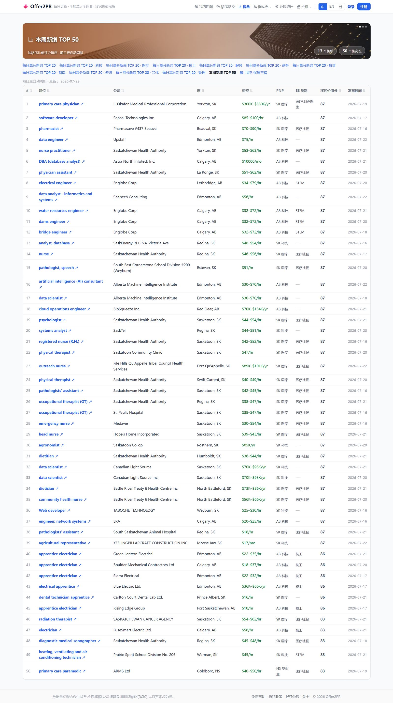
*图 19 · /rankings/weekly-top:TOP 50*

> **第 2 轮**:✅ 维持通过。
> **第 10 轮**:**新发现 #30(P2)**——头部「更新于 2026-07-03」与行内 07-10 发布时间自相矛盾:`RankingView.tsx:26` 把**第一行的 datePosted** 当「更新于」,周榜第一行是 7 天前的帖就谎报 7 天前,砸「随日更自动刷新」口碑。修法:改用 items 里 max(datePosted) 或统一取页头抓取时间。
> **第 16 轮**:#30/#32 维持 ✅(更新于 2026-07-11 ≤ 今天);**新发现 #41(P2,数据层)**——第 43 行职位标题混入 Job Bank 板面提示语:「foreman/woman, heavy equipment mechanics **This job posting is posted by a recruitment agency on behalf of the employer.**」(M18 同现):① title 清洗没剥「This job posting is posted by…」类模板句;② 该帖发布方 Manpower Services Canada Limit 是招聘中介——中介按公司名过滤漏网。修法(**先核查数据**):清洗层统计该模板句出现面(title/正文各多少帖)→ title 剥除;中介名单补 Manpower 系。涉 ETL,列下轮。
> **第 17 轮**:**#41 ✅ 复验(本图)**——50 行零模板句残留,中介帖(Manpower 等 46 帖)整体出库。
> **第 18 轮**:#41/#30/#32 维持 ✅(更新于 2026-07-16、零中介句);**新发现 #47(P2,数据层)**——榜首 #1「intern」@ CARZAN LOCAL MEATS(Regina 肉店)评分 90 全站最高,PNP/EE 挂「SK 医疗 · 医疗社服/医生」(M18 同现)。**核查已做(实锤)**:帖 49903220(source=SaskJobs 聚合)`noc=31102`(全科/家庭医生),标题只有一个词「intern」、时薪 $20-22——源数据 NOC 错标(分类器把 intern 归到住院医),08/09 如实透传后借「医疗紧缺+SK 清单命中」加分冲榜首,引流榜头名砸可信度。修法方向(**需拍板,涉评分/上榜语义**):数据层加「标题↔NOC 失配护栏」(如泛词标题 intern/worker + 薪资远低于该 NOC 典型档 → 不给紧缺/清单加分或不入榜);或按「宁可留空」把此类帖 NOC 置空转「未分类」。
> **第 20 轮**:**#47 生产复验 ✅ 终闭环(本图+M18+SSR grep 双证)**——「本周新增 TOP 50」全 50 行零「intern」裸词、零 CARZAN(仅 internal 正常词),05d 护栏随 00:01 seed 生效;榜首换 optometrist $1500–1750/day 87 分(真实高价值岗)。#30/#32/#41 维持 ✅。**产品观察(不入清单)**:前 40 行评分全 87 同分扎堆,区分度靠「同分薪资高优先」次序键撑——评分粒度是否够引流榜叙事,留价值账正餐讨论。

### 图 20 · sponsor-likely 榜单

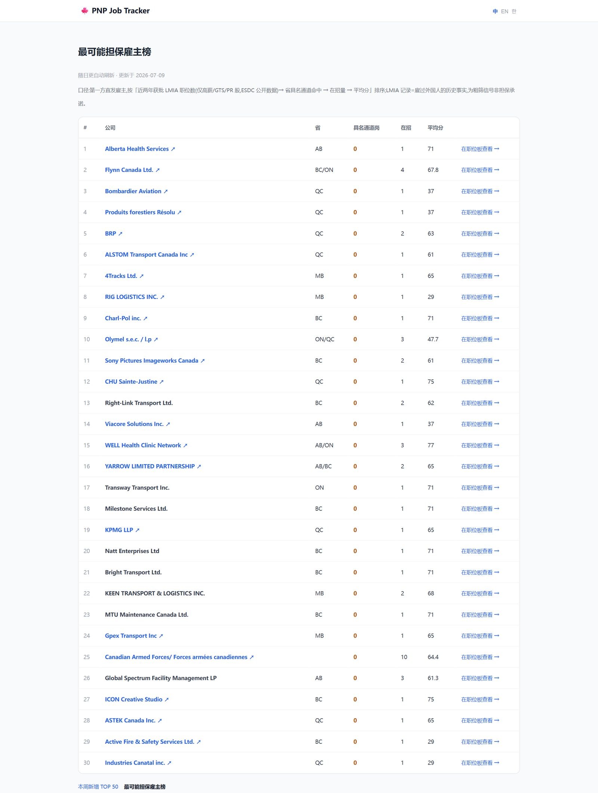
*图 20 · sponsor-likely:全零列已隐藏(#/公司/省/在招/平均分),口径行用新术语*

> **第 2 轮**:
> - **#7 ✅ 闭环**——数据核查结论:**聚合没坏**(全库 436 个在招岗有省提名清单命中,LMIA 30 强恰好零重叠,属真实分布);处置=全零时自动藏列(数据重叠后自动恢复),复查见图。
> - **#6 ✅ 闭环(本页部分)**——口径行改「省提名清单命中」。
> **第 12 轮**:**新发现 #32(P3)**——「更新于 2026-07-11」是未来日期(datePosted 为帖面 ET 日期可到明天);#30 的 max(datePosted) 应与当日取 min。
> **第 17 轮**:**#21 ✅ 闭环(本图)**——新列「LMIA 获批职位(近两年)」绿数+灰季度尾缀(AHS 168 · 2025Q4 / Flynn 162 / 庞巴迪 127),30 行全有值,第一排序键终于上榜可见;省提名清单岗列全零自动隐藏照旧。M19 同现。
> **第 19 轮**:**#48 ✅ 闭环(本图)**——第 28 行加拿大军队省列显灰「—」(6c6d008);统一 SiteFooter 本图入镜。
> **第 18 轮**:#21 维持 ✅(AHS 168 · 2025Q4 照在);**新发现 #48(P3)**——第 28 行 Canadian Armed Forces 省列**空白**(mart 实证 `province:""`,跨省雇主 LMIA 聚合无单一省),别家有值它裸空,一眼像渲染缺陷。修法:前端一行,省空时显「—」占位(与外劳记录列「—」同款)。

### 图 21 · 地区统计省索引

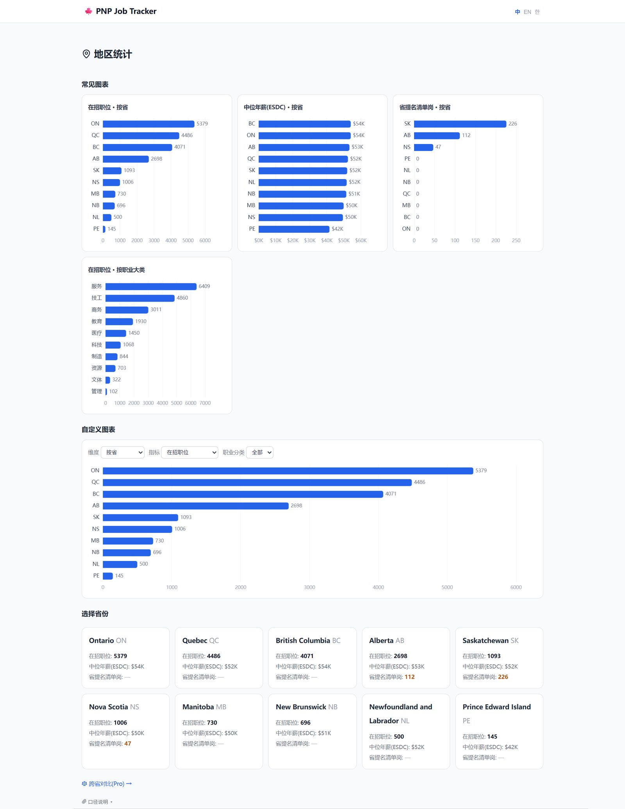
*图 21 · /stats 地区统计(E8-06 图表化):上「常见图表」四预设 + 下「自定义」维度×指标 + 省卡导航*

> **第 2 轮**:**#6 ✅ 闭环**——三语 15 处术语换新(省提名清单岗 / PNP-list jobs / PNP 목록 공고),口径说明同步重写。
> **第 11 轮(E8-06 上线)**:页面重构为图表优先(ECharts 懒加载):预设四图(按省在招/中位年薪/清单岗+全国大类岗量)+ 自定义(维度 省/大类 × 指标 6 × 过滤);**中位数红线**=「大类 × 全部省 × 中位」不合并、显提示引导选省(生产实测提示出现、选 AB 恢复出图);手机单列无溢出实拍过;h1 重复瑕疵当轮修(306c48c)。

### 图 22 · AB 省统计页

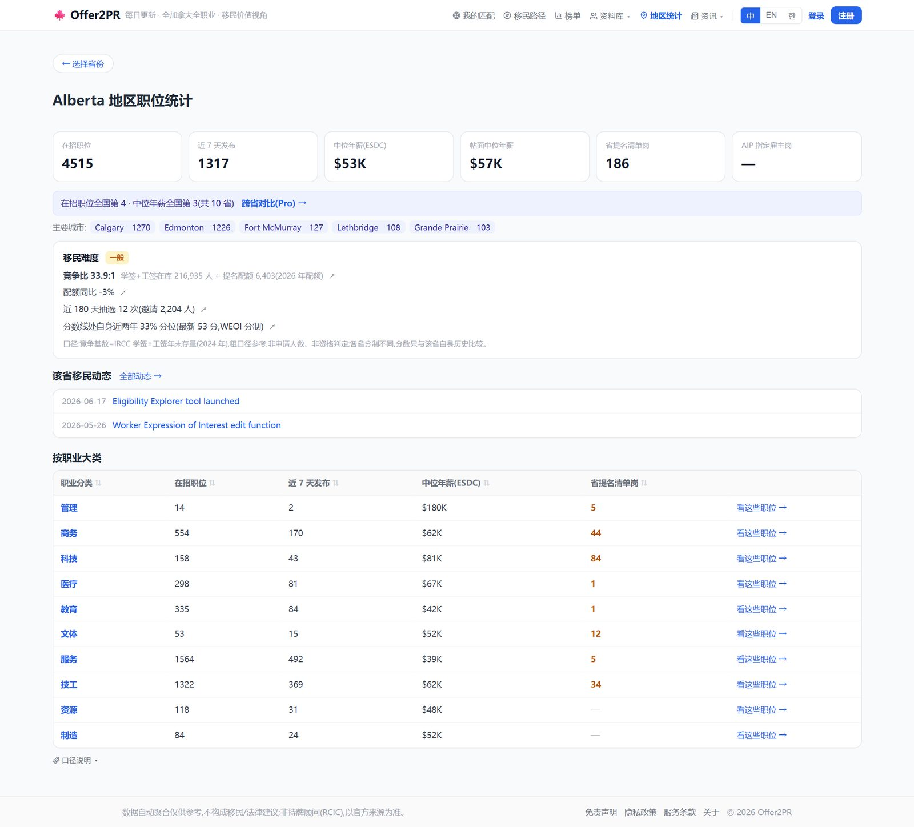
*图 22 · /stats/ab:指标卡「省提名清单岗 105」+ 按大类表*

> **第 2 轮**:#6 术语与口径说明已上线,复查见图。

### 图 23 · 统计弹窗(图表版,E8-06 新增)

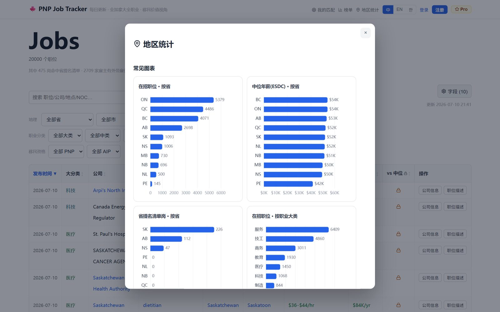
*图 23 · /jobs 顶栏「地区统计」弹窗:与页面同一 StatsIndexContent,图表在弹窗内同款渲染*

> **第 11 轮(新增)**:✅ 生产实拍;弹窗/页面单一来源(E8-02 原则),canvas 5 个全有内容。
> **第 16 轮追加:本弹窗已退役**——用户拍板顶栏三入口(我的匹配/榜单/地区统计)改跳转页面(6499f9f),StatsModal/RankingModal 组件删除;统计图表看 /stats 页(图 21/M16)。本图存档不再刷新。

> (4.3 抽选快报:仍未做,产品 backlog。)

## 五、E9 闭环新面(第 20 轮新增图号)

### 图 24 · 每日分类榜(E9-02)

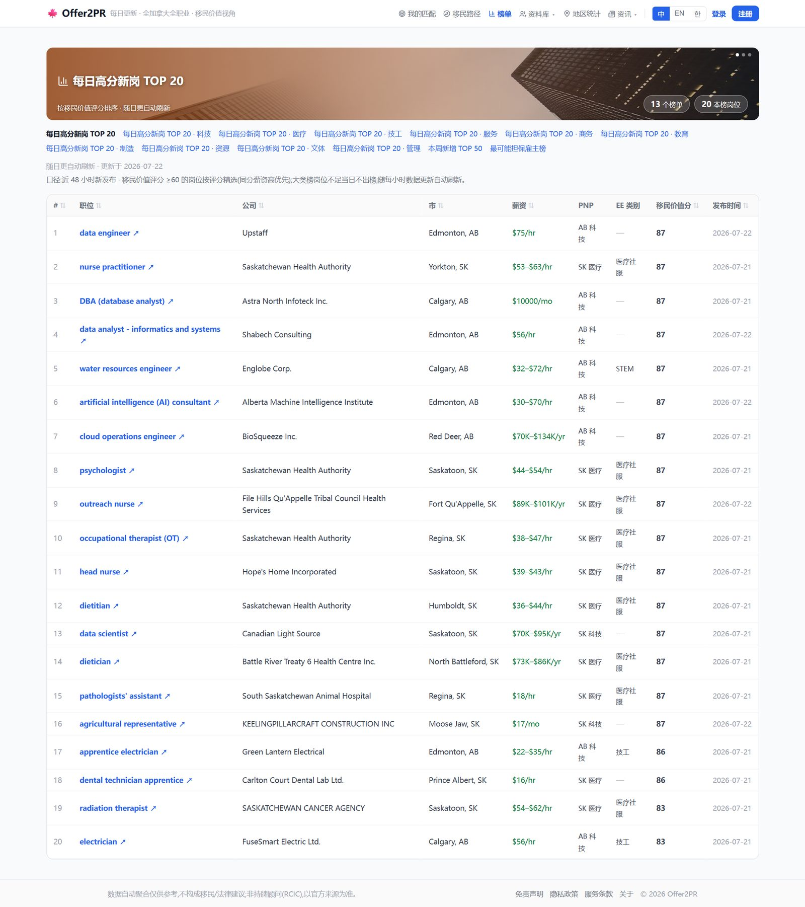
*图 24 · /rankings/daily-top:每日精选 TOP 20(全国)+ 口径行 + 底部榜单导航 chips(当前榜加粗)*

> **第 20 轮(新增)**:✅ 生产实拍——标题「每日精选 TOP 20」、口径行「近 48 小时新发布 · 移民价值评分 ≥60 按评分精选(同分薪资高优先);大类榜岗位不足当日不出榜;随每小时数据更新自动刷新」、20 行全数据(#47 护栏后零怪岗)、底部导航 chips 只列有数据的榜(全国+10 大类+本周新增+担保雇主)。M21 同验。

### 图 25 · 收藏钮(E9-01,登录态)

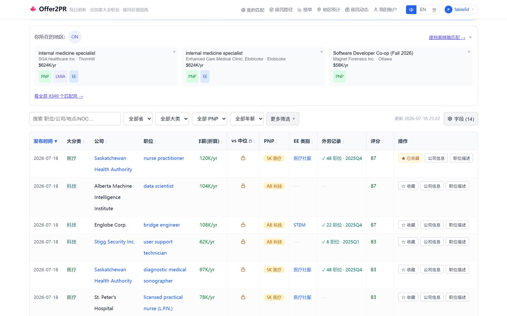
*图 25 · /jobs 操作列:首行「★ 已收藏」琥珀态,其余「☆ 收藏」;匿名点击→注册框(转化钩子)*

> **第 20 轮(新增)**:✅ 生产实拍——点击后钮变「★ 已收藏」琥珀底色,操作列三钮序:收藏/公司信息/职位描述。**新发现 #52(P2)**:手机卡片流**无收藏入口**(卡片只有 chips,E9-01 只做了桌面表格操作列)——闭环第一环在手机断链,而手机是拍板过的「方便大家使用」主场。修法:卡片加 ☆ 图标钮(寸土寸金只放图标),**动卡片布局,按第 15 轮教训先出效果图拍板再动手**。
> **第 20 轮当晚(#52 ✅,30cc20d,用户「先完善功能闭环」授权)**:卡片标题行右侧加 ☆/★ 星标钮(与匹配 chip 并排,灰/琥珀两态),匿名点=注册框、登录点=★ 并进「我的求职」,生产双态实测过;**效果图 [mobile/card-star.jpg](assets/profit-shots/mobile/card-star.jpg) 留 Frank 过目**,样式不合意一句话改。

### 图 26 · 推荐横幅(E9-02,1+3)

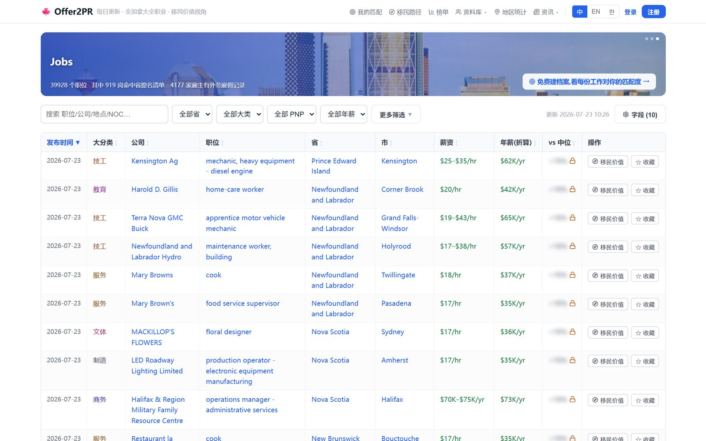
*图 26 · 本地画像凑够信号(ev≥5 且省/大类主导≥3)→「根据你最近浏览:AB」+ 看这些岗(N) + 建档反哺 + 当日关*

> **第 20 轮(新增)**:✅ 生产实拍(截图脚本注入 localStorage `jobsPref1` 画像;真实链路在图 12 背景也自然触发过——匿名段连开弹窗后横幅自己出现了)。**新发现 #51(P3)**:CTA「看这些岗(5)」的 N 按**已载入行**(首屏 50)计,AB 库内实际 604,全量换入后数字跳变 5→604——小数字反而稀释推荐说服力。修法:`loadedAll` 前 CTA 不带数字,或 N 改用与标题同源的真实计数口径。前端一处。
> **第 20 轮当晚(#51 ✅,30cc20d)**:`loadedAll` 前显 `rec.cta0`「看这些岗 →」(三语),换入后带真实 N;路由阻断 /api/jobs-data 实测无数字态。

### 图 27 · 我的求职(E9-01,账户节)

*图 27 · /account「我的求职」:收藏岗快照 + 状态下拉(想投/已投/面试中/offer)+ 移除 + 回板链接*

> **第 20 轮(新增)**:✅ 生产实拍——图 25 收藏的岗出现在列表(title/company 快照),状态下拉默认「想投」,「在职位板查看 →」回链;sidebar「我的求职」节高亮。空态文案见 `sj.empty`。M23 同验(但见 #53)。

---

# 第二部分 · 手机端(iPhone 13 实拍)

### 图 M1 · 手机首页卡片流

*图 M1 · 卡片流:薪资/「已挂 N 天」/chips*

> **第 2 轮(当日拍板)**:**#8 ✅ 闭环(拍板:不做)**——Frank 2026-07-09 确认「手机方便大家使用,先不加锁」,维持 07-07 原拍板(卡片寸土寸金不放锁标)。手机端转化入口=顶栏 Pro 按钮+建档横幅+匹配限额升级卡,不动卡片。

### 图 M2 · 手机注册框

*图 M2 · 手机注册框*

> **第 2 轮**:✅ 维持通过(sm 弹框现为自适应居中卡,随 #9)。

### 图 M3 · 手机登录框

*图 M3 · 手机登录框*

> **第 2 轮**:✅ 维持通过(同上,自适应居中)。

### 图 M4 · 手机定价页

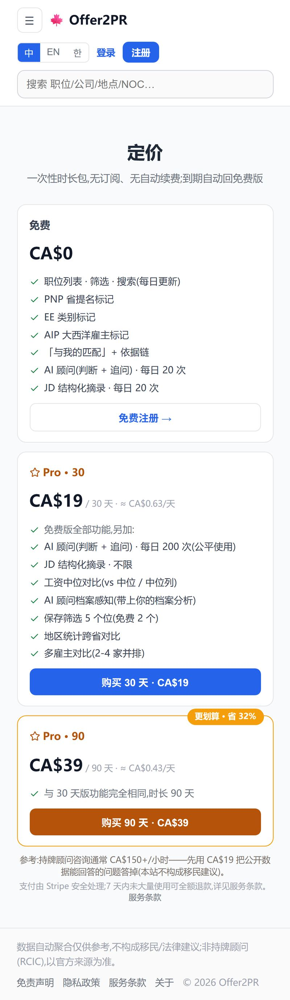
*图 M4 · 手机定价页:功能名两行整齐换行,9 行对照表,新支付文案*

> **第 2 轮**:
> - **#3 ✅ 闭环**——竖排字修复(窄屏值列收窄 + keep-all 断行)。
> - **#13 ✅ 第 3 轮闭环**——Pro 表头价格加 nowrap,「CA$19 / 30 天」整行不拆(复查见图,commit bceb09c)。

### 图 M5 · 手机升级弹框

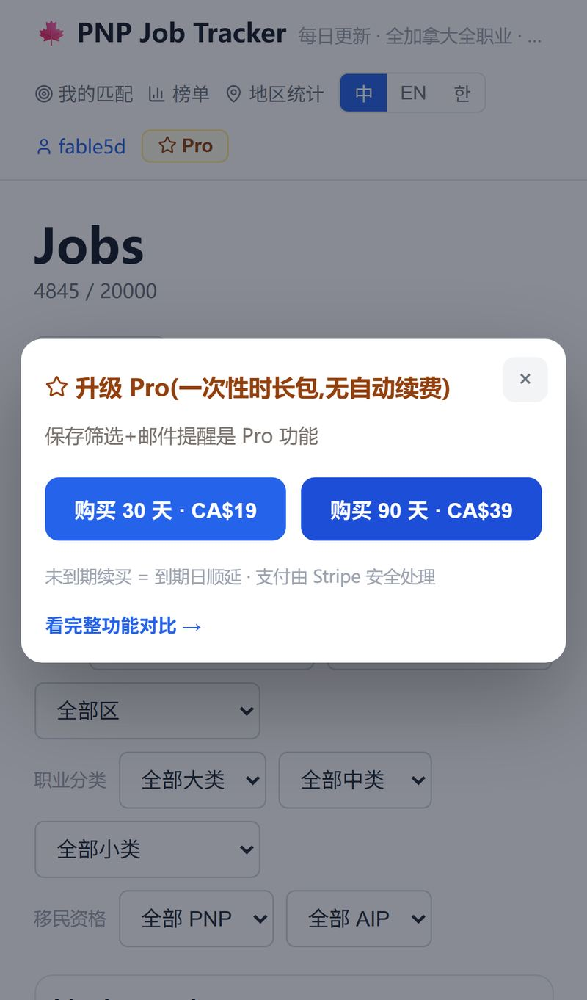
*图 M5 · 手机升级弹框:自适应高度居中卡 + 新注脚*

> **第 2 轮**:**#9 ✅ 闭环**——sm 档窄屏不再全屏留白,改自适应高度居中(E8-03 微调,md/lg 维持全屏);#2 注脚同步闭环。复查见图。

### 图 M6 · 手机 Stripe 结账页

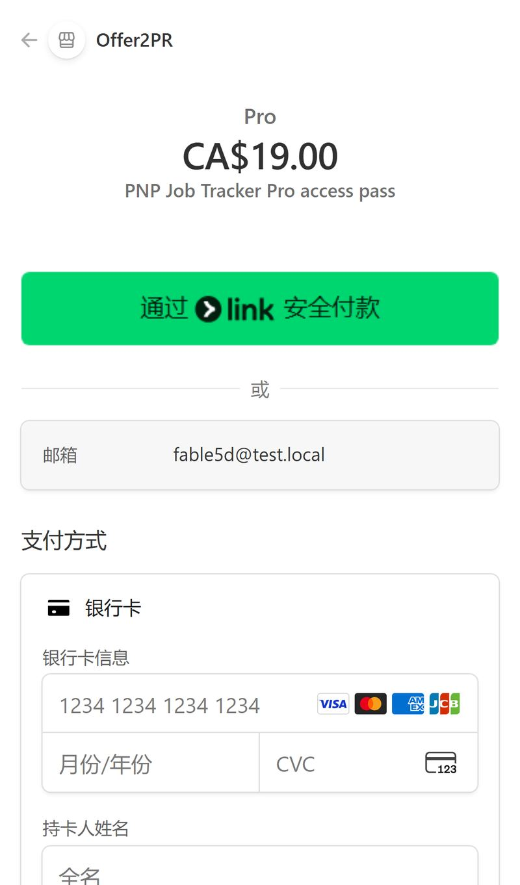
*图 M6 · 手机 Stripe 结账:中文本地化*

> **第 2 轮**:#1 品牌名仍待用户手动(同图 6)。

### 图 M7 · 手机账户档案页

*图 M7 · 手机账户页:档案 + 购买按钮(注脚已改)*

> **第 2 轮**:✅ #2 注脚闭环。

### 图 M8 · 手机「我的匹配」视图

*图 M8 · 手机匹配视图:「高」角标*

> **第 2 轮**:✅ 维持通过。
> **第 16 轮**:#42(筛选态标题分母 20000)手机同现,随图 8 一并整改。

### 图 M9 · 手机匹配依据链弹框

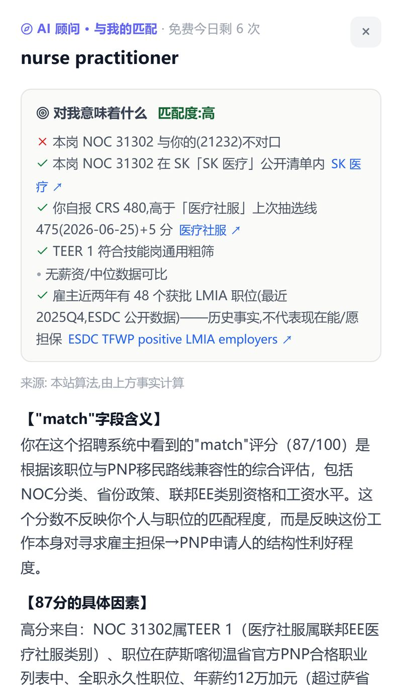
*图 M9 · 手机依据链弹框*

> **第 2 轮**:✅ 维持通过。

### 图 M10-M13 · 手机信号弹框四件

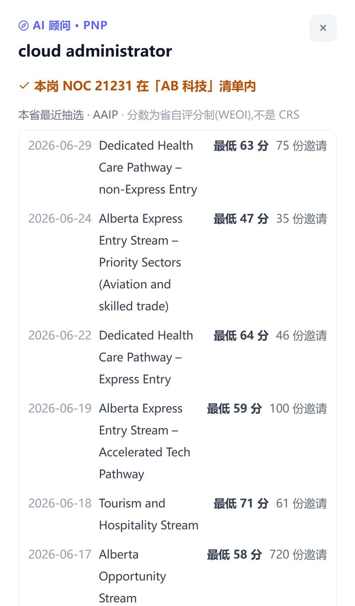
*图 M10 · 手机 PNP 弹框*

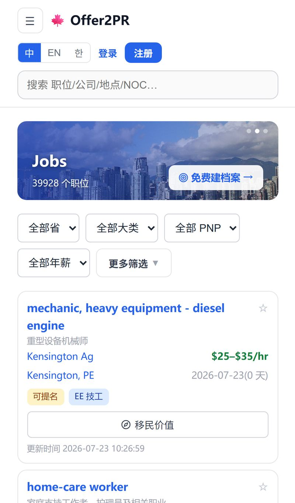
*图 M11 · 手机 EE 类别弹框*

*图 M12 · 手机 LMIA 弹框(股别分布行)*

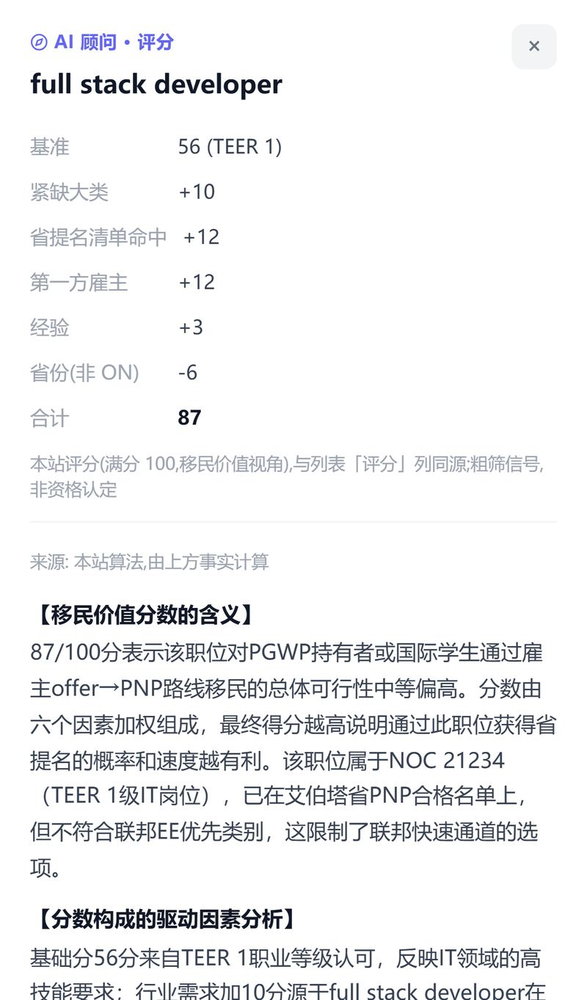
*图 M13 · 手机评分弹框*

> **第 2 轮**:✅ 全部维持通过。

### 图 M14 · 手机 JD 弹框 / 图 M15 · 手机公司顾问

*图 M14 · 手机 JD 弹框*

*图 M15 · 手机公司 AI 顾问*

> **第 2 轮**:✅ 维持通过;#12 已在图 18 闭环。
> **第 16 轮**:#36 兜底修复后补拍(首拍同图 12 裸问句现场);修复后实测占位=本岗专属问题、正文收口。M12 LMIA 首拍仍是修复前版(可视区未及正文尾,不误导,未重拍)。

### 图 M16 · 手机统计省索引 / 图 M17 · 手机 AB 省统计页

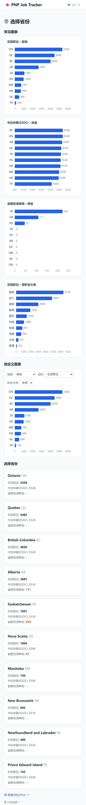
*图 M16 · 手机统计省索引(新术语)*

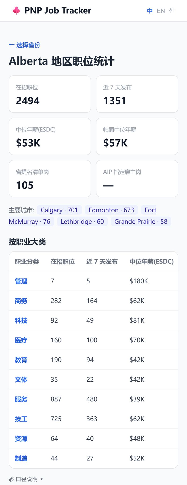
*图 M17 · 手机 AB 省页:行距正常(全页 4533px→2071px),指标卡「省提名清单岗 105」*

> **第 2 轮**:**#10 ✅ 闭环**——根因=表格被压缩致「看这些职位」列 37px 宽逐字竖排撑高整行;修复=minWidth 560 溢出横滚 + 链接列 nowrap。复查见图(整页高度减半)。

### 图 M18 · 手机 weekly-top / 图 M19 · 手机 sponsor-likely

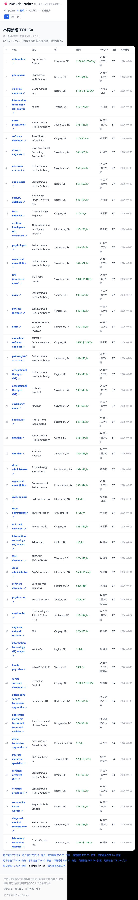
*图 M18 · 手机 weekly-top(两列收缩)*

*图 M19 · 手机 sponsor-likely(全零列已藏,新术语)*

> **第 2 轮**:✅ #6/#7 同桌面闭环。
> **第 16 轮**:M18 第 43 行 #41(标题混中介提示语)同桌面,随图 19 整改。

### 图 M20 · 手机跨省对比 gate

*图 M20 · 手机 /stats/compare gate*

> **第 2 轮**:✅ 维持通过。

### 图 M21-M23 · 手机 E9 新面(第 20 轮新增)

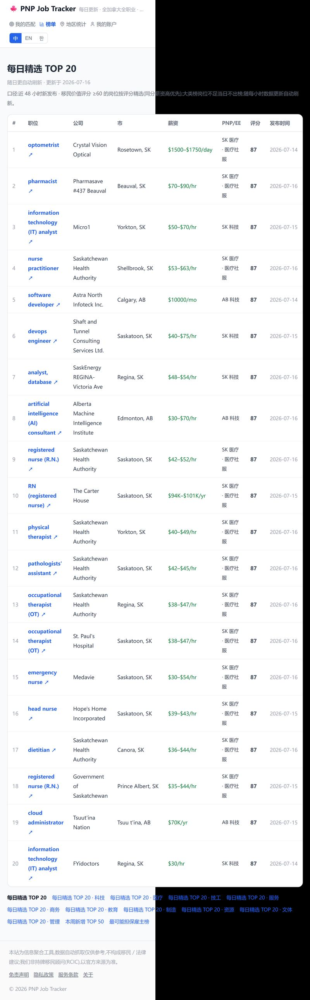
*图 M21 · 手机每日精选 TOP 20(两列收缩;右侧黑边=full-page 截图对横滚溢出区的伪影,真机白底)*

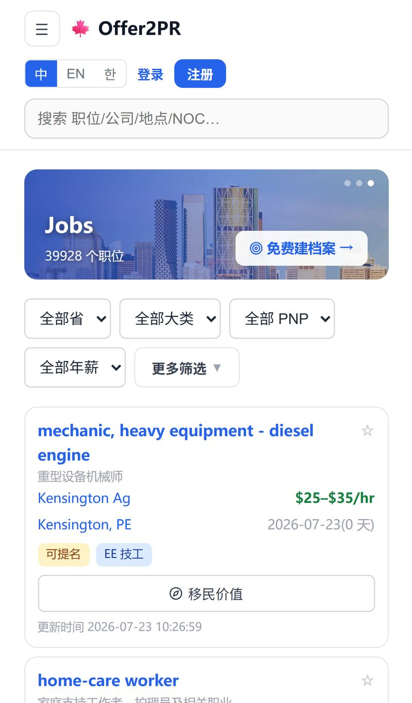
*图 M22 · 手机推荐横幅:「根据你最近浏览:AB」+ 看这些岗(5) + 建档反哺 + ×*

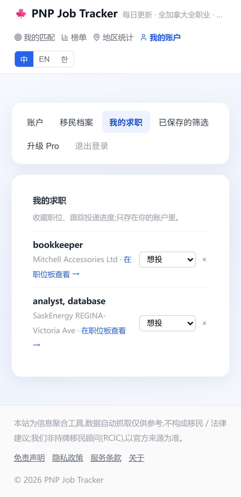
*图 M23 · 手机 /account「我的求职」(窄屏 sidebar 变顶部横排)*

> **第 20 轮(新增)**:M21 ✅(20 行全、零怪岗);M22 ✅ 横幅双端同验(#51 CTA 小数字同现);M23 基本可用但**新发现 #53(P3)**——行移除钮「×」被 flex 换行挤到卡片左下角,与所属行脱节(桌面版在行右侧);修法:× 并进标题行或该行 `flexWrap: nowrap`,前端一行。**#52(手机无收藏入口)见图 25**——M1 卡片流实拍确认卡上零收藏钮。
> **第 20 轮当晚(#53 ✅,30cc20d)**:下拉+× 包组不拆行,M23 已刷修复版(× 归位行内,两行同验);卡片星标效果图另见 [mobile/card-star.jpg](assets/profit-shots/mobile/card-star.jpg)。

---

# 第三部分 · 首周期整改清单(#1-#13)

> 2026-07-09 首周期,全部闭环;明细沉档 → [整改轮次存档.md](整改轮次存档.md)。
---

# 第四部分 · 付费价值检查(第 4 轮,2026-07-09)

> 镜头切换:UI 通过 ≠ 价值通过。判分标尺 = **五大痛点**(P1 谁真担保 / P2 这岗对我值多少 / P3 去哪个省 / P4 窗口期 / P5 信息可信吗)× **四级门槛**(不知在哪→不会抓→懒得查→**要结论**)× **付费对标 RCIC $150-300/小时**。核心问题:每一屏是「给数据」还是「给结论」?付费故事在这一屏立不立得住?
> 复查范围 = 全部 41 屏(含前三轮 ✅ 项);代码假设均已实证(match.ts 注释、i18n 键、rankings 表 schema)。**本轮只记不改,#14-#22 待拍板。**

## 4.1-4.3 逐屏价值判定与缺口原文(#14-#22)

> 已全闭环;原文沉档 → [整改轮次存档.md](整改轮次存档.md)。

## 4.4 第 4 轮汇总

| # | 级 | 缺口 | 图 | 类型 | 状态 |
|---|---|---|---|---|---|
| 14 | V-P1 | 首屏无差异化证言 | 图 1/M1 | 前端快刀 | ✅ 第 5 轮闭环(实拍:「其中 437 岗命中省提名清单 · 2529 家雇主有外劳雇佣记录 · 官方公开数据 · 每日抓取」) |
| 15 | V-P1 | 匹配限额无 FOMO 数字 | 图 8/M8 | 前端+统计值 | ✅ 第 5 轮闭环(实拍:「今日与你匹配:高 268 · 中 8528」进横幅与升级卡) |
| 16 | V-P1 | 试用额度隐形 | 图 12/18 | 响应头+前端 | ✅ 第 5 轮闭环(X-Free-Left 头,弹框显「免费今日剩 N 次」,DOM 实证) |
| 17 | V-P1 | 身份族弹框缺建档 CTA(规范 D1) | 图 13-15 | 前端快刀 | ✅ 第 5 轮闭环(PNP/EE/LMIA/AIP 弹框对未建档用户显「建档案,看这条线对你意味着什么 →」,DOM 实证) |
| 18 | V-P1 | 定价页无价值锚 | 图 4/M4 | 文案快刀 | ✅ 第 5 轮闭环(「持牌顾问咨询通常 CA$150+/小时……不构成移民建议」,DOM 实证) |
| 19 | V-P2 | 省统计给数据不给结论 | 图 22/M17 | 前端(运行时排名) | ✅ 第 5 轮闭环(实拍:「在招职位全国第 4 · 中位年薪全国第 3(共 10 省)」+ 跨省对比入口提升) |
| 20 | V-P2 | 通用评分抢付费核心智 | 图 17 | 文案快刀 | ✅ 第 5 轮闭环(口径注补「此分对所有人相同——个人化结论请用『我的匹配』」三语) |
| 21 | V-P1 | 榜单不显示 LMIA 排序依据 | 图 20/M19 | **数据层全链** | ✅ 第 17 轮闭环(拍板「本轮做」;08d5392 全链:10 带数→DDL→seed→前端列;生产实拍 AHS 168 · 2025Q4) |
| 22 | V-P2 | PGWP 字段收而不用 | 图 7/M7 | 短期文案 / 长期规则 | ✅ 第 5 轮闭环(短期档:字段下注明「暂用于 AI 顾问参考;窗口期匹配规则筹备中」);长期规则随 P4 立项 |
| 23 | V-P2 | FOMO 数字「中 8528」过大反显灌水,稀释「高 268」可信度 | 图 8 | 文案快刀 | ✅ 第 6 轮闭环(只报高:「今日与你高匹配的岗位:268 个」,生产实证) |

| 24 | P1 | 具名通道 chip 在 EN/한 界面残留中文(表格 chip/弹框命中行/清单标题/依据链/统计通道行) | 第 8 轮 EN 实拍 | 前端(streamDisplay 三语映射,7 label) | ✅ 第 10 轮闭环(生产 EN 实测四面全过:表格「AB Tech/SK Health」/命中行 `on the "SK Health" list`/清单标题/`/stats/ab/tech`「Streams hit: AB Tech」;依据链同映射) |
| 25 | P1 | 匿名顾问 429 文案不友好(「生成失败(429)」),且错过注册转化时机 | Frank 实机截图 | 前端(429 特判琥珀卡+「登录/注册 →」;错误态不再甩状态码;附带清掉「本地大模型」遗留文案) | ✅ 第 10 轮闭环(配额打满实测:琥珀卡+CTA 开注册框,EN/中同验) |
| 26 | P1 | JD 空态「未抓到该职位的描述文本」干巴巴无出路(用户点名) | Frank 实机截图 | 前端(新文案解释原因+「查看官方原帖 ↗」直达:事实块行内链 + 职位描述弹框大按钮) | ✅ 第 10 轮闭环(生产实测:解释文案+大按钮,图 18/M14 即空态样张) |
| 27 | P2 | **公司弹框「该公司在榜职位」列表体验**(用户实机反馈):① 职位行应可点击进本站职位弹窗,「— 城市」尾缀价值低不该占宽;② 「… +133」应可展开看全量 | Frank 实机截图 | 前端快刀(行点击开本站职位描述弹窗(叠层返回)、去城市尾缀;+N 改「展开其余 N 个」) | ✅ 第 10 轮闭环(078a3d8;生产实测:行点击开叠层 JD 弹窗、展开 8→141、无尾缀) |
| 28 | P1 | **EE 类别中文 label 在 EN/한 界面残留**(同 #24 性质):EE 类别表格列值「医疗社服/技工」、手机卡片「EE 医疗社服」chip、EE 弹框命中行 cats 参数、榜单通道列(该列 pnpStream 也漏 streamDisplay)、依据链 `match.r.ee.*` 的 cat 参数 | 第 10 轮 EN 实拍 | 前端(eeDisplay 九类映射,官方 key 对齐 federal-categories.json;复合「医疗社服/医生」逐段映射) | ✅ 第 11 轮闭环(ae966b5;生产 EN 实测 EE 列「Healthcare/Trades」) |
| 29 | P2 | /stats/[prov]/[cat] 分类页 SSR `<title>` 中英混杂(「科技 jobs in Alberta — wages & PNP streams」)——SEO 直出给 Google 的就是混语标题 | 第 10 轮实查 | 前端(shared.ts 新 BROAD_EN,generateMetadata 全英) | ✅ 第 11 轮闭环(生产实测 `<title>Tech jobs in Alberta…`) |
| 30 | P2 | 榜单「更新于」误用第一行 datePosted(weekly-top 显 7 天前日期,与行内 07-10 数据矛盾,砸「随日更」口碑) | 图 19/M18 | 前端一行(RankingView 改 max(datePosted)) | ✅ 第 11 轮闭环(生产实测「更新于 2026-07-10」) |
| 31 | P2 | JD 版式器不剥 markdown 强调残渣:Indeed 富文本转义的 `*Administrator *to`、`*Key Responsibilities:*`、`\**_*NO Soliciting…*_` 星号/下划线成堆(第 5 套版式问题) | 图 18/M14(Arpi's North 帖) | 前端(连堆 `*/_/\` 先拍掉、孤立 `*/\` 再清;下划线只清连堆保 URL;顺序在列表拆行后) | ✅ 第 13 轮闭环(c6ecc12;双端实测零残留,`*Key Responsibilities:*` 归一成节头) |
| 32 | P3 | 榜单「更新于」可显示未来日期(datePosted 是帖面 ET 日期,sponsor 榜实拍「更新于 2026-07-11」)——「更新于明天」损口径可信度 | 图 20 | 前端一行(max(datePosted) 用本地日期封顶) | ✅ 第 13 轮闭环(c6ecc12;实测更新于 ≤ 今天) |
| 33 | P2 | 依据链 source 链接 label 未过三语映射(EN 依据链「…draw cutoff 475」旁冒「医疗社服 ↗」)——第 14 轮语言全量回归唯一真实命中 | 第 14 轮 EN 登录段实扫 | 前端一行(JobsTable:1656 接 streamDisplay∘eeDisplay 双映射,未命中透传) | ✅ 第 14 轮同轮闭环(0c80fd2;部署复验 match-modal CLEAN) |
| 34 | P1 | 职位总数谎报:全量拉取 2 万行护栏拉满后标题降级成「已载入行数」恰好 20000 像写死(用户指出) | 用户实机 | 前端(标题永远=库内真实总数;截断小注加了又按拍板删) | ✅ 第 15 轮闭环(d74fead+9e90e72;生产实测「22608 个职位」) |
| 35 | P2 | 表格末列在视口边缘被切半截(用户指出) | 用户实机 | **三轮拍板互斥后整轮回滚**:v1 整列隐藏+小注→否(像挪了更新时间);v2 容器收口到整列边界→表格变窄→否 | ✅ 第 15 轮收口(7a0f4fd 回滚=维持全宽横滚原状;教训:改表格布局先出效果图再动手) |
| 36 | P1 | 顾问追问体验四连(用户逐条点名):建议问题千篇一律→**基于本岗内容生成**;追问回答要流式;呈现=文本框占位+Tab 补全;生成问题不要太长 | 用户实机 | 模型回复尾行 ❓ 协议+前端打字机截流(漏标记兜底摘尾行短问句;capSug>60 裁问号退罐头);chat 打字机与初判同手法;chip 删除改占位+Tab | ✅ 第 16 轮闭环(占位+Tab/限长复验过;**兜底复验揪出正则缺全角 `？` 的死代码,fde5ae1 修复+部署复验**:SHA/LMIA 弹窗裸问句消失、摘进占位) |
| 37 | P3 | 建议 chip 与输入框占位重复显示(用户指出) | 用户实机 | 并入 #36 终态(chip 删除,只留占位) | ✅ 第 16 轮闭环(实测无 chip,只剩占位) |
| 38 | P2 | ?login=1 留在地址栏,刷新反复弹登录框(用户指出) | 用户实机 | 前端(开框后 history.replaceState 洗参) | ✅ 第 15 轮闭环(9e90e72;实测刷新不再弹) |
| 39 | P3 | 公司在榜职位同名岗分不清(两条 gas technician;#27 去城市尾缀的边界) | 用户实机 | 前端(仅重名时补灰色城市尾缀) | ✅ 第 16 轮闭环(METRIC AIR 两条 gas technician 各带「· Mississauga」灰尾缀实拍,图 12) |
| 40 | P2 | 筛选布局(用户拍板):「更多筛选」折叠横条多余;字段按钮应紧贴表格上方 | 用户实机 | 前端(折叠开关删除五行常驻;字段+更新时间挪到表格右上) | ✅ 第 16 轮闭环;**同日二次拍板部分推翻**:折叠恢复(a4ecf5c,五行常驻太占竖向),字段+更新时间落在「更多筛选」开关行右侧 |
| 41 | P2 | 榜单职位标题混入 Job Bank 板面提示语「This job posting is posted by a recruitment agency…」,且发布方 Manpower 是中介(公司名过滤漏网) | 图 19/M18 | **数据层,先核查**:核查结论=37 帖 title 带句、全部中介代发(Manpower/Rapihire/Hiring Partner…),description 零出现;模板句即 Job Bank 官方中介标记 | ✅ 第 17 轮闭环(拍板「视同中介整帖过滤」;09 标记判定+名单补 manpower,46 帖出库+存量 43 帖 DML 下架;weekly-top SSR 零残留) |
| 42 | P2 | 筛选/匹配态标题分母「/ 20000」=载入上限非真实总数(22680),与 #34 口径不一致 | 图 8/M8/图 5 | 前端(分母改真实总数或措辞改「已载入 2 万行内」,**措辞需拍板**) | ✅ 第 17 轮闭环(拍板「只报命中数」;三语 subtitle.hits,生产实测「4 个命中」) |
| 43 | P3 | 顾问 AI 正文 markdown 强调符 `**` 原样露出(EE/LMIA/依据链弹窗,两端同现) | 图 14/15/9 | 前端(renderAI 统一剥连堆 `**`;追问气泡接 renderAI;建议问题 capSug 同剥) | ✅ 第 17 轮闭环(08d5392;截图复验见图 15) |
| 44 | P3 | 顾问建议追问中英夹杂:中文界面建议问题嵌英文公司名(「It Takes A Village 是否有…」) | 用户实机(轮间) | 提示词(SYSTEM 建议行语言纯度:整句用回复语言、雇主用「这家公司」指代、仅站内缩写留拉丁) | ✅ 第 18 轮闭环(4d1ccfe 当天修;生产复验四处实拍:图 9/12/15/M15 占位纯中文) |
| 45 | P2 | 语言/CLB 门槛不在数据层:建议问题/事实块/对话无法回答「这个通道英语要多少」 | 顾问对话(轮间) | **数据缺口,待立项**(按省×流抓结构化 CLB 门槛;与价值账一起排优先级) | ⬜ 待立项(不属截图整改,挂产品正餐) |
| 46 | P2 | 顾问 AI 正文偶发繁体中文且被初判缓存固化(NOC 31203 EE 弹窗两端同现) | 图 14/M11 | 提示词(zh 明令 Simplified ONLY + 举例聯邦→联邦) | ✅ 第 19 轮闭环(6c6d008;EE 弹窗双端全简体实拍) |
| 47 | P2 | weekly-top 榜首「intern」@ 肉店挂医生 NOC 31102、$20-22/hr 评分 90——源数据 NOC 错标如实透传,引流榜头名砸可信度 | 图 19/M18 | **拍板=NOC 置空转未分类**(2026-07-16 深夜);新 clean/05d:泛词标题(整串精确)× TEER0/1 × 年薪<60%中位(无中位<\$60K)→ 置空留痕 | ✅ 第 19 轮当晚闭环(01cfc7c;本地实证恰 2 帖零误杀,榜首消失待下轮 seed 生产复验) |
| 48 | P3 | sponsor 榜跨省雇主(Canadian Armed Forces)省列空白无占位(mart `province:""`) | 图 20 | 前端一行(省空显灰「—」) | ✅ 第 19 轮闭环(6c6d008;第 28 行实拍) |
| 49 | P2 | #44 复发变体:建议占位嵌英文公司名(「TABOCHE TECHNOLOGY过去是否…」「ERA是否…」)——prompt 约束存在但模型不稳定遵守,缓存换血即复发 | 图 9/15 | 前端兜底(capSug/extractSug 接 company+lang,公司名含去后缀核心名替换「这家公司/this company/이 회사」;顺手补上兜底分支绕过 capSug 的旧洞) | ✅ 第 19 轮当晚闭环(2680a68+0ed3994;生产复验占位「这家公司是否具有LMIA豁免资格…」;插曲:JSX 注释位置构建失败一次,Render 未切流量,教训=build 退出码不与 push 串链)。**第 20 轮生产复验 ✅**(图 9/12 双端占位纯中文) |
| 50 | P2 | AI 顾问断言用户身份/状态:匿名态「由于**你是PGWP持有人**…ERA 无需走LMIA流程即可雇用你」(图 15/M12);「直接雇主offer(+12)意味着**你已有**SaskEnergy的具体职位承诺」(图 17/M13,第一方帖≠用户有 offer)——把受众假设/岗位属性说成用户事实,砸「真实数据」口碑 | 图 15/17,M12/M13 | 提示词(advisor SYSTEM 红线:读者身份未知除非事实含档案;受众假设一律条件句;岗位属性≠用户状态;与 #44/#46 同一代码域) | ✅ 第 20 轮当晚闭环(30cc20d;新鲜样本实测「若你持 PGWP 或国际学生身份…」条件句,零断言;旧缓存随数据轮换血) |
| 51 | P3 | 推荐横幅 CTA「看这些岗(5)」的 N 按已载入行(首屏 50)计,AB 库内 604,全量换入后跳变 5→604——小数字稀释推荐说服力 | 图 26/M22 | 前端一处(`loadedAll` 前显 `rec.cta0` 无数字,三语) | ✅ 第 20 轮当晚闭环(30cc20d;路由阻断法实测 CTA=「看这些岗 →」) |
| 52 | P2 | 手机卡片流无收藏入口——E9-01 只做了桌面表格操作列,闭环第一环在手机断链(手机=拍板过的「方便大家使用」主场) | 图 25/M1 | 前端(卡片标题行右侧 ☆/★ 图标钮,寸土寸金只放星标;匿名点=注册框,复用 toggleSave) | ✅ 第 20 轮当晚闭环(30cc20d;生产实测:匿名点弹注册框/登录点变 ★ 琥珀/我的求职同步;**效果图 mobile/card-star.jpg 留 Frank 过目,不合意即改**) |
| 53 | P3 | 手机「我的求职」行移除钮 × 被 flex 换行挤到卡片左下角,与所属行脱节 | 图 M23 | 前端一行(下拉+× 包组 `flexShrink:0` 不拆行) | ✅ 第 20 轮当晚闭环(30cc20d;M23 已刷修复版,× 归位行内) |

**当前状态(第 20 轮+当晚四连修后)**:**#1-#53 全部闭环**(唯 #45 待立项挂价值账;#52 效果图留 Frank 过目确认)。第 20 轮=E9 发版回归 48+ 屏零回归;当晚四连修把手机端闭环打通(发现→卡片→星标→我的求职),**发帖前置条件已齐**。**待口头确认**:Stripe 图标/支持邮箱、Alipay 审批、站名随 offer2pr、#52 星标样式。
**轮间新发现存档(2026-07-16,用户使用中报告;已入汇总表)**:
- **#44** ✅ 第 18 轮闭环(4d1ccfe;详见图 9/12 第 18 轮块)。
- **#45(P2,数据缺口,待立项)语言/英语要求不在数据层**——PNP 门槛(含 CLB/雅思)当初评估「散在各省 prose、解析易错」留空(Part B #3);后果:建议问题/事实块/对话都无法回答「这个通道英语要多少」,grounded 红线下 AI 只能答「没有该数据」。若做:按省×流抓结构化 CLB 门槛(新维度或并入 pnp_occupations),事实块+match 规则+建议问题才有落点;与「价值账」正餐一起排优先级。
**第 15 轮教训记档**:布局类改动(表格宽度/隐藏策略)用户敏感度极高且口头描述易歧义——**先出效果图/说清方案再动手**,#35 三轮返工的成本远高于一次确认。
**第 16 轮教训记档**:正则字符类里的全角/半角标点肉眼难辨(`[??]` 两个半角 vs `[?？]`)——**涉 CJK 标点的正则,写完用 od/python 逐字节验一遍**;「已实施」不等于「生效」,复验要拿实际坏样本打一遍(SHA 弹窗的裸问句就是现成测试用例)。
**第 11 轮附带落地(非清单)**:①「抓取时间→更新时间」三语改名(用户点名);② E8-06 统计页图表化上线(实现文档 docs/implementation/E8-UI体验统一/06_统计页图表化.md;省页/大类页图表化留后续按反馈);③「定价弹框」核查=E8-02 已覆盖无需改;④ 图 21/M16 已刷为图表版,新增图 23(统计弹窗图表);⑤ 顾问弹框三连修(900×760/bullet 拆行/建议 chip+Tab)。
**下个 session `dd` 执行序(第 21 轮,发帖后回归)**:① ~~#50-#53~~ 已当晚全闭环(30cc20d),常规 48 屏复验带上(手机 home 卡片应见星标、横幅无数字态、旧缓存弹窗换血后无身份断言);② 常规刷新+统一检查,新发现从 #54 编号;③ 07-23 前后确认 Supabase 项目删除(E7-04 收尾);④ 截图脚本顺手活:citation 裁剪坐标左移(本轮左缘切字);⑤ 发帖后看 umami 漏斗(访问→注册→建档→点锁列)。**主线已切冷启动+价值账。正餐仍是价值账**(痛点全量盘点→定价复核,#45/评分区分度都在矩阵里排位)。**第 17 轮教训**:凡 DELETE+重灌模式,上游读失败必须炸事务——「拉不到」≠「没有」;seed ok:true 但 counts 全零=红旗。**第 18 轮备忘**:公司弹窗「在榜职位」块是「>1 岗才显示」(JobsTable.tsx:1562),单岗公司没有此块≠回归;citation-line 特写裁剪坐标随 LMIA 弹窗内容漂移,下轮截图后顺手核对。
**运维备忘**:更新时间节奏(2026-07-16 用户报「不稳定」):jobbank 1h 准点,元凶是 build 轮里官网富化每轮现抓 300 家(~17 分钟)把 seed 拖到抓取后近半小时——enrich_companies 加 `--min-interval`(默认 6h,OUT mtime 当戳)自限流,build 轮回到分钟级,页头滞后 ~5-8 分钟;审计匿名段与用户共用家庭 IP 配额(8/日,一轮审计即打满)——`dd` 后当天匿名浏览 429 属预期;deploy 完成判定:SSR 可见文案用 curl grep(如「常见图表」),客户端行为直接浏览器实测,别用 turbopack chunk 指纹(跨构建可不变);register-gate 截图手法已修进脚本(锁标是 td 里的 button,点 td 不触发);Browser pane 对 canvas 重页截图会超时——图表页实拍走 Playwright。
**产品 backlog(非清单)**:价值账(痛点盘点→定价复核)、抽选快报立项、跨省对比补 RNIP/生活成本维度、PE AIP/RNIP;**2026-07-16 用户新增两件(需立项出方案再动手)**:① **档案分步引导**——/account 档案表单改 step-by-step 向导(或可选项点选),降低建档门槛(建档=付费核输入端,转化关键一环);② **简历上传→解析→匹配**——用户传简历,自动抽 NOC/经验/语言等关键信息预填档案(用户可改),再进匹配;涉 LLM 解析、文件存储、隐私(简历=高敏 PII,留存/脱敏策略要先定)。两件都吃「档案匹配=付费核」主线,与价值账一起排优先级;③ **社区/论坛(BBS)**(2026-07-16 用户提出「大家可以来发帖」)——UGC 社区是留存护城河但有冷启动空城风险与审核成本,建议排在流量起来之后;低成本起步形态=岗位/公司页评论区(挂在既有实体下,不做全功能版块),价值账里与六环一起排位;④ **闭环四素材**(2026-07-16 用户问「用户如何使用,如何形成闭环」推导):(a) **岗位收藏+状态标记(想投/已投/面试/offer)=最小求职看板**——同时接通行动环与免费留存环,v3「投递跟踪」最小落地,建议排模拟面试之前;(b) 免费用户每周摘要邮件(收藏岗+新匹配,管线现成);(c) 依据链结论分享卡(增长环);(d) 远期:用户标记拿到 offer/提名 → 成功案例回流(独有数据资产)。
**实拍遗留**:测试号 `fable5d@test.local`(已带 1 条收藏岗 SaskEnergy analyst,供我的求职/收藏钮镜头复用);截图已刷为第 20 轮版本(2026-07-17 凌晨,48 屏 + citation 特写;新增 rank-daily/save-job/rec-banner/my-jobs ×双端)。citation 特写本轮左缘切字(坐标随 LMIA 弹窗内容漂移,脚本待微调)。推荐横幅镜头手法:脚本注入 `jobsPref1`(只压省维度,带薪资档会把 N 压 0)+ `wait_for_selector` 等横幅文本(全量换入前 N 可能为 0 不渲染)。
